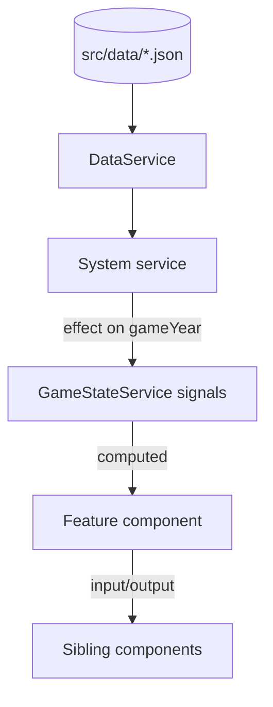

<!--
Technical implementation plans live at: docs/agents/plans/<kebab-feature>.md
Only create a saved plan for LARGE features. Small features can be planned inline in chat.

This plan gives HIGH-LEVEL strategic guidance for a capable developer/agent.
Focus on architecture, approach, patterns, edge cases and gotchas — NOT full class bodies.

⚠️ DO NOT INCLUDE:
- Full component/service implementations or detailed templates/styles
- Any backend (there is none — Helioscape is frontend-only)
- E2E tests or E2E verification steps -> ask the user to playtest manually at the end instead
-->

# Technical Implementation Plan: <feature-name>

## 1. Architecture & Strategy

### System context

<2-3 sentences: how this fits the orrery / HUD / planet-panel / Mercury / events systems and where
it sits in the PROMPTS.md build order (Block X). What it depends on; what depends on it.>

### Architecture diagram

### Key design decisions

- **<Decision 1>**: <rationale / alternatives>
- **<Decision 2>**: <rationale / alternatives>

### Data flow

<Which signals are read, which mutation methods are called, what reacts via effect()/untracked(),
how values derive purely from gameYear so save/load stays correct.>

### Patterns & conventions to follow

- Signals only; state in `GameStateService`; logic in system services; timers only in `GameLoopService`.
- Standalone + OnPush; `@if`/`@for` with `track`; `inject()`; `input()`/`output()`; strict types.
- Content from `src/data/*.json`; matching interfaces in `core/models`.
- Cleanup on destroy (RAF, `takeUntilDestroyed`, listeners, Three.js dispose).
- Tauri only via `Save`/`Settings` (guarded). Narrator voice for player-facing text.

---

## 2. Subtasks

<Break the feature into subtasks by layer. For each: the file, what it does, key signatures/signals,
pitfalls, and its co-located `*.spec.ts`. Group into milestones.>

### Milestone 1 — <name>

- [ ] `path/to/file.ts` — <purpose; key signals/inputs; pitfalls> (+ `file.spec.ts`)
- [ ] ...

### Milestone 2 — <name>

- [ ] ...

---

## 3. Assets (placeholders)

<List every visual/audio asset the feature needs. Each is a PLACEHOLDER to be generated via the
asset skills, with an exact path + size/length.>

- [ ] `src/assets/svg/.../<name>.svg` — <kind>, `viewBox 0 0 W H` — placeholder (`create-placeholder-svg`)
- [ ] `src/assets/audio/.../<name>.wav` — <category>, ~<ms> — placeholder (`create-placeholder-audio`)

---

## 4. Cross-cutting concerns

### Edge cases & pitfalls

<Boundary years, phase 0/last phase, locked planets, prerequisite/spillover gates, queue empty/full,
pause/resume mid-transition, 1× vs 4× speed.>

### Save/load

<What must serialise; how state restores; interrupted culture-event queue; version/migration.>

### Memory & performance

<RAF/listener/Three.js cleanup; late-game scale (many buildings/panels, big queues).>

### Accessibility & motion

<Tokens, reduced-motion, high-contrast/colorblind, ui-scale; correct tick vs initial-load transition.>

---

## 5. Out of scope / deferred

<What this plan deliberately does NOT build, naming the later Block that owns it.>

---

## 6. Verification

- [ ] `ng build` succeeds (0 errors)
- [ ] `ng test` (Vitest) passes
- [ ] Manual checks: <concrete steps, e.g. open planet panel, advance year, confirm bar fills>
- [ ] Ask the user to playtest the flow manually (no automated E2E)

---

## 7. References

- GDD: `docs/GDD/<file>.md`
- Architecture: `docs/agents/ARCHITECTURE.md`
- Prompt block: `docs/agents/PROMPTS.md` / `PROMPTS-pt2.md` — Block <X>
