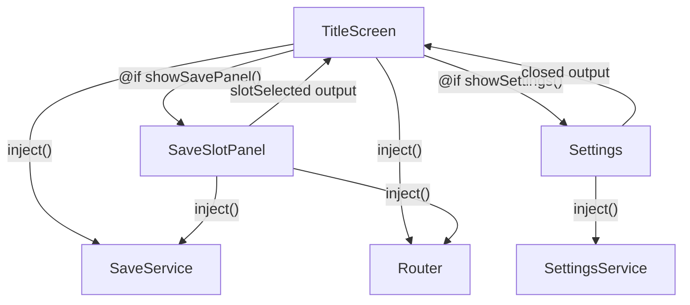

# Plan — Title Screen (Block 04-1)

**Status**: Ready for implementation  
**Prompt file**: `docs/agents/prompts/04-1-title-screen.txt`  
**Date**: 2026-06-11

---

## Scope

Build the Helioscape title screen: the first route a player sees. It shows the game title,
buttons for New Game / Continue / Load Game / Options / Quit, delegates to child overlays
(`SaveSlotPanelComponent` for save-slot selection, `SettingsComponent` for settings), then
navigates to `/game`.

### In scope

- `TitleScreenComponent` — full replacement of the stub
- `SaveSlotPanelComponent` — new child component in `title-screen/save-slot-panel/`
- `SettingsComponent` — new component in `features/settings/` (basic, wired to SettingsService)
- Tests for `TitleScreenComponent` and `SaveSlotPanelComponent`

### Out of scope / deferred

- Audio on button clicks (AudioService not yet built)
- Fullscreen toggle inside SettingsComponent (Tauri window API, tracked in TODO.md)
- Volume sliders in SettingsComponent (AudioService, tracked in TODO.md)
- Overwrite-confirmation dialog when a player picks an occupied slot in NEW_GAME mode
- Route animations / page transitions
- GameShellComponent (separate block)

---

## Architecture & data flow



**Async init pattern** — `SaveService.hasSave()` and `getAllSlotInfos()` are async. Resolve both
in the constructor body via `.then()`, writing results into private `signal()`s. Angular renders
with the initial `false`/`null` values first (Continue is hidden), then updates the DOM once the
promises settle. No `async`/`await` in lifecycle hooks — no need for `AsyncPipe` or `toSignal`.

---

## Layers

### Layer 1 — Models (no new model needed)

`SlotInfo` is already exported from `save.service.ts`. The only new type needed is a union literal
for the panel mode — define it as a named export directly in `save-slot-panel.component.ts` (no
separate model file; a union this small doesn't warrant one).

```ts
// save-slot-panel.component.ts
export type SaveSlotMode = 'NEW_GAME' | 'LOAD';
```

### Layer 2 — JSON data

None. The title screen reads slot metadata already serialised into localStorage/Tauri files.

### Layer 3 — Core services

No changes to `SaveService` or `SettingsService` — the public API already has everything needed:

| Method | Used by |
|---|---|
| `hasSave()` | TitleScreen — controls Continue visibility |
| `getAllSlotInfos()` | TitleScreen — most-recent slot for Continue meta; SaveSlotPanel — slot cards |
| `load(slot)` | TitleScreen — Continue action; SaveSlotPanel — Load mode |
| `save(slot)` | SaveSlotPanel — NEW_GAME mode (save new game to chosen slot) |
| `getSlotInfo(slot)` | Not needed; `getAllSlotInfos` covers both callers |

### Layer 4 — System services

None.

### Layer 5 — Shared utils / pipes

None new. The template can display `kardashevLevel` and `gameYear` directly from `SlotInfo` without
custom pipes (formatting is minimal here: "Year XXXX · K" + level number).

---

## File-by-file subtasks

---

### File 1 · `src/app/features/title-screen/title-screen.component.ts`

**Replace the stub entirely.**

#### Responsibility
Root of the title screen route. Orchestrates the button bar, shows/hides the two overlays, and
handles all button actions.

#### Injected services
- `private readonly saveService = inject(SaveService)`
- `private readonly router = inject(Router)`

#### Signals
```ts
// Internal state — async-resolved from SaveService on construction
private readonly _hasSave = signal(false);
private readonly _mostRecentSlot = signal<SlotInfo | null>(null);

// Overlay visibility
readonly showSavePanel = signal(false);
readonly saveMode = signal<SaveSlotMode>('LOAD');
readonly showSettings = signal(false);

// CSS initial-load animation trigger
readonly loaded = signal(false);

// Public reads used in template
readonly hasSave = this._hasSave.asReadonly();
readonly mostRecentSlot = this._mostRecentSlot.asReadonly();
```

#### Constructor init
```ts
constructor() {
  // Resolve async save state — hasSave starts false so Continue is hidden until known
  this.saveService.hasSave().then(has => this._hasSave.set(has));
  this.saveService.getAllSlotInfos().then(slots => {
    const occupied = slots.filter(s => s.exists);
    if (occupied.length === 0) return;
    const recent = occupied.reduce((a, b) =>
      (a.saveTimestamp ?? 0) >= (b.saveTimestamp ?? 0) ? a : b
    );
    this._mostRecentSlot.set(recent);
  });
}
```

#### AfterViewInit
```ts
ngAfterViewInit(): void {
  // Defer one microtask so Angular has rendered, then add the loaded class.
  // This ensures the CSS transition from opacity 0 → 1 is visible.
  Promise.resolve().then(() => this.loaded.set(true));
}
```

#### Public action methods
```ts
onNewGame(): void {
  if (this._hasSave()) {
    this.saveMode.set('NEW_GAME');
    this.showSavePanel.set(true);
  } else {
    this.router.navigate(['/game'], { queryParams: { slot: 1 } });
  }
}

onContinue(): void {
  const slot = this._mostRecentSlot();
  if (!slot) return;
  // Load is fire-and-forget here; GameShellComponent reads hydrated state
  // NOTE: we could await and show a spinner, but that's complexity for a later block
  this.saveService.load(this._getSlotIndex(slot));
  this.router.navigate(['/game']);
}

onLoadGame(): void {
  this.saveMode.set('LOAD');
  this.showSavePanel.set(true);
}

onOptions(): void {
  this.showSettings.set(true);
}

onQuit(): void {
  // NOTE: window.close() is blocked by browsers unless the tab was opened by script.
  // Tauri provides a proper app.quit() — wire that up in the Tauri integration block.
  window.close();
}

onPanelClosed(): void {
  this.showSavePanel.set(false);
}

onSettingsClosed(): void {
  this.showSettings.set(false);
}
```

`_getSlotIndex(slot: SlotInfo): number` — helper that maps a `SlotInfo` back to its 0-based index
(autosave = 0, manual = 1–3). `getAllSlotInfos()` returns them in order `[0, 1, 2, 3]`, so the
index equals the position in the returned array.

> **Pitfall**: `getAllSlotInfos()` returns `[autosave, slot1, slot2, slot3]`. `SlotInfo` has no
> `slot` field. We need to track the slot index alongside the info. Simplest fix: after resolving
> all slot infos, pair each with its index before finding the most-recent one. Store the pair.

Revised `_mostRecentSlot` type:
```ts
private readonly _mostRecentSlot = signal<{ slot: number; info: SlotInfo } | null>(null);
```
Constructor updated accordingly:
```ts
this.saveService.getAllSlotInfos().then(slots => {
  const occupied = slots
    .map((info, slot) => ({ slot, info }))
    .filter(pair => pair.info.exists);
  if (occupied.length === 0) return;
  const recent = occupied.reduce((a, b) =>
    (a.info.saveTimestamp ?? 0) >= (b.info.saveTimestamp ?? 0) ? a : b
  );
  this._mostRecentSlot.set(recent);
});
```

#### Template sketch
```html
<div class="title-screen" [class.initial-load]="loaded()">
  <div class="title-screen__content">
    <h1 class="title-screen__title">HELIOSCAPE</h1>
    <p class="title-screen__subtitle">Terraform the Solar System</p>

    <nav class="title-screen__buttons">
      <button class="title-screen__btn" (click)="onNewGame()">New Game</button>

      @if (hasSave()) {
        <div class="title-screen__continue-block">
          <button class="title-screen__btn" (click)="onContinue()">Continue</button>
          @if (mostRecentSlot(); as recent) {
            <p class="title-screen__save-meta">
              Year {{ recent.info.gameYear }} · K{{ recent.info.kardashevLevel }}
            </p>
          }
        </div>
      }

      <button class="title-screen__btn" (click)="onLoadGame()">Load Game</button>
      <button class="title-screen__btn" (click)="onOptions()">Options</button>
      <button class="title-screen__btn title-screen__btn--quit" (click)="onQuit()">Quit</button>
    </nav>
  </div>

  @if (showSavePanel()) {
    <app-save-slot-panel [mode]="saveMode()" (closed)="onPanelClosed()" />
  }
  @if (showSettings()) {
    <app-settings (closed)="onSettingsClosed()" />
  }
</div>
```

#### CSS (scoped SCSS)
```scss
.title-screen {
  position: fixed; inset: 0;
  background: var(--color-bg-base);
  display: flex; align-items: center; justify-content: center;

  // Initial-load fade-in: start invisible, transition when .initial-load is set
  opacity: 0;
  transition: var(--transition-initial);  // all 0.8s ease-out
  &.initial-load { opacity: 1; }

  &__content { text-align: center; }

  &__title {
    font-family: var(--font-mono);
    font-size: var(--text-2xl);
    color: var(--color-accent-glow);
    letter-spacing: 0.1em;
    margin-bottom: var(--space-sm);
  }

  &__subtitle {
    font-size: var(--text-md);
    color: var(--color-text-secondary);
    margin-bottom: var(--space-xl);
  }

  &__buttons {
    display: flex; flex-direction: column;
    gap: var(--space-lg);  // 24px — as specified
    align-items: center;
  }

  &__btn {
    font-family: var(--font-mono);
    font-size: var(--text-sm);
    color: var(--color-text-primary);
    background: transparent;
    border: var(--border-accent);
    border-radius: var(--radius-md);
    padding: var(--space-sm) var(--space-xl);
    cursor: pointer;
    transition: var(--transition-ui);
    min-width: 200px;

    &:hover { color: var(--color-accent-glow); border-color: var(--color-accent-glow); }
    &--quit { color: var(--color-text-secondary); border-color: transparent; }
    &--quit:hover { color: var(--color-bad); border-color: transparent; }
  }

  &__continue-block { display: flex; flex-direction: column; align-items: center; gap: var(--space-xs); }

  &__save-meta {
    font-size: var(--text-xs);
    color: var(--color-text-secondary);
    font-family: var(--font-mono);
  }
}
```

#### Imports to include in `imports[]`
`SaveSlotPanelComponent`, `SettingsComponent`

#### Test: `title-screen.component.spec.ts`
| Spec | What to verify |
|---|---|
| renders title text | `h1` contains "HELIOSCAPE" |
| Continue hidden when no save | `hasSave` signal false → no Continue button |
| Continue visible when save exists | `hasSave` signal true → Continue button present |
| onNewGame routes immediately when no save | `router.navigate` called with `['/game']` |
| onNewGame opens panel when save exists | `showSavePanel()` is true, `saveMode()` is `'NEW_GAME'` |
| onLoadGame opens panel in LOAD mode | `showSavePanel()` true, `saveMode()` is `'LOAD'` |
| onOptions shows settings | `showSettings()` true |
| onPanelClosed hides panel | `showSavePanel()` false |

---

### File 2 · `src/app/features/title-screen/save-slot-panel/save-slot-panel.component.ts`

**New file.**

#### Responsibility
Full-screen overlay modal that lists all save slots (autosave + 3 manual). In `NEW_GAME` mode, any
slot is selectable to start a fresh game there. In `LOAD` mode, only occupied slots are selectable.
On selection, delegates the async action to the parent via outputs, or handles it internally and
emits `closed`.

#### Injected services
- `private readonly saveService = inject(SaveService)`
- `private readonly router = inject(Router)`
- `private readonly destroyRef = inject(DestroyRef)`

#### Inputs / outputs
```ts
readonly mode = input.required<SaveSlotMode>();
readonly closed = output<void>();
```

#### Signals
```ts
readonly slots = signal<Array<{ slot: number; info: SlotInfo }>>([]);
readonly loading = signal(true);
```

#### Init
```ts
constructor() {
  this.saveService.getAllSlotInfos().then(infos => {
    this.slots.set(infos.map((info, slot) => ({ slot, info })));
    this.loading.set(false);
  });
}
```

#### Template sketch
```html
<div class="save-slot-panel__backdrop" (click)="closed.emit()">
  <div class="save-slot-panel" (click)="$event.stopPropagation()">
    <h2>{{ mode() === 'NEW_GAME' ? 'Choose Save Slot' : 'Load Game' }}</h2>

    @if (loading()) {
      <p>Loading...</p>
    } @else {
      @for (pair of slots(); track pair.slot) {
        <button
          class="save-slot-panel__card"
          [class.save-slot-panel__card--occupied]="pair.info.exists"
          [class.save-slot-panel__card--autosave]="pair.slot === 0"
          [disabled]="mode() === 'LOAD' && !pair.info.exists"
          (click)="onSlotClick(pair.slot, pair.info)"
        >
          <span class="save-slot-panel__label">
            {{ pair.slot === 0 ? 'Autosave' : 'Slot ' + pair.slot }}
          </span>
          @if (pair.info.exists) {
            <span class="save-slot-panel__meta">
              Year {{ pair.info.gameYear }} · K{{ pair.info.kardashevLevel }}
            </span>
          } @else {
            <span class="save-slot-panel__empty">Empty</span>
          }
        </button>
      }
    }

    <button class="save-slot-panel__close" (click)="closed.emit()">Cancel</button>
  </div>
</div>
```

#### Action method
```ts
onSlotClick(slot: number, info: SlotInfo): void {
  if (this.mode() === 'LOAD') {
    if (!info.exists) return;
    this.saveService.load(slot).then(() => {
      this.router.navigate(['/game']);
    });
  } else {
    // NEW_GAME: navigate to game with slot param; GameShellComponent initialises state
    this.router.navigate(['/game'], { queryParams: { slot } });
  }
}
```

> **Note on NEW_GAME mode**: We do _not_ save here — GameShellComponent is responsible for
> initialising a fresh game state and saving to the selected slot. We simply pass the slot number
> as a query param and navigate. This keeps TitleScreen decoupled from game-state init logic.

#### CSS: scoped SCSS for backdrop + modal card layout

- `backdrop`: `position:fixed; inset:0; background:var(--color-bg-overlay); z-index: 100;`
- `modal`: centred card, `var(--color-bg-surface)` background, `var(--radius-md)`, `var(--border-subtle)`, padding `var(--space-xl)`, slots arranged in a `1×4` vertical list
- Disabled slots: `opacity: 0.4; cursor: not-allowed;`
- Occupied slots: amber left-border accent (`var(--color-accent-dim)`)

#### Test: `save-slot-panel.component.spec.ts`
| Spec | What to verify |
|---|---|
| renders 4 slot cards after load | slots array length === 4 |
| shows "Empty" for unoccupied slots | |
| in LOAD mode, empty slots have disabled attribute | |
| in NEW_GAME mode, all slots are clickable | |
| onSlotClick LOAD calls saveService.load + router.navigate | |
| onSlotClick NEW_GAME calls router.navigate with slot query param | |
| backdrop click emits closed | |

---

### File 3 · `src/app/features/settings/settings.component.ts`

**New file.**

#### Responsibility
A basic settings overlay. Wires directly to `SettingsService`. For this block, expose the settings
that have full implementations: `uiScale`, `textSizeMultiplier`, `colorblindMode`,
`reducedMotion`, `highContrast`, `autosaveIntervalYears`, `confirmIrreversible`. Volume and
fullscreen are listed but stubbed (pending AudioService and Tauri window API — see TODO.md).

#### Injected services
- `private readonly settings = inject(SettingsService)`

#### Inputs / outputs
```ts
readonly closed = output<void>();
```

#### Template sketch
```html
<div class="settings__backdrop" (click)="closed.emit()">
  <div class="settings" (click)="$event.stopPropagation()">
    <h2 class="settings__title">Options</h2>

    <section class="settings__group">
      <label>UI Scale</label>
      <!-- range 1.0–2.0 step 0.25; bind via (input) to settings.set('uiScale', +$event.target.value) -->
    </section>

    <section class="settings__group">
      <label>Reduced Motion
        <input type="checkbox" [checked]="settings.reducedMotion()" (change)="settings.set('reducedMotion', $event.target.checked)" />
      </label>
    </section>

    <!-- Volume sliders: display with NOTE comment that AudioService wires them up -->
    <section class="settings__group settings__group--stub">
      <p>Volume controls — available after Audio is implemented.</p>
    </section>

    <button class="settings__close" (click)="closed.emit()">Close</button>
  </div>
</div>
```

> **NOTE**: `SettingsService.set()` signature — check it exists and accepts `(key: keyof SettingsValues, value)`. If not, call the individual setter methods already on the service. Read the service before implementing.

#### CSS: similar backdrop/modal pattern to SaveSlotPanel

---

### File 4 · Tests

Co-locate tests:
- `src/app/features/title-screen/title-screen.component.spec.ts`
- `src/app/features/title-screen/save-slot-panel/save-slot-panel.component.spec.ts`

Use `TestBed.configureTestingModule` with standalone component, mock `SaveService` (returns empty
infos for default), mock `Router`. Keep tests unit-level — no DOM querying beyond checking
component properties or emitted outputs.

---

## Milestones

### Milestone 1 — SaveSlotPanelComponent (leaf, no dependencies)
1. Create `save-slot-panel.component.ts` with the type `SaveSlotMode`, inputs, outputs, slot display, and action method.
2. Write its spec.

### Milestone 2 — SettingsComponent (leaf, no dependencies)
1. Create `settings.component.ts` with `closed` output and basic settings controls.
2. No spec needed for this block (basic UI only; test when fleshed out).

### Milestone 3 — TitleScreenComponent (depends on M1 + M2)
1. Replace the stub in `title-screen.component.ts`, importing both child components.
2. Write its spec.

### Milestone 4 — Wiring check
1. Verify `app.routes.ts` already lazy-loads TitleScreenComponent at `''` — it does, no change needed.
2. Verify `GameShellComponent` stub at `/game` route accepts `slot` query param — that's a deferred concern; add a TODO.

---

## TODO.md updates

**Remove** (now being implemented):
- `Routes — TitleScreenComponent stub`

**Add** (newly deferred):
- `GameShellComponent` — read `slot` query param from router and use it as the initial save slot for a new game. Depends on GameShellComponent implementation block.

---

## Verification checklist

- [ ] `ng build` — no TypeScript errors, no unused imports
- [ ] `ng test` — title-screen and save-slot-panel specs green
- [ ] Manual: `ng serve` → title screen renders; Continue is hidden; New Game navigates to `/game?slot=1`
- [ ] Manual: Add a fake save in localStorage, reload → Continue appears with year + kardashev meta
- [ ] Manual: Load Game → panel shows 4 slots, empty slots disabled
- [ ] Manual: Options → settings overlay opens/closes
- [ ] Manual: title fades in smoothly on page load (opacity transition)
- [ ] No `any`, no `!`, no `*ngIf`, no hardcoded colours, no `document.querySelector` in services
