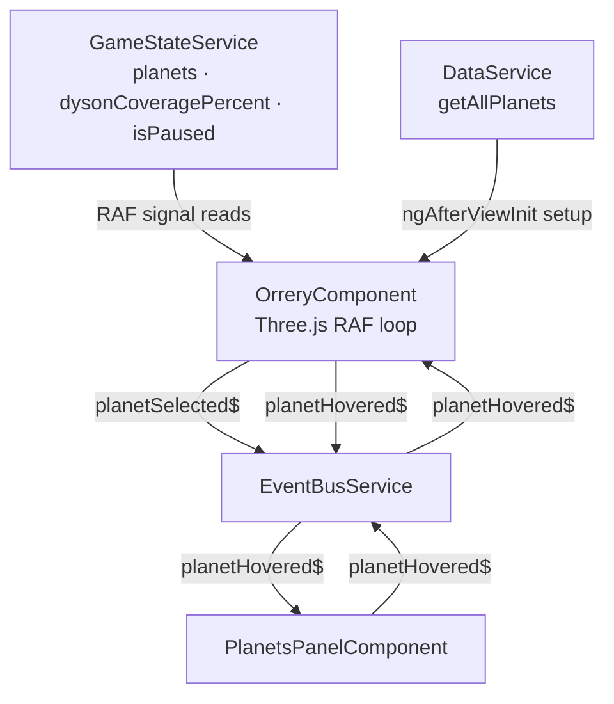

# Technical Implementation Plan: Block 6.1 — OrreryComponent (Three.js)

## 1. Architecture & Strategy

### System context

This is the centrepiece visual component — a real-time Three.js solar system rendered on a `<canvas>`. It sits inside `GameShellComponent` (Block 5) which owns the full-viewport layout. All 4 planets are always rendered; locked planets appear visually normal at rest and indicate their locked state only on hover (grey tint + `not-allowed` cursor). Clicking any planet, locked or not, emits `EventBus.planetSelected$`; `PlanetPanelComponent` (Block 7) handles the locked message. The orrery also cross-talks with `PlanetsPanelComponent` (already built in Block 5) via a new `EventBus.planetHovered$` Subject.

**Depends on**: Blocks 0–5 (all services, GameShell, PlanetsPanel).  
**Depended on by**: Block 7 (PlanetPanel subscribes to `planetSelected$`); future DysonSwarm shader block; future surface-shader block; future camera-zoom block.

### Architecture diagram



### Key design decisions

- **`PLANET_ORBITS` constant lives in the component file, not `planets.json`**: orbital radii, periods and initial angles are pure rendering constants with zero gameplay impact — not saved, not read by any service. Adding them to `PlanetData` would require retro-fitting the model (Block 0) and `DataService` (Block 1) for no gameplay gain.

- **`GameLoopService` is NOT injected**: the prompt listed it but it has no role here. The RAF loop gates orbital-angle advances via `gameState.isPaused()`, which is already available on `GameStateService`. Injecting `GameLoopService` would be dead code.

- **Cross-hover via `EventBus.planetHovered$`**: hover state is transient UI, not game state, so it does not belong in `GameStateService`. An RxJS `Subject<string | null>` on `EventBusService` is the correct bus. Both `OrreryComponent` and `PlanetsPanelComponent` emit it on mouse events and subscribe to it (with `takeUntilDestroyed`) to apply their respective highlight styles.

- **Separate `hitAreaMesh` per planet, NOT raycasting against the visible sphere or orbit torus**: the visible planet spheres are small at the default camera distance; the orbit tori are geometrically thin. Each planet gets an invisible `SphereGeometry` of radius ~2× the visual sphere for reliable raycasting. The orbit rings are never in the raycast target list.

- **`IntersectionObserver` gates RAF**: required by ARCHITECTURE.md. When the canvas is not visible (e.g. navigated away), the RAF is cancelled; it resumes on re-entry. This prevents GPU work while the orrery is off-screen.

- **`ResizeObserver` keeps the renderer in sync**: the orrery fills a flex/grid cell whose size changes when the planet panel slides in (Block 7). Without a resize handler the aspect ratio breaks. Update `renderer.setSize`, `camera.aspect`, and call `camera.updateProjectionMatrix()` on each resize.

- **Locked planets: normal appearance at rest, grey+disabled on hover**: permanently greying locked planets makes the UI feel dead. The grey tint appears only on `mouseenter` so the player gets clear feedback ("I cannot do this") at the moment it's needed, not as an ambient state.

- **Dyson swarm sphere opacity wired to `dysonCoveragePercent`**: the prompt mentions the Dyson sphere placeholder but leaves it disconnected. A single opacity lerp (`coverage / 100 * 0.4`) in the signal-read block at the top of RAF costs nothing and makes the placeholder useful immediately.

### Data flow

```
GameStateService.planets()          → per-frame: locked/unlocked state, atmosphereColor per planet
GameStateService.isPaused()         → per-frame: gate angle advances
GameStateService.dysonCoveragePercent() → per-frame: Dyson swarm sphere opacity
DataService.getAllPlanets()         → ngAfterViewInit: build meshes from visual.baseColor
EventBusService.planetSelected$.next(id) → on click (all planets, locked or not)
EventBusService.planetHovered$.next(id|null) → on mousemove / mouseleave
EventBusService.planetHovered$      → subscribe: apply highlight when PlanetsPanel hovers
```

Orbital angles are mutable rendering-only state stored in a `Map<string, number>` inside the component class. They are advanced each RAF frame (when not paused) and are deliberately NOT tied to `gameYear` — they are visual-only and do not round-trip through save/load.

---

## 2. Subtasks

### Milestone 1 — EventBus contract

- [ ] **`src/app/core/services/event-bus.service.ts`** — Add `planetHovered$ = new Subject<string | null>()`. No other changes. Emit `null` when the cursor leaves all planets.

---

### Milestone 2 — OrreryComponent: constants, types & shell

- [ ] **`src/app/features/orrery/orrery.component.ts`** — Replace the stub.

#### Private constant (top of file, outside class)

```ts
interface PlanetOrreryConfig {
  readonly orreryRadius: number;   // Three.js units from origin
  readonly orbitalPeriod: number;  // relative to Earth = 1.0
  readonly initialAngle: number;   // radians, spreads planets at game start
  readonly visualRadius: number;   // sphere radius for the visible mesh
  readonly hitRadius: number;      // sphere radius for the invisible hit area
}

const PLANET_ORBITS: Record<string, PlanetOrreryConfig> = {
  earth:   { orreryRadius: 11, orbitalPeriod: 1.000, initialAngle: 0,           visualRadius: 0.7, hitRadius: 1.4 },
  mercury: { orreryRadius: 5,  orbitalPeriod: 0.241, initialAngle: Math.PI,     visualRadius: 0.35, hitRadius: 0.9 },
  mars:    { orreryRadius: 17, orbitalPeriod: 1.881, initialAngle: Math.PI / 2, visualRadius: 0.55, hitRadius: 1.2 },
  venus:   { orreryRadius: 8,  orbitalPeriod: 0.615, initialAngle: Math.PI * 1.5, visualRadius: 0.6, hitRadius: 1.3 },
};

// Visual angular velocity multiplier — controls how fast planets orbit on-screen.
// Tune this constant post-playtest; it has no gameplay effect.
const ORBIT_SPEED_FACTOR = 0.0004; // radians per frame at 60 fps
```

`angularVelocity` per planet = `(1 / orbitalPeriod) * ORBIT_SPEED_FACTOR`.

#### Component shell

```ts
@Component({
  selector: 'app-orrery',
  standalone: true,
  changeDetection: ChangeDetectionStrategy.OnPush,
  templateUrl: './orrery.component.html',
  styleUrl:    './orrery.component.scss',
})
export class OrreryComponent implements AfterViewInit, OnDestroy {
  private readonly gameState  = inject(GameStateService);
  private readonly dataService = inject(DataService);
  private readonly eventBus   = inject(EventBusService);
  private readonly destroyRef  = inject(DestroyRef);

  @ViewChild('orreryCanvas') private readonly canvasRef!: ElementRef<HTMLCanvasElement>;

  // Three.js
  private _renderer!: THREE.WebGLRenderer;
  private _scene!: THREE.Scene;
  private _camera!: THREE.PerspectiveCamera;
  private _rafId: number | null = null;

  // Per-planet tracking
  private _planetAngles   = new Map<string, number>();   // current orbit angle (radians)
  private _planetMeshes   = new Map<string, THREE.Mesh>(); // visible spheres
  private _hitAreaMeshes  = new Map<string, THREE.Mesh>(); // invisible, raycasting only
  private _orbitRings     = new Map<string, THREE.Mesh>(); // torus rings (static)
  private _orbitMaterials = new Map<string, THREE.MeshStandardMaterial>();
  private _planetMaterials= new Map<string, THREE.MeshStandardMaterial>();

  // Sun/Dyson
  private _dysonSwarmMesh!: THREE.Mesh;
  private _dysonSwarmMaterial!: THREE.MeshStandardMaterial;

  // Interaction
  private _raycaster = new THREE.Raycaster();
  private _pointer   = new THREE.Vector2();
  private _hoveredPlanetId: string | null = null; // local only — no signal needed

  // Observers
  private _intersectionObserver: IntersectionObserver | null = null;
  private _resizeObserver: ResizeObserver | null = null;
}
```

**Template** (`orrery.component.html`): single line — `<canvas #orreryCanvas></canvas>`.

---

### Milestone 3 — `ngAfterViewInit`: scene setup

All Three.js object creation lives in private builder methods called from `ngAfterViewInit`. Keep the lifecycle hook itself short.

#### `ngAfterViewInit` body

```
1. _initRenderer(canvas)
2. _buildScene()
3. _buildCamera()
4. _buildLights()
5. _buildSun()
6. For each planet from dataService.getAllPlanets(): _buildPlanet(planetData)
7. _setupEventListeners(canvas)
8. _setupObservers(canvas)
9. _setupBusSubscriptions()
10. _animate()  // start RAF
```

#### `_initRenderer(canvas)`
- `new THREE.WebGLRenderer({ canvas, antialias: true, alpha: true })`
- `renderer.setPixelRatio(Math.min(window.devicePixelRatio, 2))`
- `renderer.setSize(canvas.clientWidth, canvas.clientHeight)`
- `renderer.toneMapping = THREE.ACESFilmicToneMapping`

#### `_buildCamera()`
- `PerspectiveCamera(45, aspect, 0.1, 500)`
- Position: `(0, 28, 12)`, lookAt: `(0, 0, 0)` — slightly angled above ecliptic plane, enough to show orbital depth while planets remain clearly separated.

#### `_buildLights()`
- `AmbientLight(0xffffff, 0.05)` — very dim, as per prompt.
- `DirectionalLight(0xfff4e0, 2.0)` at position `(0, 5, 0)` — from sun position (origin), pointing outward. Warm tint matches the sun's emissive.

#### `_buildSun()`
- Visual sphere: `SphereGeometry(1.2, 32, 32)`, `MeshStandardMaterial({ color: 0xffcc44, emissive: 0xff9900, emissiveIntensity: 1.2 })`. Not in raycasting list.
- Dyson swarm sphere: `SphereGeometry(1.6, 32, 32)`, `MeshStandardMaterial({ color: 0xffaa00, transparent: true, opacity: 0, wireframe: true, depthWrite: false })`. Store in `_dysonSwarmMesh` / `_dysonSwarmMaterial`.
  - `// TODO: replace wireframe Dyson swarm placeholder with DysonSwarm ShaderMaterial when implemented`

#### `_buildPlanet(planetData: PlanetData)`
- **Orbit ring**: `TorusGeometry(config.orreryRadius, 0.04, 8, 128)`, `MeshStandardMaterial({ color: 0xffffff, transparent: true, opacity: 0.08 })`. Store in `_orbitRings` and `_orbitMaterials`. Add to scene.
- **Visible sphere**: `SphereGeometry(config.visualRadius, 32, 32)`, `MeshStandardMaterial({ color: hexToThreeColor(planetData.visual.baseColor) })`. Store in `_planetMeshes` and `_planetMaterials`. Add to scene.
- **Hit area**: `SphereGeometry(config.hitRadius, 16, 16)`, `MeshBasicMaterial({ visible: false })`. Store in `_hitAreaMeshes`. Add to scene. Set `mesh.userData = { planetId: planetData.id }`.
- **Angle init**: `_planetAngles.set(planetData.id, PLANET_ORBITS[planetData.id].initialAngle ?? 0)`.
- Position visible sphere + hit area at initial angle: `x = cos(angle) * orreryRadius, z = sin(angle) * orreryRadius`.

#### `_setupEventListeners(canvas)`
- `canvas.addEventListener('click', this._onClick)` — uses `_raycaster` against `_hitAreaMeshes` values.
- `canvas.addEventListener('mousemove', this._onMouseMove)` — hover detection.
- `canvas.addEventListener('mouseleave', this._onMouseLeave)` — clear hover.
- Store handlers as arrow-function class fields so `removeEventListener` works in cleanup.

#### `_setupObservers(canvas)`
- **`IntersectionObserver`**: `isIntersecting ? _startRAF() : _stopRAF()`. Observe the canvas element.
- **`ResizeObserver`**: on each entry, call `_onResize(entry.contentRect)`. Observe the canvas element.

#### `_setupBusSubscriptions()`
```ts
this.eventBus.planetHovered$
  .pipe(takeUntilDestroyed(this.destroyRef))
  .subscribe(id => this._applyExternalHover(id));
```
`_applyExternalHover(id)`: highlight the matching planet mesh (emissive boost) and dim orbit ring of all others. This is the "PlanetsPanel hovered → orrery highlights" path.

---

### Milestone 4 — RAF loop (`_animate`)

Structure (strictly follows ARCHITECTURE.md canvas-component rules):

```ts
private _animate(): void {
  this._rafId = requestAnimationFrame(() => this._animate());

  // ── 1. Read ALL signals into locals — never call signal getters mid-render ──
  const isPaused        = this.gameState.isPaused();
  const planetsState    = this.gameState.planets();
  const dysonCoverage   = this.gameState.dysonCoveragePercent();

  // ── 2. Advance orbit angles (skip when game is paused) ──
  if (!isPaused) {
    for (const [id, config] of Object.entries(PLANET_ORBITS)) {
      const prev = this._planetAngles.get(id) ?? config.initialAngle;
      const angularVelocity = (1 / config.orbitalPeriod) * ORBIT_SPEED_FACTOR;
      this._planetAngles.set(id, prev + angularVelocity);
    }
  }

  // ── 3. Update planet positions ──
  for (const [id, config] of Object.entries(PLANET_ORBITS)) {
    const angle = this._planetAngles.get(id) ?? 0;
    const x = Math.cos(angle) * config.orreryRadius;
    const z = Math.sin(angle) * config.orreryRadius;
    this._planetMeshes.get(id)?.position.set(x, 0, z);
    this._hitAreaMeshes.get(id)?.position.set(x, 0, z);
  }

  // ── 4. Update planet visual state (locked/unlocked, atmosphereColor, hover) ──
  for (const [id, mat] of this._planetMaterials) {
    const planetState = planetsState[id];
    const isLocked    = planetState === undefined;
    const isHovered   = this._hoveredPlanetId === id;

    if (isHovered && isLocked) {
      // Locked hover: grey tint to communicate "cannot interact"
      mat.color.set(0x888888);
      mat.emissiveIntensity = 0;
    } else if (isHovered && !isLocked) {
      // Unlocked hover: emissive highlight
      mat.emissiveIntensity = 0.25;
    } else {
      // At rest: restore base color from current atmosphereColor or visual.baseColor
      const baseHex = planetState?.visualParams?.atmosphereColor
        ?? this.dataService.getPlanet(id).visual.baseColor;
      mat.color.set(baseHex);
      mat.emissiveIntensity = 0;
    }
    // TODO: update ShaderMaterial uniforms here when planet surface shaders are added
  }

  // ── 5. Update Dyson swarm opacity ──
  this._dysonSwarmMaterial.opacity = (dysonCoverage / 100) * 0.4;

  // ── 6. Render ──
  this._renderer.render(this._scene, this._camera);
}
```

**Pitfall**: `this.dataService.getPlanet(id)` is a synchronous cache lookup (no fetch) — safe to call in the RAF loop. Still, prefer reading `visualParams.atmosphereColor` from the planet state when available, falling back to `visual.baseColor` only for locked planets or before terraforming has mutated the state.

---

### Milestone 5 — Interaction handlers

#### `_onClick = (event: MouseEvent): void`
1. Compute normalised device coordinates from `event.offsetX / canvas.width` etc.
2. `_raycaster.setFromCamera(_pointer, _camera)`.
3. `_raycaster.intersectObjects([..._hitAreaMeshes.values()])` — only hit areas, never orbit tori.
4. If intersection: `const planetId = hit.object.userData['planetId']` → `eventBus.planetSelected$.next(planetId)`.
5. No distinction between locked/unlocked at click time — `PlanetPanelComponent` handles locked state in Block 7.

#### `_onMouseMove = (event: MouseEvent): void`
1. Normalise pointer coordinates.
2. `_raycaster.setFromCamera(_pointer, _camera)`.
3. Intersect against `_hitAreaMeshes.values()`.
4. Derive `newHoveredId: string | null = intersections[0]?.object.userData['planetId'] ?? null`.
5. If `newHoveredId !== _hoveredPlanetId`:
   - `_hoveredPlanetId = newHoveredId`.
   - `eventBus.planetHovered$.next(newHoveredId)`.
   - Update `canvas.style.cursor`:
     - `newHoveredId === null` → `'default'`
     - Locked planet (`planetsState[newHoveredId] === undefined`) → `'not-allowed'`
     - Unlocked → `'pointer'`
   - Note: reading `gameState.planets()` here (outside RAF) is acceptable — this is an event handler, not mid-render. Only the RAF callback must use the "read locals at top" discipline.

#### `_onMouseLeave = (): void`
- `_hoveredPlanetId = null`.
- `eventBus.planetHovered$.next(null)`.
- `canvas.style.cursor = 'default'`.

#### `_applyExternalHover(id: string | null)` (from EventBus subscription)
- When PlanetsPanel emits a hovered planet: apply a subtle emissive boost to that planet mesh and slightly brighten its orbit ring. All other planets' orbit rings dim to standard opacity.
- When `id === null`: restore all orbit rings to standard opacity, clear any external-hover emissive.
- **Separate this from `_hoveredPlanetId`** (which tracks local orrery hover) — use a separate `_externalHoveredPlanetId: string | null` field. The RAF loop checks both when determining material state.

---

### Milestone 6 — Resize & observer helpers

#### `_onResize({ width, height }: DOMRectReadOnly): void`
```ts
if (width === 0 || height === 0) return;
this._renderer.setSize(width, height, false);
this._camera.aspect = width / height;
this._camera.updateProjectionMatrix();
```
`false` as third arg to `setSize` prevents Three.js from overriding the canvas CSS dimensions.

#### `_startRAF() / _stopRAF()`
```ts
private _startRAF(): void {
  if (this._rafId !== null) return;
  this._animate();
}
private _stopRAF(): void {
  if (this._rafId !== null) {
    cancelAnimationFrame(this._rafId);
    this._rafId = null;
  }
}
```

---

### Milestone 7 — `ngOnDestroy`: full cleanup

```ts
ngOnDestroy(): void {
  // 1. Cancel RAF
  this._stopRAF();

  // 2. Disconnect observers
  this._intersectionObserver?.disconnect();
  this._resizeObserver?.disconnect();

  // 3. Remove DOM event listeners
  const canvas = this.canvasRef.nativeElement;
  canvas.removeEventListener('click', this._onClick);
  canvas.removeEventListener('mousemove', this._onMouseMove);
  canvas.removeEventListener('mouseleave', this._onMouseLeave);

  // 4. Dispose Three.js resources — GPU leak prevention (most reviewed rule in codebase)
  this._scene.traverse(obj => {
    if (obj instanceof THREE.Mesh) {
      obj.geometry.dispose();
      if (Array.isArray(obj.material)) {
        obj.material.forEach(m => m.dispose());
      } else {
        obj.material.dispose();
      }
    }
  });
  this._renderer.dispose();

  // 5. Clear Maps
  this._planetMeshes.clear();
  this._hitAreaMeshes.clear();
  this._orbitRings.clear();
  this._planetMaterials.clear();
  this._orbitMaterials.clear();
  this._planetAngles.clear();
}
```

`takeUntilDestroyed(this.destroyRef)` handles the EventBus subscription automatically — no manual teardown needed there.

---

### Milestone 8 — SCSS

**`src/app/features/orrery/orrery.component.scss`**

```scss
:host {
  display: block;
  width: 100%;
  height: 100%;
}

canvas {
  display: block;
  width: 100%;
  height: 100%;
}
```

No tokens needed — the component outputs no HTML elements other than the canvas. Cursor is controlled programmatically.

---

### Milestone 9 — PlanetsPanelComponent: hover cross-talk

The existing `PlanetsPanelComponent` needs three small additions. No structural changes.

**`src/app/features/hud/planets-panel/planets-panel.component.ts`**

1. Add `private readonly destroyRef = inject(DestroyRef)` (likely already present — check).
2. Add `readonly hoveredPlanetId = signal<string | null>(null)` (private writable, no `.asReadonly()` needed — read directly in template).
3. In constructor: subscribe to `eventBus.planetHovered$` → `this.hoveredPlanetId.set(id)`.
4. Add `onRowMouseEnter(id: string)` → `eventBus.planetHovered$.next(id === 'moon' ? 'earth' : id)`.
5. Add `onRowMouseLeave()` → `eventBus.planetHovered$.next(null)`.
6. Template: add `(mouseenter)="onRowMouseEnter(row.id)"` and `(mouseleave)="onRowMouseLeave()"` to each row element.
7. Template/SCSS: apply `class.is-hovered` binding using `hoveredPlanetId() === row.id` (or `=== 'earth'` for Moon row when `hoveredPlanetId() === 'earth'`). Style this as an accent-colour highlight distinct from the existing `is-selected` style.

**`src/app/features/hud/planets-panel/planets-panel.component.scss`** — add:
```scss
.planets-panel__row.is-hovered {
  background-color: var(--color-surface-hover);
  // Use a separate token/modifier from is-selected to avoid visual confusion
}
```
If `--color-surface-hover` doesn't exist in `tokens.scss`, add it there (a slightly lighter variant of `--color-surface-raised`).

---

### Milestone 10 — TODO.md

- Mark the existing `OrreryComponent — Three.js orrery implementation` TODO as completed (with date 2026-06-11).

---

## 3. Out of scope (deferred)

| Feature | Deferred to |
|---|---|
| DysonSwarm `ShaderMaterial` | Dyson shader block (later) |
| Planet surface shaders / layer textures | Surface shader block (later) |
| Smooth camera zoom transition on planet select | Post-playtest polish block |
| `tokens.scss` `--color-surface-hover` token | Add if missing, otherwise use closest existing token |

---

## 4. Verification checklist

- [ ] `npx ng build` — zero errors, zero `any` warnings.
- [ ] `npx ng test` — all existing tests still green; new `orrery.component.spec.ts` green.
- [ ] Manual: orrery renders with sun + 4 planets orbiting smoothly in the game view.
- [ ] Manual: hovering a locked planet (Mercury/Mars/Venus at game start) → planet goes grey, cursor shows `not-allowed`.
- [ ] Manual: hovering an unlocked planet → cursor shows `pointer`, planet emissive brightens slightly.
- [ ] Manual: hover a row in PlanetsPanel → matching planet in orrery emissive-highlights.
- [ ] Manual: hover a planet in orrery → matching row in PlanetsPanel shows hover highlight.
- [ ] Manual: clicking a locked planet → PlanetPanel opens (or shows locked state — Block 7 behaviour).
- [ ] Manual: clicking an unlocked planet → PlanetPanel opens with correct planet data.
- [ ] Manual: resize window / drag planet panel open → orrery canvas re-fits, no distortion.
- [ ] Manual: navigate to title screen and back → no GPU memory leak (Chrome DevTools → Performance Monitor → GPU Memory stable).
- [ ] Manual: pause game → planets stop orbiting; resume → orbiting resumes.
- [ ] Manual: Dyson swarm wireframe sphere is invisible at game start (coverage = 0) and becomes visible as `dysonCoveragePercent` grows (test by temporarily mutating the signal in DevTools).

---

## 5. Test outline

**`src/app/features/orrery/orrery.component.spec.ts`**

```ts
// Mock THREE globally — full WebGL renderer cannot run in Vitest/jsdom.
// Use jest-three or manual mock that stubs WebGLRenderer, Scene, etc.

describe('OrreryComponent', () => {
  it('creates without error when injected with stub services');
  it('calls renderer.dispose() in ngOnDestroy');
  it('calls cancelAnimationFrame in ngOnDestroy');
  it('emits planetSelected$ when _onClick fires on a hit area mesh');
  it('emits planetHovered$(id) on mousemove intersection');
  it('emits planetHovered$(null) on mouseleave');
  it('does NOT advance orbit angles when isPaused() is true');
  it('updates dyson swarm opacity proportionally to dysonCoveragePercent');
  it('applies grey color to hovered locked planet material');
  it('restores base color when hover leaves a locked planet');
});
```

Approach: provide minimal fakes for `GameStateService`, `DataService`, `EventBusService`. Return a fixed set of 2 planets (Earth + Mars) from `getAllPlanets()` to keep test surface small. The Three.js renderer stub should capture `dispose()` calls to verify cleanup.
