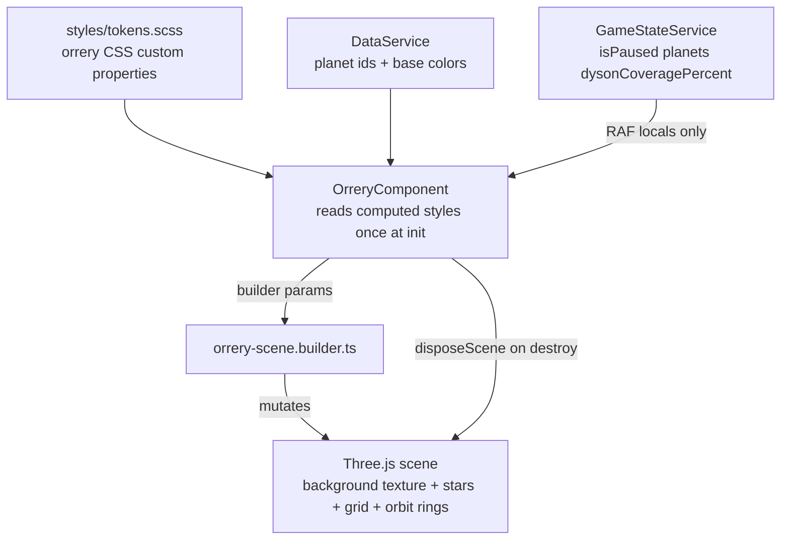

# Technical Implementation Plan: Block 18.1 — Orrery Background, Starfield, Grid, Orbit Lines

## 1. Architecture & Strategy

### System context

This block is a narrow visual patch on top of the existing Three.js orrery from Block 6. It keeps the current component/builder split: `orrery.component.ts` continues to own Angular lifecycle, RAF discipline, hover/click handling, observers, and teardown, while `orrery-scene.builder.ts` becomes the single place that constructs and disposes backdrop visuals and orbit-line materials.

It depends only on the current orrery implementation, design tokens, and existing `DataService` planet content. It deliberately stops before the later Block 18 work that owns planet textures (18-2), flat day/night lighting and camera reframing (18-3), post-process glow/pixelation (18-4), and orbit-ring interaction changes (18-5).

### Active TODO check

`docs/agents/TODO.md` contains no deferred item that becomes implementable inside this block. Existing orrery TODOs for moon/probe transit visuals and camera zoom remain out of scope and should stay deferred.

### Architecture diagram

### Key design decisions

- **Builder owns generated textures and backdrop objects**: the gradient texture, starfield geometry/material, optional feature stars, and grid line segments should all be created in `orrery-scene.builder.ts`, not in the Angular component. That keeps them testable as pure-ish scene helpers and preserves the current separation where the component manages lifecycle but does not decide Three.js construction details.

- **Use generated `CanvasTexture` for the background, not CSS behind the canvas**: the prompt wants the background centred on the sun inside scene space, disposable with the Three.js scene, and testable from the builder. A generated texture assigned to `scene.background` satisfies all three and avoids DOM layering hacks.

- **Pass resolved token values into the builder as parameters**: AGENTS.md forbids hardcoded hex values in TypeScript. The component should resolve CSS custom properties once from `getComputedStyle(document.documentElement)` during setup, build a typed `OrreryBackdropPalette`, and pass it into builder functions. No per-frame token reads.

- **Backdrop stays mostly static; only optional starfield rotation is frame-updated**: the gradient and grid never change after creation. The starfield may optionally rotate at an imperceptible speed, but the parameter defaults to `0` and is updated from a cached `THREE.Points` reference without allocations or signal reads in RAF.

- **Keep existing orbit-ring mesh pattern for Block 18-5 compatibility**: this block should recolor and re-opacity the current visible orbit rings rather than replacing them with a different primitive. Block 18-5 will add ring hit proxies and hover behavior later; this block should not make that harder.

### Data flow

- **Read from `GameStateService` in RAF**: unchanged from today. This block does not add new signals or mutations.
- **Read from CSS tokens once at scene setup**: `OrreryComponent` resolves `--orrery-bg-core`, `--orrery-bg-edge`, `--orrery-grid`, `--orrery-orbit`, and optionally `--orrery-star` / `--orrery-star-feature` into strings and passes them to the builder.
- **Read from `DataService` once at scene setup**: unchanged planet iteration to create planet/orbit objects.
- **Mutable render-only state**: a new cached `THREE.Points` reference for starfield, and optionally a `THREE.Group` or `THREE.LineSegments` reference for grid if the component needs direct access. None of this enters `GameStateService` or save data.

### Patterns & conventions to follow

- Signals remain in `GameStateService`; no new app state for backdrop visuals.
- No new timers or effects; continue using the existing RAF loop and observer lifecycle.
- No hardcoded colors in TypeScript; use CSS tokens only.
- No allocation inside RAF; read all signals once into locals at the top as the current component already does.
- Three.js cleanup must include generated `CanvasTexture`, `BufferGeometry`, `PointsMaterial`, `LineBasicMaterial`, and any helper meshes or groups.

---

## 2. Subtasks

Layer-by-layer summary first:

- **Models**: no app model changes.
- **JSON data**: no new `public/data/*.json` content; backdrop is purely visual and tunable through builder defaults + tokens.
- **Core services**: no service changes.
- **System services**: no service changes.
- **Shared utilities/components**: none required unless the developer chooses to extract a tiny token-reading helper; not necessary for this block.
- **Feature component/builder**: all functional work lives here.
- **Styles/tokens**: add new orrery-specific visual tokens.
- **Assets**: none; all visuals are generated in code.
- **App wiring**: none.
- **Tests**: add focused unit/spec coverage for builder output and component setup/teardown expectations.

### Milestone 1 — Design tokens and typed builder config

- [ ] `src/styles/tokens.scss` — add the new orrery backdrop tokens.
  Responsibility: define the palette and base visual defaults that TypeScript will consume indirectly.
  Planned tokens:
  - `--orrery-bg-core`
  - `--orrery-bg-edge`
  - `--orrery-grid`
  - `--orrery-orbit`
  - `--orrery-star`
  - `--orrery-star-feature`
  Pitfalls:
  - Keep them aligned with the GDD visual direction: retro-functional, dark backgrounds, warm amber/orange accents, mission-control aesthetic.
  - Use token names that still make sense when 18-3/18-4 add more visual layers.
  Test: no dedicated spec; exercised indirectly by component setup and manual visual verification.

- [ ] `src/app/features/orrery/orrery-scene.builder.ts` — introduce typed config interfaces near the top of the file.
  Responsibility: make the new visuals tunable without editing internals.
  Planned interfaces:
  - `OrreryBackdropPalette`
  - `OrreryStarfieldOptions`
  - `OrreryGridOptions`
  - `OrreryOrbitStyleOptions`
  - `OrreryBackdropObjects` return shape for created resources
  Suggested defaults, documented in a short comment block:
  - `starCount: 320`
  - `featureStarCount: 8`
  - `starfieldRotationSpeed: 0`
  - `gridOpacity: 0.14`
  - `orbitOpacity: 0.12`
  - `showRadialSpokes: true`
  - `radialSpokeCount: 12`
  Pitfalls:
  - Keep this rendering-only; do not leak these knobs into application state.
  - Defaults should be comments or exported constants, not magic values embedded repeatedly.
  Test: `orrery-scene.builder.spec.ts` should verify default application and output object structure.

### Milestone 2 — Background gradient and starfield builders

- [ ] `src/app/features/orrery/orrery-scene.builder.ts` — add a generated radial-background builder.
  Responsibility: create a disposable `CanvasTexture` and assign it to `scene.background`.
  Planned signature:
  `buildBackground(scene: THREE.Scene, palette: OrreryBackdropPalette): THREE.CanvasTexture`
  Implementation shape:
  - Create an offscreen canvas, likely square (`1024x1024` is sufficient for this layer).
  - Draw a radial gradient with the bright centre biased to the sun's apparent position in frame, not dead-centre of the texture if the camera framing currently places the sun slightly below centre.
  - Use `palette.backgroundCore` and `palette.backgroundEdge` only.
  - Mark the texture color space consistently with the renderer setup if needed.
  Pitfalls:
  - Do not leave the canvas texture untracked; `scene.background` alone is not enough for disposal.
  - Keep the gradient subtle enough that 18-4 glow still has room to add value.
  Test: `orrery-scene.builder.spec.ts` should verify a `CanvasTexture` is returned and assigned.

- [ ] `src/app/features/orrery/orrery-scene.builder.ts` — add a starfield builder using one geometry and one material.
  Responsibility: produce a cheap static backdrop `THREE.Points` set.
  Planned signature:
  `buildStarfield(scene: THREE.Scene, options: OrreryStarfieldOptions): THREE.Points`
  Implementation shape:
  - Single `BufferGeometry` with positions distributed behind the orbital plane, wide enough to fill the view.
  - Single `PointsMaterial` using warm-white token color, additive blending, transparent opacity.
  - Use vertex attributes or a compromise strategy for varied point sizes; if per-star size is awkward with plain `PointsMaterial`, split size variation into positional depth plus a small range of feature-star coordinates encoded into the same geometry as slightly offset or duplicated samples. Keep one geometry, one material.
  - Optional feature stars come from the same generation pass, governed by `featureStarCount`.
  Pitfalls:
  - Avoid overbuilding with custom shaders in this block; keep it cheap and disposable.
  - The starfield must not share orbital rotation with planets.
  - If the implementation uses `sizeAttenuation`, keep scale gentle so stars do not read as particles.
  Test: `orrery-scene.builder.spec.ts` should verify one `Points` object, expected counts, and scene attachment.

### Milestone 3 — Ecliptic grid and orbit-line recolor

- [ ] `src/app/features/orrery/orrery-scene.builder.ts` — add a faint ecliptic-grid builder aligned to orbit radii.
  Responsibility: draw low-opacity blueprint-like rings and optional radial spokes on `y = 0`.
  Planned signature:
  `buildEclipticGrid(scene: THREE.Scene, orbitConfigs: Record<string, PlanetOrreryConfig>, options: OrreryGridOptions): THREE.Object3D`
  Implementation shape:
  - Generate concentric circles that match the existing `PLANET_ORBITS` radii so the grid reinforces the orbits already in view.
  - Use `LineSegments` or grouped `LineLoop` objects with a shared faint-blue material.
  - Optionally add evenly spaced radial spokes from the sun out to the outer orbit.
  - Slightly offset the grid above or below exact `y = 0` if needed to prevent z-fighting with orbit-ring meshes.
  Pitfalls:
  - This is an atmospheric guide plane, not a tactical map. Keep opacity low and line count restrained.
  - Use a single shared material wherever possible.
  Test: `orrery-scene.builder.spec.ts` should verify ring count matches configured radii and spoke toggling works.

- [ ] `src/app/features/orrery/orrery-scene.builder.ts` — extend `buildPlanetObjects()` to accept orbit style parameters.
  Responsibility: recolor the existing visible orbit rings from white to the faint-blue family.
  Planned change:
  - Add an `orbitStyle: OrreryOrbitStyleOptions` parameter.
  - Construct `ringMat` using `orbitStyle.color` and `orbitStyle.opacity` instead of hardcoded white/0.08.
  Pitfalls:
  - Keep the ring mesh primitive and thickness unchanged in this block.
  - Preserve current return shape so the component's hover logic remains intact until 18-5 changes it.
  Test: `orrery-scene.builder.spec.ts` should assert orbit material color/opacity come from inputs.

### Milestone 4 — Component wiring, token resolution, RAF-safe updates, teardown

- [ ] `src/app/features/orrery/orrery.component.ts` — resolve tokens once during scene setup and pass new builder params.
  Responsibility: remain the orchestration layer for the scene builder.
  Planned additions:
  - A private helper such as `_readBackdropPalette()` that calls `getComputedStyle(document.documentElement)` once and returns token strings.
  - Local backdrop-option constants for star count, grid opacity, orbit opacity, and rotation speed. These are builder parameters, not signals.
  - Cached references for the returned background texture and starfield object if direct per-frame rotation update is needed.
  Pitfalls:
  - No token reads inside RAF.
  - No direct DOM styling hacks behind the canvas.
  - Keep setup order sensible: background/lights/sun/backdrop, then planets.
  Test: `orrery.component.spec.ts` should verify builder helpers are invoked and listeners/observers still clean up.

- [ ] `src/app/features/orrery/orrery.component.ts` — minimally extend the RAF loop for optional starfield rotation.
  Responsibility: keep backdrop static by default, but allow the builder parameter to be animated cheaply.
  Planned change:
  - After existing signal reads and planet updates, rotate the starfield object around `y` only if `starfieldRotationSpeed !== 0`.
  - Use a cached numeric field, not a signal.
  Pitfalls:
  - No allocations.
  - No new signal reads.
  - Do not tie starfield motion to game pause unless explicitly chosen; for a pure backdrop, either always advance slowly or document that pause freezes all scene motion for consistency.
  Test: `orrery.component.spec.ts` can verify the branch is inert when speed is zero; full visual motion stays a manual check.

- [ ] `src/app/features/orrery/orrery-scene.builder.ts` — strengthen `disposeScene()` so non-mesh render objects are cleaned up.
  Responsibility: make this block's new Points, lines, and background texture disposable in the existing traversal path.
  Planned change:
  - Dispose `scene.background` when it is a `THREE.Texture`.
  - Traverse and dispose `BufferGeometry` and `Material` on `THREE.Points`, `THREE.Line`, and `THREE.LineSegments`, not just `THREE.Mesh`.
  - Continue `renderer.dispose()` at the end.
  Pitfalls:
  - This is the root-cause cleanup fix this block needs; otherwise the prompt's non-negotiable disposal requirement is not met.
  - Avoid double-disposing shared materials by keeping traversal logic tolerant of repeated disposal.
  Test: `orrery-scene.builder.spec.ts` should include disposal coverage for background texture and non-mesh objects.

### Milestone 5 — Tests

- [ ] `src/app/features/orrery/orrery-scene.builder.spec.ts` — new focused builder spec.
  Responsibility: cover pure scene-construction behavior without Angular.
  Cases to include:
  - `buildBackground()` assigns and returns a `CanvasTexture`.
  - `buildStarfield()` creates one `THREE.Points` with one geometry and one material.
  - `buildEclipticGrid()` creates concentric geometry aligned to supplied orbit radii.
  - `buildPlanetObjects()` uses passed orbit color/opacity values.
  - `disposeScene()` disposes meshes, points, lines, and `scene.background` textures.
  Pitfalls:
  - Keep assertions structural and disposal-focused; do not overfit to exact random coordinates.

- [ ] `src/app/features/orrery/orrery.component.spec.ts` — new component-level wiring spec.
  Responsibility: cover setup orchestration and teardown, not WebGL rendering output.
  Cases to include:
  - Component builds the scene after view init and registers observers/listeners.
  - Destroy disconnects observers, removes manual listeners, and calls cleanup.
  - Token-resolution helper returns required palette fields.
  - Optional starfield rotation path is skipped when configured speed is zero.
  Pitfalls:
  - Mock builder functions and renderer where useful; do not turn this into an integration test for Three.js itself.

---

## 3. Assets (placeholders)

No external placeholder assets are required for this block. The background and starfield are generated in code as disposable canvas/Three.js resources. Planet/sun placeholder textures belong to Block 18-2.

---

## 4. Cross-cutting concerns

### Edge cases & pitfalls

- The background gradient centre should visually align with the sun's framed position, not blindly assume the middle of the canvas.
- Orbit-grid lines must avoid z-fighting with the existing orbit torus meshes.
- Feature-star count should tolerate `0` without creating a second object or special-case scene path.
- The builder should handle an empty or filtered planet set gracefully even though production data currently includes all four planets.
- Keep the orbit-ring hover opacity logic in `orrery.component.ts` compatible with the new base opacity so 18-5 can later swap to ring-only highlight behavior cleanly.

### Save/load

No save-schema impact. All new visuals are rebuilt on component mount from tokens and builder defaults. No render-only state needs serialisation.

### Memory & performance

- Gradient texture is generated once at setup, never in RAF.
- Starfield uses one geometry and one material.
- Grid should reuse shared materials and keep line counts low.
- `disposeScene()` must be upgraded so this block does not leak GPU memory on repeated mount/unmount cycles.
- No per-frame signal reads beyond the existing `isPaused`, `planets`, and `dysonCoveragePercent` locals.

### Accessibility & motion

- Token-driven colors preserve future theming and high-contrast adjustments.
- The starfield rotation default remains `0` so reduced-motion users are not forced into extra ambient movement.
- If ambient rotation is enabled later, keep it subtle enough that the orrery still reads as calm rather than noisy.

---

## 5. Out of scope / deferred

- **Block 18-2**: procedural placeholder textures for planets and sun surfaces.
- **Block 18-3**: flat day/night shading, light-rig cleanup, and camera re-framing.
- **Block 18-4**: post-processing pixelation, atmosphere glow, sun glow.
- **Block 18-5**: hoverable/clickable orbit rings, hit proxies, ring-only highlight behavior, and removing the current locked-planet gray-out interaction.
- **Block 22 / existing TODOs**: terraforming-driven texture cross-fades and moon/probe transit visuals.

---

## 6. Verification

- [ ] `ng build` succeeds with no new errors.
- [ ] Add and run focused specs for `orrery-scene.builder.spec.ts` and `orrery.component.spec.ts`.
- [ ] `ng test` passes if the workspace test runner is healthy.
- [ ] If Vitest still fails on the known repo-wide `@app/*` alias issue, record that as a pre-existing tooling problem and treat `ng build` plus the focused spec signal as the authoritative validation for this block.
- [ ] Manual checks:
  - open the game and confirm the black/transparent background is replaced by a warm radial backdrop centred on the sun
  - confirm the starfield sits behind the orbits and does not move with planets
  - confirm the ecliptic grid is faint, blue, concentric, and does not overpower the scene
  - confirm orbit rings render in the new faint-blue family and still respond to the existing hover opacity change
  - switch away from and back to the game view to ensure no console disposal errors and no obvious GPU/resource leak symptoms
  - resize the window / open the planet panel to confirm the scene still fills correctly
- [ ] Ask the user to playtest the revised orrery backdrop manually after implementation.

---

## 7. References

- GDD: `docs/GDD/main-gdd.md`
- Architecture: `docs/agents/ARCHITECTURE.md`
- Current implementation: `src/app/features/orrery/orrery.component.ts`, `src/app/features/orrery/orrery-scene.builder.ts`
- Prompt block: `docs/agents/prompts/18-1-orrery-background-grid.txt`
- Adjacent prompts: `docs/agents/prompts/18-2-orrery-planet-textures.txt`, `docs/agents/prompts/18-3-orrery-daynight-lighting.txt`, `docs/agents/prompts/18-5-orrery-orbit-interaction.txt`