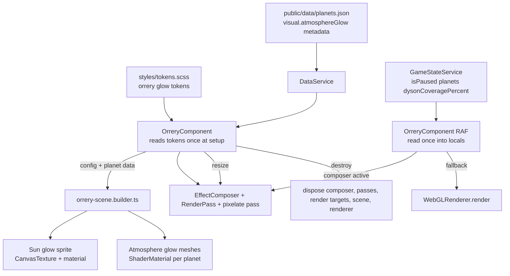

# Technical Implementation Plan: Block 18.4 — Orrery Pixelate, Sun Glow, Atmosphere Glow

## 1. Architecture & Strategy

### System context

Block 18.4 is the final visual layer in the post-playtest orrery overhaul. It sits on top of the existing Three.js component/builder split: `OrreryComponent` owns Angular lifecycle, RAF, resize, observers, render routing, and teardown; `orrery-scene.builder.ts` owns cheap render objects, generated textures, materials, and scene disposal helpers.

This feature reads static planet metadata from `DataService` / `public/data/planets.json` and runtime `GameStateService` signals once per RAF frame. It does not mutate game state and does not create save data. The primary risk is GPU resource leakage from `EffectComposer`, render targets, generated `CanvasTexture`s, shader materials, and glow meshes, so cleanup must be designed before visuals are tuned.

### Active TODO check

`docs/agents/TODO.md` has no deferred TODO that becomes implementable inside Block 18.4. Existing orrery TODOs for moon/probe transit visuals and selected-planet camera zoom remain deferred; this block should not start them.

### Architecture diagram

### Key design decisions

- **One documented `OrreryVisualEffectsConfig` object**: pixelation, sun glow, and atmosphere glow should be tuned from one exported config shape with defaults, not scattered constants. The default config lives near the builder rendering defaults and is supplied to the component. It remains render-only configuration, not saved game state.

- **Use `RenderPixelatedPass` if available in Three 0.184, otherwise a tiny custom pass**: try the official `three/examples/jsm/postprocessing/RenderPixelatedPass.js` first because it is already part of the `three` dependency. If TypeScript/examples exports make that awkward, use a local custom pixelate `ShaderPass` setup in the component. Do not add a new dependency.

- **Component owns post-processing lifecycle**: `EffectComposer`, `RenderPass`, and pixelate pass depend on renderer/camera/scene/canvas size, so `OrreryComponent` should construct and dispose them. The builder should not know about Angular lifecycle or resize observers.

- **Builder owns glow render objects**: sun glow texture/material/sprite and atmosphere glow mesh/material creation belong in `orrery-scene.builder.ts`, matching the existing pattern for sun, planets, background, starfield, and disposal.

- **Atmosphere metadata is JSON-driven**: current planet data has `initialState.atmosphereColor` and `atmosphereDensity`, but no explicit static atmosphere-glow flag/strength. Add `visual.atmosphereGlow` metadata so Mercury can opt out and Earth/Venus/Mars can define defaults without TypeScript planet-id hardcoding.

- **No bloom by default**: the prompt allows optional `UnrealBloomPass`, but the default plan should avoid it. A generated radial sun sprite plus additive atmosphere shells is cheaper, easier to tune, and simpler to dispose. If bloom is added later, it must be behind the same config and include explicit render-target disposal.

### Data flow

`OrreryComponent.ngAfterViewInit()` reads tokens once via `getComputedStyle(document.documentElement)`, merges them with `DEFAULT_ORRERY_VISUAL_EFFECTS_CONFIG`, builds the normal scene, then optionally creates the post-processing chain. It passes sun/atmosphere options to builder helpers while iterating static planet data.

In `_animate()`:

1. Read `isPaused`, `planetsState`, and `dysonCoveragePercent` into locals at the top, as today.
2. Advance render-only orbit angles only when unpaused.
3. Update planet meshes, texture/layer uniforms, hit areas, and atmosphere glow mesh positions together from the same computed `x/z` orbit position.
4. Update atmosphere glow uniforms from `planetsState[id]?.visualParams.atmosphereColor` and `atmosphereDensity`, falling back to static `initialState`, multiplied by static JSON glow defaults and global config. Reuse existing `THREE.Color` and `Vector3` uniform objects; no per-frame allocation.
5. Keep the sun glow at the sun origin and billboard it toward the existing camera. Prefer `sunGlow.sprite.quaternion.copy(this._camera.quaternion)` over `lookAt()` to avoid per-frame target allocation.
6. Route rendering through `composer.render()` only when pixel post-processing is active; otherwise call `renderer.render(scene, camera)`.

No system service reacts via `effect()` and no mutation methods are called.

### Patterns & conventions to follow

- Signals are read once at the top of RAF; no signal getters mid-render.
- No game logic in the component; this is render-only visual state.
- No hardcoded colors in TypeScript. Sun-glow default color comes from a token. Atmosphere colors come from `PlanetVisualParams` / `PlanetInitialState` / `visual.atmosphereGlow.color` in JSON.
- No per-frame texture, material, geometry, array, `Color`, or `Vector3` allocation.
- All generated Three.js resources must be disposed explicitly, including composer render targets.

---

## 2. Subtasks

Layer-by-layer summary:

- **Models**: extend planet visual metadata for atmosphere glow.
- **JSON data**: add per-planet atmosphere-glow flags/default strengths to `public/data/planets.json`.
- **Core services**: no new state or mutations; `DataService` should already surface typed `PlanetData`.
- **System services**: none.
- **Shared utilities/components**: none.
- **Feature builder/component**: main implementation.
- **Styles/tokens**: add sun-glow token(s) consumed once at setup.
- **Assets**: no external assets; generated `CanvasTexture` only.
- **App wiring**: none.
- **Tests**: model validation, builder construction/disposal, component render routing/resize/cleanup.

### Milestone 1 — Config contract, tokens, and planet data

- [ ] `src/app/features/orrery/orrery-scene.builder.ts` — add exported config interfaces and defaults.
  Responsibility: define one tuning surface for the entire feature.
  Planned shapes:
  - `OrreryPixelateConfig`: `enabled`, `pixelSize`.
  - `OrrerySunGlowConfig`: `enabled`, `size`, `color`, `intensity`, optional `textureSize`.
  - `OrreryAtmosphereGlowConfig`: `enabled`, `thickness`, `intensity`.
  - `OrreryVisualEffectsConfig`: `{ pixelate, sunGlow, atmosphereGlow }`.
  - `DEFAULT_ORRERY_VISUAL_EFFECTS_CONFIG` with subtle defaults: pixelate enabled with a small pixel size, sun glow warm and moderate, atmosphere glow enabled but thin.
  Pitfalls:
  - The default object should be documented and exported so the user can tune it in one place.
  - Do not include token fallback hex literals in TS. If a token is missing, prefer a named token read that returns an empty string and let tests catch it, or use an existing token read path from component setup.
  Test: builder spec asserts defaults are present and documented by name; component spec can assert token color is merged into config.

- [ ] `src/styles/tokens.scss` — add or confirm token(s) for sun glow color.
  Responsibility: give TypeScript a CSS custom property to read for the warm amber glow.
  Planned token:
  - `--orrery-sun-glow: var(--color-accent-glow)` or a direct token value if SCSS/CSS variable usage is acceptable in computed style output.
  Optional:
  - `--orrery-atmosphere-glow-earth`, `--orrery-atmosphere-glow-mars`, etc. are not necessary if planet JSON owns atmosphere colors.
  Pitfalls:
  - Component reads computed token values once at setup; no token reads in RAF.
  - If `getComputedStyle()` returns unresolved `var(...)` for chained custom properties in tests/browser, prefer direct token value or read `--color-accent-glow` as fallback in component helper.
  Test: component palette/config helper spec should include the new token.

- [ ] `src/app/core/models/planet.model.ts` — add atmosphere-glow metadata under `PlanetVisualData`.
  Responsibility: make the atmosphere glow data-driven.
  Planned interface:
  - `PlanetAtmosphereGlowData` with `enabled: boolean`, optional `color?: string`, optional `intensity?: number`.
  - `PlanetVisualData.atmosphereGlow?: PlanetAtmosphereGlowData`.
  Pitfalls:
  - Keep this as static render metadata, not mutable save state.
  - `color` should be optional because runtime `visualParams.atmosphereColor` should usually win.
  Test: update `planet.model.spec.ts` validation fixtures.

- [ ] `src/app/core/models/planet.validation.ts` — validate `visual.atmosphereGlow`.
  Responsibility: reject malformed planet JSON before rendering.
  Rules:
  - `enabled` must be boolean when object is present.
  - Optional `color` must be valid hex.
  - Optional `intensity` must be non-negative; recommended range can be `0..1` if the developer wants normalized values, but allowing `>1` is acceptable if documented as a multiplier.
  - Mercury should be allowed to set `{ "enabled": false, "intensity": 0 }`.
  Pitfalls:
  - Do not infer planet behavior by id in the renderer; validation may warn only if a planet has atmosphere density but no glow metadata, but do not block loading unless required by project style.
  Test: add passing/failing validation cases.

- [ ] `public/data/planets.json` — add `visual.atmosphereGlow` for each current planet.
  Responsibility: provide static opt-in/strength without hardcoding planet ids in TS.
  Recommended defaults:
  - Earth: `{ "enabled": true, "intensity": 0.85 }` using runtime Earth atmosphere color.
  - Venus: `{ "enabled": true, "intensity": 1.0 }` using runtime Venus atmosphere color.
  - Mars: `{ "enabled": true, "intensity": 0.28 }` using runtime Mars atmosphere color.
  - Mercury: `{ "enabled": false, "intensity": 0 }`.
  Pitfalls:
  - Keep atmosphere colors in `initialState.atmosphereColor` / runtime `visualParams.atmosphereColor`, unless a planet needs a static override.
  - Preserve existing JSON formatting conventions; Prettier may expand long one-line phase strings when saved.
  Test: `planet.model.spec.ts` and `ng build` catch model/JSON typing via `DataService` consumers.

### Milestone 2 — Sun glow builder

- [ ] `src/app/features/orrery/orrery-scene.builder.ts` — add sun glow object types and builder helper.
  Responsibility: create a cheap additive billboard around the existing sun.
  Planned type/signature:
  - `OrrerySunGlowObjects`: `sprite`, `texture`, `material`.
  - `buildSunGlow(scene: THREE.Scene, options: OrrerySunGlowConfig): OrrerySunGlowObjects | null`.
  Implementation shape:
  - If disabled or intensity <= 0, return `null` and add nothing.
  - Generate one radial-gradient canvas texture at setup, e.g. `256x256` or configurable `textureSize`.
  - Use `THREE.SpriteMaterial` or a simple camera-facing quad material with `transparent: true`, `depthWrite: false`, `blending: THREE.AdditiveBlending`, `opacity` from intensity, `toneMapped: false`.
  - Set sprite scale from `size` and place at the sun origin.
  Pitfalls:
  - Do not allocate/update the texture in RAF.
  - The generated `CanvasTexture` must be disposed; `SpriteMaterial.map` disposal in `disposeMaterial()` should catch it, but tests should verify it.
  - Keep it visually behind/in addition to the sun, not an interaction hit target.
  Test: builder spec verifies sprite/material/texture construction, additive blending, scene attachment, and disposal through `disposeScene()`.

- [ ] `src/app/features/orrery/orrery.component.ts` — store optional sun glow reference and billboard in RAF.
  Responsibility: update orientation only, not recreate visuals.
  Planned fields:
  - `_sunGlow: OrrerySunGlowObjects | null`.
  RAF update:
  - `this._sunGlow?.sprite.quaternion.copy(this._camera.quaternion);`
  Pitfalls:
  - Do not call `lookAt()` with a newly allocated vector.
  - If using `THREE.Sprite`, explicit billboarding may already happen; still keep a consistent lightweight update path only if needed.
  Test: component spec can assert no fallback render allocation and that sun glow reference is nulled on destroy.

### Milestone 3 — Atmosphere glow builder and RAF updates

- [ ] `src/app/features/orrery/orrery-scene.builder.ts` — add atmosphere glow material and object types.
  Responsibility: create a reusable glow shell per planet that opts in via JSON.
  Planned types:
  - `OrreryAtmosphereGlowUniforms` with `uColor`, `uIntensity`, `uOpacity`, `uFresnelPower` or equivalent.
  - `OrreryAtmosphereGlowMaterial` as typed `THREE.ShaderMaterial`.
  - `OrreryAtmosphereGlowObject`: `mesh`, `material`, `planetId`.
  Planned builder signature:
  - `buildAtmosphereGlow(scene, planetData, config, orbitConfig): OrreryAtmosphereGlowObject | null`.
  Implementation shape:
  - Return `null` if global config disabled, `planetData.visual.atmosphereGlow?.enabled !== true`, or static intensity <= 0.
  - Use a `SphereGeometry` slightly larger than `config.visualRadius * (1 + thickness)`.
  - Use `ShaderMaterial` with additive blending, transparent, `side: THREE.BackSide` or a fresnel-style shell. Back-side sphere is preferred for cheap rim feel.
  - Initial `uColor` from `planetData.visual.atmosphereGlow.color ?? planetData.initialState.atmosphereColor`.
  - Initial intensity multiplied by global atmosphere intensity and static planet intensity.
  Pitfalls:
  - Do not make atmosphere glow a child of the planet mesh if existing code separately positions layer meshes; either pattern is okay, but keep RAF updates straightforward and cleanup scene-traversal-friendly.
  - It must not be raycastable; do not add it to `_hitAreaMeshes`.
  - It should not obscure locked/unreached planets too strongly; use static fallback color/intensity but let locked tint remain on the planet surface.
  Test: builder spec covers enabled/disabled planets, material uniforms, side/blending/depth flags.

- [ ] `src/app/features/orrery/orrery.component.ts` — track atmosphere glow objects by planet id and update them with planet positions.
  Responsibility: keep glow shells aligned with their planets and runtime atmosphere state.
  Planned field:
  - `_atmosphereGlows = new Map<string, OrreryAtmosphereGlowObject>()`.
  RAF update per planet:
  - Set glow mesh position to the same `x, 0, z` as the planet.
  - Optionally copy visible planet rotation only if the shader/geometry requires it; rim shell normally does not.
  - Determine runtime visual params once from local `planetsState`.
  - Set `uColor` from `visualParams?.atmosphereColor ?? staticPlanet.initialState.atmosphereColor`, unless JSON provided explicit static glow color.
  - Set `uIntensity` or `uOpacity` from global config * static planet glow intensity * runtime atmosphere density.
  Pitfalls:
  - Reuse `THREE.Color` uniform `.set(...)`; do not create `new THREE.Color()` in RAF.
  - Clamp visual density/intensity enough to avoid Venus washing out the planet.
  - If a planet is locked and absent from `planetsState`, use static initial atmosphere density/color so the orrery still has a readable planet identity.
  Test: component spec extends RAF uniform tests to include atmosphere glow position/color/intensity updates.

### Milestone 4 — Pixelate post-processing chain

- [ ] `src/app/features/orrery/orrery.component.ts` — add post-processing imports and typed fields.
  Responsibility: own composer lifecycle and render routing.
  Preferred imports:
  - `EffectComposer` from `three/examples/jsm/postprocessing/EffectComposer.js`.
  - `RenderPass` from `three/examples/jsm/postprocessing/RenderPass.js`.
  - `RenderPixelatedPass` from `three/examples/jsm/postprocessing/RenderPixelatedPass.js`, if compatible.
  Alternative:
  - `ShaderPass` from examples plus local `PixelateShader` constants in the component or builder. Keep it tiny and documented.
  Planned fields:
  - `_composer: EffectComposer | null = null`.
  - `_renderPass: RenderPass | null = null`.
  - `_pixelatePass: RenderPixelatedPass | ShaderPass | null = null`.
  - `_visualEffectsConfig: OrreryVisualEffectsConfig`.
  Pitfalls:
  - Examples imports often need `.js` suffix with modern TypeScript/Angular ESM.
  - Type definitions for example passes may vary. Do a quick compile check after the first edit in implementation.
  Test: component spec can stub composer shape if WebGL/jsdom makes real composer awkward.

- [ ] `src/app/features/orrery/orrery.component.ts` — add `_setupPostProcessing()` helper.
  Responsibility: create composer only when pixelation is enabled and pixel size > 0.
  Planned behavior:
  - If disabled, leave all composer fields `null`.
  - Build composer with existing renderer.
  - Add a `RenderPass(scene, camera)`.
  - Add pixelated pass configured with the subtle default pixel size.
  - Set composer pixel ratio and size to match current renderer/canvas.
  Pitfalls:
  - `RenderPixelatedPass` constructor shape may differ by Three version; verify against installed package before implementation.
  - Pixel size should be small by default; avoid a coarse Minecraft-like look.
  - The component input option is allowed by the prompt, but a builder/config param is enough unless a parent currently needs live controls. Do not build UI controls in this block.
  Test: render routing spec verifies composer is used only when active.

- [ ] `src/app/features/orrery/orrery.component.ts` — route rendering and resizing through composer when active.
  Responsibility: preserve fallback render path and keep resize correct.
  RAF render step:
  - `if (this._composer) this._composer.render(); else this._renderer.render(this._scene, this._camera);`
  Resize step:
  - Always call `renderer.setSize(width, height, false)` and update camera aspect/projection.
  - If composer exists, call `composer.setSize(width, height)` and update the pixel pass size/uniforms as required by the chosen pass.
  Pitfalls:
  - Do not call both composer and renderer render in the same frame.
  - Device pixel ratio handling should match renderer; if composer exposes `setPixelRatio`, set it once at setup and on DPR-sensitive changes only if needed.
  Test: component spec covers active composer render path, fallback render path, and resize calling composer/pass size methods.

### Milestone 5 — Cleanup hardening

- [ ] `src/app/features/orrery/orrery.component.ts` — add explicit post-processing disposal before renderer disposal.
  Responsibility: prevent composer render target leaks.
  Planned helper:
  - `_disposePostProcessing(): void`.
  Disposal duties:
  - Dispose pixelate pass if it exposes `dispose()`.
  - Dispose render pass if it exposes `dispose()`.
  - Dispose composer via `composer.dispose()`.
  - Explicitly dispose known internal render targets if accessible and not already handled by `composer.dispose()` in the installed Three version. Because access may be private, prefer official `dispose()` first, then inspect typings during implementation.
  - Null all composer/pass fields.
  Pitfalls:
  - Call this before `disposeScene(this._scene, this._renderer)` so renderer is still alive while render targets dispose.
  - Do not rely on `renderer.dispose()` to clean composer render targets.
  Test: component destroy spec with fake pass/composer disposal spies.

- [ ] `src/app/features/orrery/orrery-scene.builder.ts` — confirm/extend `disposeScene()` covers glow resources.
  Responsibility: dispose generated sun glow textures/materials and atmosphere shader resources.
  Current cleanup already disposes scene background, mesh geometries/materials, `Points`, `LineSegments`, material texture slots, and shader uniform textures. Extend if needed for:
  - `THREE.Sprite` geometry/material path.
  - `SpriteMaterial.map` texture slot, already likely covered by `map`.
  - Atmosphere `ShaderMaterial` uniforms.
  Pitfalls:
  - Use duplicate guards to avoid double-disposing textures shared by material slots and uniforms.
  - Clear component maps/references after disposal.
  Test: builder spec adds sprite + atmosphere shader disposal cases.

### Milestone 6 — Tests and documentation notes

- [ ] `src/app/features/orrery/orrery-scene.builder.spec.ts` — add builder specs.
  Cases:
  - `buildSunGlow()` returns `null` when disabled and creates one additive sprite/texture when enabled.
  - `buildAtmosphereGlow()` respects planet JSON opt-in and creates a larger back-side/additive shell.
  - `disposeScene()` disposes generated glow texture/material/geometry and atmosphere shader resources.
  Pitfalls:
  - Keep tests structural; do not assert exact gradient pixels.

- [ ] `src/app/features/orrery/orrery.component.spec.ts` — add component lifecycle/render specs.
  Cases:
  - Pixelate enabled routes RAF through composer; disabled falls back to renderer.
  - Resize updates renderer, camera, composer, and pixel pass sizing hook.
  - Destroy disposes composer/passes before renderer/scene and clears maps.
  - Atmosphere glow uniforms update from local `planetsState` values read at frame start.
  Pitfalls:
  - Use fakes for composer/passes where jsdom/WebGL makes real objects brittle.

- [ ] `src/app/core/models/planet.model.spec.ts` — update validation fixtures and new atmosphere-glow cases.
  Cases:
  - Valid atmosphere glow metadata passes.
  - Invalid `enabled`, invalid hex `color`, and negative `intensity` fail.
  - Mercury disabled glow is valid.

---

## 3. Assets (placeholders)

No external placeholder assets are required. The sun glow uses a generated radial-gradient `CanvasTexture`, and atmosphere glow uses generated Three.js geometry/materials.

If the developer later chooses an SVG/PNG sprite instead of the generated canvas texture, that would need a placeholder asset, but it is not the preferred implementation for this block.

---

## 4. Cross-cutting Concerns

### Edge cases & pitfalls

- `RenderPixelatedPass` may not compile cleanly depending on the installed Three examples typings. Start implementation with a tiny import/build check; fall back to a custom `ShaderPass` only if needed.
- Pixelate disabled must be a true fallback: no composer render, no composer resize assumptions, no composer disposal errors.
- Canvas can resize to `0x0`; keep the existing guard and do not update composer/pass sizes in that case.
- Locked planets may not exist in `planetsState`; atmosphere glow should fall back to static JSON initial state.
- Mercury has `atmosphereDensity: 0` and should also explicitly set glow disabled in JSON.
- Venus starts dense and can easily overwhelm the scene; clamp or scale runtime density through config so the rim stays soft.
- Sun glow should stay visual-only and never participate in raycasting.
- If using `THREE.Sprite`, verify it works with pixelate post-processing and transparent canvas without depth artifacts.

### Save/load

No save schema changes. Atmosphere glow metadata is static content loaded from JSON. Runtime color/density already live in `PlanetVisualParams` and are restored through existing planet state hydration.

### Memory & performance

- One composer, one render pass, one pixel pass; no bloom by default.
- One generated sun glow texture/material/sprite.
- At most one atmosphere glow shell per visible configured planet.
- No per-frame allocations; update existing uniforms and transforms only.
- Dispose order: stop RAF, disconnect observers/listeners, dispose composer/passes/render targets, dispose scene resources, dispose renderer, clear maps/references.
- `EffectComposer` render targets are non-negotiable cleanup; verify with spies and code review.

### Accessibility & motion

This block does not add UI controls. Configurability is a documented code config object for tuning. Pixelation should be subtle enough that text/overlays are unaffected because the composer only renders the Three.js canvas scene, not Angular HUD DOM.

Reduced motion does not require disabling static glow or pixelation. Avoid animated shimmer/pulsing; if intensity animation is ever added later, it must respect reduced motion and remain out of this block.

---

## 5. Out of scope / deferred

- Block 18.1: background, starfield, ecliptic grid, orbit line styling.
- Block 18.2: planet texture generation and texture overhaul.
- Block 18.3: flat day/night lighting, city lights, lighting rig changes beyond what already exists.
- Block 18.5: orbit-ring interaction, ring hover selection, removing planet gray-out behavior.
- Selected-planet camera zoom / orbit-view composition from the existing TODO.
- Bloom as a default visual path; optional future bloom must be separately guarded and disposed.
- Any in-game settings UI for changing the visual-effects config live.
- Audio, Tauri, save-slot UI, or backend work.

---

## 6. Verification

- [ ] `ng build` succeeds with 0 errors.
- [ ] `npx vitest run src/app/core/models/planet.model.spec.ts` passes. This is the known Vitest slice without the project-wide `@app/*` alias issue.
- [ ] `npx vitest run src/app/features/orrery/orrery-scene.builder.spec.ts src/app/features/orrery/orrery.component.spec.ts` is attempted; if it fails on the known `@app/*` Vitest alias issue, record it and rely on `ng build` for compile validation.
- [ ] Manual check: start the app, view the orrery, confirm the whole Three.js scene has a subtle pixel texture and disabling pixelation returns to plain renderer output.
- [ ] Manual check: resize the viewport and confirm pixelation scale, camera aspect, glow placement, hover/click raycasting, and canvas size remain correct.
- [ ] Manual check: confirm the sun has a warm soft glow without bloom-like overexposure.
- [ ] Manual check: Earth/Venus have clear atmosphere rims, Mars has a faint rim, Mercury has none.
- [ ] Manual check: pause/unpause keeps existing orbit behavior; glows do not allocate/pulse/jitter.
- [ ] Ask the user to playtest visual feel manually; no automated E2E for this block.

---

## 7. References

- Prompt block: `docs/agents/prompts/18-4-orrery-pixelate-glow.txt`
- Architecture: `docs/agents/ARCHITECTURE.md` — Three.js/canvas lifecycle, RAF discipline, cleanup rules
- GDD: `docs/GDD/main-gdd.md` — calm cosmic wonder, orrery as civilisational-scale visual surface
- Existing code: `src/app/features/orrery/orrery-scene.builder.ts`, `src/app/features/orrery/orrery.component.ts`, `src/app/core/models/planet.model.ts`, `src/app/core/models/planet.validation.ts`, `public/data/planets.json`
