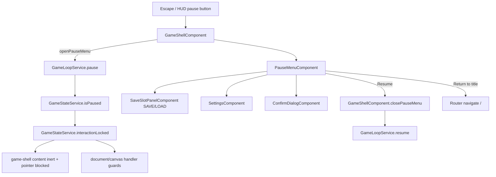

# Technical Implementation Plan: Pause Menu Interaction Lock

## 1. Architecture & Strategy

### System context

This finishes deferred Block 10.1/10.2 and implements Block 23's missing interaction lock. The owning surfaces are `GameShellComponent`, `PauseMenuComponent`, and `GameLoopService`, with narrow guards in interactive components that can bypass DOM inert through document/canvas listeners.

The feature depends on existing `GameStateService.isPaused`, `GameLoopService.pause()/resume()`, `SaveSlotPanelComponent`, `SettingsComponent`, and app routing. The current critical bug is that `GameShellComponent.isPauseMenuOpen` is only local UI state and is not coupled to the authoritative pause signal.

### Architecture diagram

### Key design decisions

- **Use `GameStateService.isPaused` as the single source of truth**: Add a readonly `interactionLocked` computed alias derived from `_isPaused`. Do not persist a separate lock flag; saved pause state already exists.
- **Make `GameShellComponent` own pause menu lifecycle**: Escape and the HUD pause button should open the same menu path. Opening pauses; closing via Resume resumes. This removes the clock-only pause path.
- **Use a central inert wrapper plus focused guards**: The shell should make all non-pause UI inert and non-pointerable while paused. Components with global/canvas handlers must also check `interactionLocked()` so keyboard/document events cannot slip around the wrapper.
- **Create the missing confirm dialog now**: Block 10.2 is documented as carried forward, but no file exists. The pause menu should not invent an inline confirm implementation.
- **Keep save/settings ownership unchanged**: Save and Load continue through `SaveService` via `SaveSlotPanelComponent`; settings continue through `SettingsComponent`/`SettingsService`. No new Tauri call site is added.

### Data flow

`GameShellComponent.openPauseMenu()` calls `GameLoopService.pause()`. `GameLoopService.pause()` cancels scheduled ticks and calls an explicit `GameStateService.setPaused(true)`. `GameStateService.interactionLocked` mirrors `isPaused`, so the shell inert wrapper and handler guards read one authoritative signal.

`GameShellComponent.closePauseMenu()` calls `GameLoopService.resume()` for Resume/close flows. Route navigation to the title stops the shell and clock through the existing component destruction path. Load flows must avoid accidental resume after `SaveSlotPanelComponent` hydrates state; the implementation should choose and test one consistent UX, preferably returning to a paused menu after load.

No system service should react directly to the lock. Existing systems continue to react to `gameYear`; because pause stops year advancement, terraforming/research/countdown values derived from year naturally freeze.

### Patterns & conventions to follow

- Standalone components, OnPush, `inject()`, `input()`/`output()`, signals, `@if`/`@for` with `track`.
- Keep components thin. `PauseMenuComponent` owns only UI panel state; `GameShellComponent` owns pause lifecycle and route actions.
- No `setTimeout` in new pause code. Focus restoration can use `queueMicrotask`/microtask Promise if needed after render.
- Any manual `document` key listener for focus trap must be removed on destroy. Existing `@HostListener` patterns are acceptable, but focus trap logic is usually clearer with a bound listener.
- SCSS uses BEM and tokens only. No inline styles except existing dynamic bindings already present in the app.
- Tauri APIs remain guarded and owned by existing services. Browser builds hide native Quit to Desktop.

---

## 2. Subtasks

### Milestone 1 — Authoritative pause state

- [ ] `src/app/core/services/game-state.service.ts` — Add `readonly interactionLocked = computed(() => this._isPaused())` near computed/public signals. Add `setPaused(paused: boolean): void` beside `togglePause()`. Keep `togglePause()` for compatibility but prefer explicit setter from new code. Pitfall: do not add a serialized `interactionLocked` field.
- [ ] `src/app/core/services/game-loop.service.ts` — Change `pause()`/`resume()` to call `setPaused(true/false)` instead of toggling. Ensure `resume()` does not schedule duplicate timers when already running. `tick()` keeps guarding `!gameState.isPaused()`.
- [ ] `src/app/core/services/game-loop.service.spec.ts` — Add/update specs for pause stopping year advancement, resume restarting, repeated resume avoiding duplicate ticks, and externally paused state preventing tick advance.
- [ ] `src/app/core/services/game-state.service.spec.ts` if present, otherwise cover through loop/shell specs — Verify `interactionLocked()` mirrors pause state and reset clears pause.

### Milestone 2 — Shared confirm dialog

- [ ] `src/app/shared/components/confirm-dialog/confirm-dialog.component.ts` — Create standalone OnPush component with `message = input.required<string>()`, `isDestructive = input<boolean>(false)`, `confirmed = output<void>()`, `cancelled = output<void>()`.
- [ ] `src/app/shared/components/confirm-dialog/confirm-dialog.component.html` — Inline confirm UI only: message, optional destructive warning, Confirm, Cancel. Use `@if` for the warning.
- [ ] `src/app/shared/components/confirm-dialog/confirm-dialog.component.scss` — BEM classes such as `confirm-dialog__message`, `confirm-dialog__actions`, `confirm-dialog__button--destructive`; tokens only.
- [ ] `src/app/shared/components/confirm-dialog/confirm-dialog.component.spec.ts` — Assert message rendering, destructive warning visibility, and both outputs.

### Milestone 3 — Real pause menu overlay

- [ ] `src/app/features/pause-menu/pause-menu.component.ts` — Replace the inline-template stub. Keep `isOpen = input<boolean>(false)` and `closed = output<void>()`; add shell-owned outputs such as `resumeRequested`, `returnToTitleRequested`, and optionally `loadCompleted`/`loadedFromSlot` if needed to reconcile load state. Import `SaveSlotPanelComponent`, `SettingsComponent`, and `ConfirmDialogComponent`.
- [ ] `src/app/features/pause-menu/pause-menu.component.ts` — Add internal UI signals: active view `'menu' | 'save' | 'load' | 'settings'`, pending confirm `'load' | 'title' | 'quit' | null`, and `isTauri` computed/readonly boolean guarded by `typeof window !== 'undefined' && '__TAURI__' in window`.
- [ ] `src/app/features/pause-menu/pause-menu.component.html` — Full-screen overlay with root menu buttons: Resume, Save Game, Load Game, Settings, Return to Title. Hide Quit to Desktop unless Tauri exists. Use `@if` to mount save/load/settings/confirm subpanels.
- [ ] `src/app/features/pause-menu/pause-menu.component.ts/html` — Resume emits to shell. Save opens `SaveSlotPanelComponent` in `SAVE` mode. Load shows confirm before mounting `SaveSlotPanelComponent` in `LOAD` mode. Settings mounts `SettingsComponent`. Return to Title shows destructive confirm and emits to shell.
- [ ] `src/app/features/pause-menu/pause-menu.component.ts` — Implement focus trap: store previous focused element on open, focus the first menu button after render, trap Tab/Shift+Tab inside the overlay, restore focus on close. Remove any manual listener in `ngOnDestroy`.
- [ ] `src/app/features/pause-menu/pause-menu.component.scss` — Fixed full-screen backdrop and panel, fade/scale reveal, z-index above all game overlays, BEM classes, tokens only. Include reduced-motion-compatible transitions through existing token conventions.
- [ ] `src/app/features/pause-menu/pause-menu.component.spec.ts` — Verify closed root does not render interactive controls; Resume emits; Save/Load/Settings show correct panels; Load requires confirm; Return to Title requires confirm; Quit hidden in browser; Escape behavior closes subpanel or requests resume from root.

### Milestone 4 — Shell placement and lock wrapper

- [ ] `src/app/features/game-shell/game-shell.component.ts` — Replace direct `isPauseMenuOpen.update()` with methods: `openPauseMenu()`, `closePauseMenu(options?: { resume?: boolean })`, `togglePauseMenu()`, `returnToTitle()`.
- [ ] `src/app/features/game-shell/game-shell.component.ts` — `openPauseMenu()` should no-op if already open, call `gameLoop.pause()`, and set `isPauseMenuOpen` true. `closePauseMenu()` should close and resume by default. `returnToTitle()` should close without resume and navigate to `/`.
- [ ] `src/app/features/game-shell/game-shell.component.ts` — Update Escape handling: if pause menu open, close/resume; otherwise open/pause. When pause is active, ResearchHub must not win Escape over the pause menu.
- [ ] `src/app/features/game-shell/game-shell.component.html` — Wrap all non-pause game UI in a single `.game-shell__content`: HUD, planets menu, orrery, Mercury, planet panel, culture event card/toast, research hub, resource power bar.
- [ ] `src/app/features/game-shell/game-shell.component.html` — Bind `[attr.inert]="gameState.interactionLocked() ? '' : null"` and `[class.game-shell__content--locked]="gameState.interactionLocked()"` to the content wrapper. Keep `<app-pause-menu>` outside this wrapper.
- [ ] `src/app/features/game-shell/game-shell.component.html` — Wire pause menu outputs to shell methods: resume/closed to `closePauseMenu()`, return-to-title to `returnToTitle()`.
- [ ] `src/app/features/game-shell/game-shell.component.scss` — Move the existing grid layout from `:host` to `.game-shell__content` if necessary. Locked content uses `pointer-events: none` and optional subdued visual treatment. Keep pause menu positioning internal to the pause component.
- [ ] `src/app/features/game-shell/game-shell.component.spec.ts` — Create focused spec: Escape opens and calls pause; Resume closes and calls resume; content wrapper receives `inert`; pause menu remains outside inert wrapper; Return to Title routes to `/`.

### Milestone 5 — HUD pause button uses menu path

- [ ] `src/app/features/hud/time-controls/time-controls.component.ts` — Add `pauseRequested = output<void>()`. Change pause button action to emit this output instead of calling `gameLoop.pause()/resume()`. Keep speed changes delegated to `GameLoopService.setSpeed()`.
- [ ] `src/app/features/hud/time-controls/time-controls.component.html` — Keep current aria labels/pressed state derived from `isPaused`; click still calls the component method.
- [ ] `src/app/features/hud/hud.component.ts` — Add `pauseRequested = output<void>()` and forward the child output. Remove any pause-loop dependency if it becomes unused.
- [ ] `src/app/features/hud/hud.component.html` — Wire `<app-time-controls (pauseRequested)="pauseRequested.emit()" />`.
- [ ] `src/app/features/game-shell/game-shell.component.html` — Wire `<app-hud (pauseRequested)="openPauseMenu()" />` inside the content wrapper.
- [ ] `src/app/features/hud/time-controls/time-controls.component.spec.ts` — Update pause-click expectations from `gameLoop.pause()/resume()` calls to output emission. Keep speed specs unchanged.
- [ ] `src/app/features/hud/hud.component.spec.ts` — Verify forwarding from HUD to shell-facing output.

### Milestone 6 — Guard bypass handlers

- [ ] `src/app/features/culture-events/culture-event-card/culture-event-card.component.ts` — Inject `GameStateService`. Guard `onKeyDown`, `onContinue()`, and `onChoice()` so they no-op while `interactionLocked()` is true. This prevents document key handling and focused buttons from mutating culture state under pause.
- [ ] `src/app/features/culture-events/culture-event-card/culture-event-card.component.spec.ts` — Add locked-state assertions for Escape/Enter/choice/continue no-op behavior.
- [ ] `src/app/features/research-hub/research-hub.component.ts` — It already injects `GameStateService`; guard `onEscape`, `onNodeSelect`, `onStartSelectedNode`, `onPauseSelectedNode`, `onResumeSelectedNode`, and any focus method that mutates selected state while locked.
- [ ] `src/app/features/research-hub/research-hub.component.spec.ts` — Add locked-state assertions that research start/pause/resume and Escape do nothing while locked.
- [ ] `src/app/features/mercury/mercury-grid/mercury-grid.component.ts` — It already injects `GameStateService`; read `locked` once at the top of the RAF loop. Skip edge scroll while locked. Guard `onMouseMove`, `onClick`, `onKeyDown`, and any placement/tile emit path so no placement or `tileClicked.emit()` occurs while locked.
- [ ] `src/app/features/mercury/mercury-grid/mercury-grid.component.spec.ts` if existing, otherwise the closest Mercury component spec — Add locked-state assertions for pointer and keyboard placement no-op behavior. Keep this focused; do not rewrite Mercury placement internals.

### Milestone 7 — Save/load consistency from pause

- [ ] `src/app/features/pause-menu/pause-menu.component.ts` and `src/app/features/game-shell/game-shell.component.ts` — Decide and implement one load UX: preferred behavior is that loading from the pause menu leaves the game paused with the pause menu still open or immediately reopened. Do not auto-resume a loaded game unless the user chooses Resume.
- [ ] `src/app/features/title-screen/save-slot-panel/save-slot-panel.component.ts` — Avoid broad changes if possible. If a load-complete output is needed for pause-menu reconciliation, add it in a backward-compatible way and keep title-screen behavior intact.
- [ ] Specs — Cover the selected load behavior so future changes do not reintroduce clock-only or unlocked pause states.

---

## 3. Assets (placeholders)

No visual or audio assets are required for this feature.

---

## 4. Cross-cutting concerns

### Edge cases & pitfalls

- Escape currently has multiple owners (`GameShellComponent`, `ResearchHubComponent`, `CultureEventCardComponent`). Pause must take priority while open/locked.
- `SaveSlotPanelComponent` is already a full overlay. When used inside pause menu, ensure backdrop stacking and focus behavior do not put it behind the pause panel or outside the trap.
- `GameLoopService.resume()` must not schedule duplicate timers if called repeatedly.
- The HUD pause button must not leave the game in a paused-but-no-menu state.
- If a save file restores `isPaused: true`, the shell should not start unlocked interaction. The implementation should reconcile shell menu visibility with loaded paused state.
- Canvas focus can survive DOM changes; Mercury keyboard handlers need explicit lock guards.
- `inert` support is good in modern browsers, but CSS `pointer-events: none` on the wrapper is still needed for the immediate playtest issue.

### Save/load

No save schema change is required. `isPaused` is already serialized and hydrated. The new `interactionLocked` signal derives from pause state and must not be serialized.

Load from pause must avoid accidental resume. The safest UX is: load, keep paused, keep or reopen the pause menu, and let the player choose Resume.

### Memory & performance

No new RAF loops. The only new lifecycle-sensitive code should be the pause menu focus trap listener, if implemented manually. Store bound listener references and remove them in `ngOnDestroy`.

The Mercury RAF loop should read `interactionLocked()` once per frame alongside other top-of-frame signal reads. Do not read signals mid-draw.

### Accessibility & motion

The pause overlay is a modal dialog: `role="dialog"`, `aria-modal="true"`, labelled heading, focus trap, focus restore. The inert wrapper prevents tabbing into the game behind it.

Fade/scale motion should use existing design tokens and respect reduced motion. Text/buttons must remain usable at UI scale and text-size settings from `SettingsService`.

---

## 5. Out of scope / deferred

- Native Tauri quit implementation beyond guarded/hide-in-browser UI. Actual desktop quit wiring belongs to a later Tauri integration pass.
- Reworking the internals of Mercury, research, terraforming, or culture event systems. This plan only blocks their interactions while paused.
- Save format migration.
- Audio feedback for opening/closing pause. Audio integration remains tracked separately in TODO.md.
- E2E automation.

---

## 6. Verification

- [ ] `ng build` succeeds with zero errors.
- [ ] Targeted Vitest specs pass for `GameLoopService`, `PauseMenuComponent`, `ConfirmDialogComponent`, `GameShellComponent`, `TimeControlsComponent`, `HudComponent`, and the edited Mercury/Culture/Research guard specs.
- [ ] Full `ng test` / Vitest pass, allowing only pre-existing unrelated failures if documented.
- [ ] Manual: Escape opens the pause menu and the year stops advancing.
- [ ] Manual: Resume closes the menu and the year advances again.
- [ ] Manual: HUD pause opens the same pause menu, not a clock-only pause.
- [ ] Manual: while paused, Mercury placement/clicks/keyboard, research actions, planet-panel actions, and culture event dialogs do nothing.
- [ ] Manual: Save and Settings open over the paused game and return to the pause menu.
- [ ] Manual: Load warns first and leaves pause/lock state consistent after load.
- [ ] Manual: Return to Title confirms before routing to `/`.
- [ ] Manual: browser build hides Quit to Desktop.
- [ ] Ask the user to playtest the flow manually; no automated E2E for this block.

---

## 7. References

- Prompt: `docs/agents/prompts/done/23-1-pause-menu-interaction-lock.txt`
- Original Block 10 source: `docs/agents/PROMPTS.md` — Block 10.1/10.2
- Carry-forward note: `docs/agents/PROMPTS-pt2.md` — Block 11.3
- Architecture: `docs/agents/ARCHITECTURE.md`
- Standards: `AGENTS.md`
- GDD tone/context: `docs/GDD/main-gdd.md`
