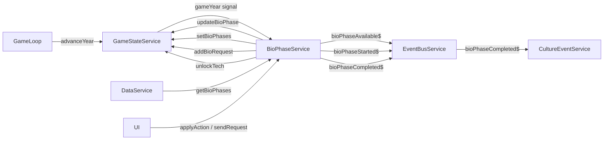

# Plan — `src/app/core/systems/bio-phase.service.ts`

**Prompt block:** 3.7  
**Status:** Ready to implement

---

## 1. What this service does

`BioPhaseService` is a pure **system service** — it holds no state of its own. All state lives in
`GameStateService._bioPhases` (`Record<string, PlanetBioState>`).

It:

1. **Initialises per-planet bio state** for a new campaign via the public `initNewGame()` method.
2. **Ticks running phases** once per game-year, computing effective duration from action count.
3. **Unlocks (makes available) locked phases** when their prerequisites are met.
4. Provides two **public UI entry points**: `applyAction()` and `sendRequest()`.
5. **Completes phases** by updating state, optionally unlocking a spillover tech, and emitting
   `bioPhaseCompleted$` — `CultureEventService` already subscribes and queues the matching CE.

---

## 2. Architecture fit



- Single `effect()` on `gameYear` → `untracked(() => this._processYear(year))`, identical pattern
  to `ResearchService`, `DysonService`, and `KardashevService`.
- `CultureEventService._checkBioCompleteTriggers()` **already exists** and picks up
  `bioPhaseCompleted$`. `BioPhaseService` does **not** call `queueEvent()` directly.
- `initNewGame()` is a public method called by the game shell after `gameState.reset()` (same
  pattern as `cultureEventService.resumeQueueAfterLoad()` after `hydrate()`).

---

## 3. Pre-implementation gaps

| Gap | Detail | Recommendation |
|-----|--------|----------------|
| `bio-phases.json` is empty (`{}`) | `DataService` loads it but returns empty arrays for all planets | Populate in Milestone 2; service uses `FALLBACK_PHASE_DEFINITIONS` constant as safety net |
| `odnBuilt`, `bioreactorBatchesActive`, `precipitationEnginesBuilt`, `atmosphericCatalystShipsBuilt` are never mutated | These `PlanetBioState` fields are set by a future Mercury orbital-components feature | `_isComponentBuilt()` reads them correctly; component-gated phases simply won't unlock until that feature ships. Add TODO in `TODO.md`. |
| No `setBioPhases` mutation on `GameStateService` | `_bioPhases` signal is private; no public setter exists yet | Add `setBioPhases()` in Milestone 1 |
| No `addBioRequest` mutation on `GameStateService` | `PlanetBioState.requestsSent` has no public mutator | Add `addBioRequest()` in Milestone 1 |
| No `bioPhaseAvailable$` subject on `EventBusService` | Needed for UI notification when a phase unlocks | Add it in Milestone 1 |
| `BioPhaseDef.nominalDurationYears` vs. prompt's `durationYears` | The existing `BioPhaseDef` interface (in `data.service.ts`) uses `nominalDurationYears` | Use `nominalDurationYears` everywhere. `BioPhaseState.durationYears` stores the nominal value at init. |
| `initNewGame()` call site | No game shell exists yet | Document in `TODO.md`; service works correctly once called |

---

## 4. Layered breakdown

### Milestone 1 — Patch dependencies (3 small changes)

#### 1a. `src/app/core/services/event-bus.service.ts`

Add one new subject after `bioPhaseStarted$`:

```ts
/** A bio phase has become available (requirements met) on a planet. */
readonly bioPhaseAvailable$ = new Subject<BioPhaseEvent>();
```

No import changes needed — `BioPhaseEvent` is already imported.

---

#### 1b. `src/app/core/services/game-state.service.ts`

Add two mutations to the existing `// Bio-phase mutations` section (after `updateBioPhase`):

```ts
/**
 * Replaces the entire bio-phases map.
 * Used by BioPhaseService.initNewGame() to seed a fresh campaign.
 * hydrate() already writes _bioPhases directly — this is the equivalent
 * public method for new-game initialisation.
 */
setBioPhases(phases: Record<string, PlanetBioState>): void {
  this._bioPhases.set(phases);
}

/** Adds requestId to a planet's requestsSent list (idempotent). */
addBioRequest(planetId: string, requestId: string): void {
  this._bioPhases.update((bioPhases) => {
    const planet = bioPhases[planetId];
    if (!planet || planet.requestsSent.includes(requestId)) return bioPhases;
    return {
      ...bioPhases,
      [planetId]: { ...planet, requestsSent: [...planet.requestsSent, requestId] },
    };
  });
}
```

---

### Milestone 2 — Populate `public/data/bio-phases.json`

Replace the empty `{}` with four phases per planet. Structure:
`Record<string, BioPhaseDef[]>` where keys are planet IDs (`"mars"`, `"venus"`).

The `completeCeId` values must correspond to entries in `culture-events.json` with trigger type
`bio_phase_complete`. Use the IDs below; add matching CE entries to `culture-events.json` in the
same milestone (stub entries with empty choices are fine for the playtest).

`actions` lists are the action IDs the player can "apply" via the Ecosystem Composer. Each taken
action reduces effective duration by 8 % (see §5 formula). Keep 3–4 per phase.

**Mars phases (~110yr nominal total):**

| `id` | `displayName` | `nominalDurationYears` | `actions` | `requiresComponents` | other |
|---|---|---|---|---|---|
| `mars-bio-1` | "Pioneer Microbes" | 20 | `["seed_cyanobacteria", "add_perchlorate_reducers", "deploy_iron_oxidisers"]` | `[]` | — |
| `mars-bio-2` | "Chemolithotrophs & Fixers" | 25 | `["add_nitrogen_fixers", "seed_methanogens", "add_chemolithotrophs", "boost_soil_cycling"]` | `[]` | `canStartAtPreviousPercent: 0.5` |
| `mars-bio-3` | "Early Plants & Aquatics" | 30 | `["introduce_mosses", "seed_algae_mats", "add_fungal_networks", "deploy_decomposers"]` | `["bioreactor"]` | `spilloverTech: "mars_early_biosphere"` |
| `mars-bio-4` | "Biosphere Stabilisation" | 35 | `["introduce_ferns", "add_pollinators", "complete_food_web", "seed_tundra_package"]` | `["precipitationEngine"]` | — |

**Venus phases (~130yr nominal total):**

| `id` | `displayName` | `nominalDurationYears` | `actions` | `requiresComponents` | other |
|---|---|---|---|---|---|
| `venus-bio-1` | "Acid Chemistry Reducers" | 25 | `["seed_sulphur_reducers", "add_chemolithotrophs", "deploy_acid_package"]` | `[]` | — |
| `venus-bio-2` | "Ocean Foundation Microbes" | 30 | `["seed_aquatic_microbes", "add_phytoplankton", "introduce_kelp", "boost_ocean_buffer"]` | `[]` | `canStartAtPreviousPercent: 0.5` |
| `venus-bio-3` | "Atmospheric Processors" | 35 | `["add_nitrogen_fixers", "seed_mosses", "deploy_coastal_package", "introduce_lichens"]` | `["atmosphericCatalystShip"]` | `spilloverTech: "venus_early_biosphere"` |
| `venus-bio-4` | "Biosphere Emergence" | 40 | `["introduce_ferns", "add_pollinators", "seed_forest_understory", "complete_food_web"]` | `["atmosphericCatalystShip", "odn"]` | — |

`completeCeId` for each phase: `"ce_mars_bio_1_complete"`, `"ce_mars_bio_2_complete"` …
`"ce_venus_bio_4_complete"`. Add 8 matching stub entries in `culture-events.json`.

---

### Milestone 3 — `src/app/core/systems/bio-phase.service.ts` (new file)

#### Module-level constants (not exported)

```ts
/**
 * Per-action reduction factor applied to effective duration.
 * effectiveDuration = nominalDuration * (1 - clamp((actionCount - 1) * SPEEDUP_PER_ACTION, 0, MAX_SPEEDUP))
 */
const SPEEDUP_PER_ACTION = 0.08;

/** Maximum total speedup (40 % = minimum 60 % of nominal duration). */
const MAX_SPEEDUP = 0.40;

/**
 * Fallback phase definitions used when DataService returns an empty array
 * (e.g. bio-phases.json is not yet populated or fails to load).
 * Keep in sync with the JSON — remove once JSON is canonical.
 */
const FALLBACK_PHASE_DEFINITIONS: Record<string, BioPhaseDef[]> = {
  mars: [ /* mirror Milestone 2 data */ ],
  venus: [ /* mirror Milestone 2 data */ ],
};
```

> **NOTE:** `FALLBACK_PHASE_DEFINITIONS` exists purely as a safety net. Once `bio-phases.json` is
> populated (Milestone 2), `DataService.getBioPhases()` returns non-empty arrays and the fallback
> is never used in production.

---

#### Service skeleton

```ts
@Injectable({ providedIn: 'root' })
export class BioPhaseService {
  private readonly gameState = inject(GameStateService);
  private readonly data      = inject(DataService);
  private readonly eventBus  = inject(EventBusService);

  constructor() {
    effect(() => {
      const year = this.gameState.gameYear();
      untracked(() => this._processYear(year));
    });
  }

  // Public API (called by UI and game shell)
  initNewGame(): void { ... }
  applyAction(planetId: string, phaseIndex: number, actionId: string): void { ... }
  sendRequest(planetId: string, requestId: string): void { ... }

  // Private — tick
  private _processYear(year: number): void { ... }
  private _checkAvailability(planetId: string): void { ... }
  private _tickRunningPhases(planetId: string, year: number): void { ... }

  // Private — requirements
  private _requirementsMet(planetId: string, phaseIndex: number): boolean { ... }
  private _isComponentBuilt(componentId: string, state: PlanetBioState): boolean { ... }

  // Private — completion
  private _completePhase(planetId: string, phaseIndex: number): void { ... }

  // Private — data helper
  private _getDefsForPlanet(planetId: string): BioPhaseDef[] { ... }
}
```

---

#### Method-by-method spec

---

**`initNewGame(): void`** — public

Called by the game shell immediately after `gameState.reset()`. Do NOT call in the constructor.

```
For each planetId in ['mars', 'venus']:
  defs = _getDefsForPlanet(planetId)
  Build PlanetBioState:
    currentPhaseIndex: 0
    phases: defs.map((def, i) => ({
      status: i === 0 ? 'available' : 'locked',
      actionsTaken: [],
      progressYears: 0,
      durationYears: def.nominalDurationYears,
      startedYear: 0,
      completedYear: 0,
    }))
    odnBuilt: false
    bioreactorBatchesActive: 0
    precipitationEnginesBuilt: 0
    atmosphericCatalystShipsBuilt: 0
    requestsSent: []
    discoveredOrganisms: []
Call gameState.setBioPhases(initial)
```

Phase 0 is initialised as `'available'` directly — there are no requirements for Bio I on either
planet. This avoids waiting a full year before the first phase becomes clickable.

---

**`_processYear(year: number): void`** — private

```
const bioPhases = gameState.bioPhases()
if (Object.keys(bioPhases).length === 0) return  // not initialised yet
for (const planetId of Object.keys(bioPhases)):
  _checkAvailability(planetId)
  _tickRunningPhases(planetId, year)
```

The early-return guard prevents spurious no-op ticks before `initNewGame()` is called.

---

**`_checkAvailability(planetId: string): void`** — private

```
const planetState = gameState.bioPhases()[planetId]
if (!planetState) return
planetState.phases.forEach((phase, index) => {
  if (phase.status !== 'locked') return
  if (_requirementsMet(planetId, index)) {
    gameState.updateBioPhase(planetId, index, { status: 'available' })
    const def = _getDefsForPlanet(planetId)[index]
    if (def) eventBus.bioPhaseAvailable$.next({ planetId, phaseId: def.id })
  }
})
```

---

**`_requirementsMet(planetId: string, phaseIndex: number): boolean`** — private

```
const planetState = gameState.bioPhases()[planetId]
if (!planetState) return false
const defs = _getDefsForPlanet(planetId)
const def = defs[phaseIndex]
if (!def) return false

// 1. Previous phase requirement
if (phaseIndex > 0) {
  const prevPhase = planetState.phases[phaseIndex - 1]
  if (!prevPhase) return false

  if (def.canStartAtPreviousPercent !== undefined) {
    // Can start early once previous phase hits the percent threshold
    const prevCompleted = prevPhase.status === 'complete'
    const prevProgress = prevCompleted ? 1 : prevPhase.progressYears / prevPhase.durationYears
    if (!prevCompleted && prevProgress < def.canStartAtPreviousPercent) return false
  } else {
    // Default: previous phase must be complete
    if (prevPhase.status !== 'complete') return false
  }
}

// 2. Component requirements
for (const componentId of def.requiresComponents) {
  if (!_isComponentBuilt(componentId, planetState)) return false
}

// 3. Request requirement
if (def.requiresRequest && !planetState.requestsSent.includes(def.requiresRequest)) {
  return false
}

return true
```

---

**`_isComponentBuilt(componentId: string, state: PlanetBioState): boolean`** — private

Maps the string component IDs used in JSON to concrete `PlanetBioState` fields:

```ts
switch (componentId) {
  case 'odn':                    return state.odnBuilt;
  case 'bioreactor':             return state.bioreactorBatchesActive > 0;
  case 'precipitationEngine':    return state.precipitationEnginesBuilt > 0;
  case 'atmosphericCatalystShip':return state.atmosphericCatalystShipsBuilt > 0;
  default:
    console.warn(`[BioPhaseService] unknown component requirement: "${componentId}"`);
    return false;
}
```

> NOTE: All four component fields are always `false` / `0` until the Mercury orbital-components
> feature is built. Phases with component requirements will remain locked until then.

---

**`applyAction(planetId: string, phaseIndex: number, actionId: string): void`** — public

```
const planetState = gameState.bioPhases()[planetId]
if (!planetState) return

const phase = planetState.phases[phaseIndex]
if (!phase) return
if (phase.status !== 'available' && phase.status !== 'running') return

const defs = _getDefsForPlanet(planetId)
const def = defs[phaseIndex]
if (!def) return

// Reject unknown actions
if (!def.actions.includes(actionId)) return

// Prevent duplicate actions
if (phase.actionsTaken.includes(actionId)) return

const isFirstAction = phase.status === 'available'

gameState.updateBioPhase(planetId, phaseIndex, {
  actionsTaken: [...phase.actionsTaken, actionId],
  ...(isFirstAction ? {
    status: 'running',
    startedYear: gameState.gameYear(),
  } : {}),
})

if (isFirstAction) {
  eventBus.bioPhaseStarted$.next({ planetId, phaseId: def.id })
}
```

"First action" semantics: taking any action on an `'available'` phase both records the action
AND starts the phase (`status → 'running'`, `startedYear` set). Subsequent actions on a
`'running'` phase only record the action (no status change).

---

**`sendRequest(planetId: string, requestId: string): void`** — public

```
gameState.addBioRequest(planetId, requestId)
// No event emitted — availability check runs next tick via _checkAvailability
```

---

**`_tickRunningPhases(planetId: string, year: number): void`** — private

```
// Snapshot phases at tick start — iterate over the pre-tick values
const phases = gameState.bioPhases()[planetId]?.phases ?? []
const defs = _getDefsForPlanet(planetId)

phases.forEach((phase, index) => {
  if (phase.status !== 'running') return

  const newProgress = phase.progressYears + 1
  gameState.updateBioPhase(planetId, index, { progressYears: newProgress })

  // Effective duration: base × (1 - clamped_speedup)
  // Each action beyond the first reduces duration by SPEEDUP_PER_ACTION (8%).
  // Total speedup is capped at MAX_SPEEDUP (40%), so minimum is 60% of base.
  const actionCount = phase.actionsTaken.length
  const speedup = Math.min((actionCount - 1) * SPEEDUP_PER_ACTION, MAX_SPEEDUP)
  const effectiveDuration = phase.durationYears * (1 - speedup)

  if (newProgress >= effectiveDuration) {
    _completePhase(planetId, index)
  }
})
```

`year` is accepted for testability (mirrors `ResearchService._processYear`) but is not used in the
body — the tick is index-based (progressYears += 1).

---

**`_completePhase(planetId: string, phaseIndex: number): void`** — private

```
const defs = _getDefsForPlanet(planetId)
const def = defs[phaseIndex]
if (!def) return

gameState.updateBioPhase(planetId, phaseIndex, {
  status: 'complete',
  completedYear: gameState.gameYear(),
})

if (def.spilloverTech) {
  gameState.unlockTech(def.spilloverTech)
}

// CultureEventService already subscribes to bioPhaseCompleted$ and calls
// _checkBioCompleteTriggers(planetId, phaseId). No direct queueEvent() call needed here.
eventBus.bioPhaseCompleted$.next({ planetId, phaseId: def.id })
```

---

**`_getDefsForPlanet(planetId: string): BioPhaseDef[]`** — private

```ts
const fromData = this.data.getBioPhases(planetId);
return fromData.length > 0 ? fromData : (FALLBACK_PHASE_DEFINITIONS[planetId] ?? []);
```

Prefers JSON data; falls back to the constant only when the JSON returns an empty array.

---

### Milestone 4 — `src/app/core/systems/bio-phase.service.spec.ts` (new file)

Tests to cover:

| Test | Scenario |
|---|---|
| `_processYear` — no-op guard | `bioPhases` is `{}` → no mutations called |
| `_checkAvailability` — phase 0 already available | Initialised with status `'available'` → no change on tick |
| `_checkAvailability` — phase 1 unlocks when phase 0 complete | Phase 0 `status='complete'` → phase 1 transitions to `'available'`, `bioPhaseAvailable$` emits |
| `_checkAvailability` — phase 1 unlocks at 50% (canStartAtPreviousPercent) | Phase 0 `progressYears=10`, `durationYears=20` → phase 1 transitions (0.5 threshold met) |
| `_checkAvailability` — component requirement blocks | `requiresComponents: ['bioreactor']`, `bioreactorBatchesActive=0` → stays `'locked'` |
| `_checkAvailability` — request requirement blocks | `requiresRequest: 'req_xyz'`, not in `requestsSent` → stays `'locked'` |
| `applyAction` — first action starts phase | Status `'available'` → `updateBioPhase` called with `status:'running'`, `bioPhaseStarted$` emits |
| `applyAction` — subsequent action on running phase | Status `'running'` → only `actionsTaken` extended, no status change, no event |
| `applyAction` — unknown actionId rejected | Not in `def.actions` → no mutation |
| `applyAction` — duplicate actionId rejected | Already in `actionsTaken` → no mutation |
| `_tickRunningPhases` — progress increments | `progressYears += 1` per tick |
| `_tickRunningPhases` — effectiveDuration with 1 action | `speedup = 0`, `effectiveDuration = durationYears` |
| `_tickRunningPhases` — effectiveDuration with 3 actions | `speedup = 2 * 0.08 = 0.16`, `effectiveDuration = durationYears * 0.84` |
| `_tickRunningPhases` — speedup capped at 40% | 8 actions → `speedup = min(0.56, 0.40) = 0.40`, `effectiveDuration = durationYears * 0.60` |
| `_tickRunningPhases` — completion fires at threshold | `progressYears >= effectiveDuration` → `_completePhase` called |
| `_completePhase` — updates status and year | `status:'complete'`, `completedYear` set |
| `_completePhase` — spillover tech unlocked | `def.spilloverTech` present → `unlockTech` called |
| `_completePhase` — no spillover tech | `def.spilloverTech` undefined → `unlockTech` NOT called |
| `_completePhase` — bioPhaseCompleted$ emits | Subject receives `{ planetId, phaseId }` |
| `sendRequest` — delegates to GameStateService | `addBioRequest` called with correct args |
| `initNewGame` — seeds correct initial state | Phase 0 `'available'`, phases 1–3 `'locked'`, all counters zero |

---

## 5. Effective duration formula (reference)

```
actionCount  = phase.actionsTaken.length        // minimum 1 once running
speedup      = clamp((actionCount - 1) × 0.08, 0, 0.40)
effectiveDuration = phase.durationYears × (1 − speedup)
```

| actions taken | speedup | effective % of base |
|---|---|---|
| 1 | 0 % | 100 % |
| 2 | 8 % | 92 % |
| 3 | 16 % | 84 % |
| 4 | 24 % | 76 % |
| 5 | 32 % | 68 % |
| 6+ | 40 % (capped) | 60 % (minimum) |

---

## 6. TODO.md entries to add

```
### BioPhaseService — initNewGame() call site
- File: src/app/features/game-shell/game-shell.component.ts (or game init sequence)
- Location: After gameState.reset() call
- TODO: Call bioPhaseService.initNewGame() when starting a new campaign
- Depends on: GameShellComponent implementation
- Prompt block: TBD (Game Shell block)

### BioPhaseService — Mercury orbital component requirements
- File: src/app/core/systems/bio-phase.service.ts
- Location: _isComponentBuilt()
- TODO: PlanetBioState.odnBuilt / bioreactorBatchesActive / precipitationEnginesBuilt /
  atmosphericCatalystShipsBuilt are never mutated. Component-gated bio phases (Bio III+ on
  both planets) will remain locked until MercuryBuildService or an orbital-components service
  writes to these fields.
- Depends on: MercuryBuildService orbital-component feature
- Prompt block: TBD (Mercury orbitals block)
```

---

## 7. Implementation order

1. **Milestone 1** — patch `event-bus.service.ts` and `game-state.service.ts` (small, no risk)
2. **Milestone 2** — populate `bio-phases.json` and add 8 CE stubs to `culture-events.json`
3. **Milestone 3** — implement `bio-phase.service.ts`
4. **Milestone 4** — implement `bio-phase.service.spec.ts`
5. **TODO.md** — add two new entries, hand off to **reviewer**
