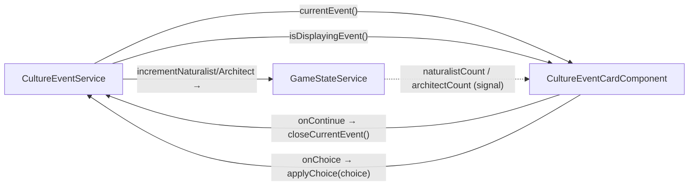

# Plan: Culture Event Card

**Feature**: `CultureEventCardComponent` — full implementation of the narrative overlay card  
**Block**: 08-1  
**Author**: lead-developer  
**Date**: 2026-06-13  
**Status**: Ready for developer

---

## Summary

Replace the stub `CultureEventCardComponent` with a fully-functional fixed overlay that
renders a narrative event card driven by `CultureEventService.currentEvent()`. The card
is always in the DOM (never destroyed), hidden via CSS when no event is active.

---

## Context / What Already Exists

| File | State |
|---|---|
| `culture-event-card.component.ts` | Stub — empty template, no logic |
| `culture-event.service.ts` | Full — `currentEvent`, `isDisplayingEvent`, `closeCurrentEvent()` |
| `culture-event.model.ts` | Full — `CultureEvent`, `CultureEventChoice` interfaces |
| `game-state.service.ts` | Has `incrementNaturalist()` / `incrementArchitect()` |
| `game-shell.component.html` | Already includes `<app-culture-event-card />` — no wiring change needed |
| `public/data/culture-events.json` | 30 events, all `choices: []` today |
| `public/assets/svg/portraits/` | 6 files exist; **26 missing** |

**`DataService` injection**: The prompt requests it but `CultureEventService.currentEvent()`
already returns the full `CultureEvent` shape (title, narratorText, portrait, choices). The
component does **not** need to inject `DataService` directly — the signal provides everything.
Do not inject it to avoid unnecessary coupling.

**`CultureEventService.applyChoice()`**: Does not exist yet. The component must not call
`gameState.incrementNaturalist/Architect()` directly (no game logic in components). We add a
minimal `applyChoice()` method to the service in Milestone 1.

---

## Architecture Diagram



---

## Scope Guard (out of scope for this block)

- Toast component (`CultureEventToastComponent`) — separate stub, separate prompt
- Typewriter / typewriter animation — prompt explicitly says no
- `CultureEventChoice.effects[]` full application (TechTree unlocks) — depends on
  populated JSON + TechTreeService; remains in TODO.md
- AudioService call on event display — AudioService not yet created; remains in TODO.md

---

## Milestones

### Milestone 1 — Service: add `applyChoice()`

**File**: `src/app/core/systems/culture-event.service.ts`

Add one public method after `closeCurrentEvent()`:

```ts
/**
 * Applies the tag effect of a choice and closes the current event.
 *
 * NOTE: choice.effects[] (tech unlocks, etc.) are not yet applied —
 * pending JSON population and TechTreeService integration. See TODO.md.
 */
applyChoice(choice: CultureEventChoice): void {
  if (choice.tag === 'naturalist') {
    this.gameState.incrementNaturalist();
  } else if (choice.tag === 'architect') {
    this.gameState.incrementArchitect();
  }
  this.closeCurrentEvent();
}
```

Add `CultureEventChoice` to the existing `import type` block at the top of the file.

**Pitfalls**: `gameState` is already injected; no new injection needed. `untracked()` is not
needed here — this runs in response to user interaction, never inside a reactive context.

**Test**: `culture-event.service.spec.ts` — add two cases: choice with `tag: 'naturalist'`
increments naturalist count and closes; choice with `tag: 'architect'` increments architect
and closes; choice with `tag: ''` does neither and still closes.

---

### Milestone 2 — Component class

**File**: `src/app/features/culture-events/culture-event-card/culture-event-card.component.ts`

```
Inject:
  - CultureEventService  (currentEvent, isDisplayingEvent, closeCurrentEvent, applyChoice)

Signals / computeds:
  - event = cultureEventService.currentEvent        (alias for template brevity)
  - isVisible = cultureEventService.isDisplayingEvent
  - paragraphs = computed(() => event()?.narratorText.split('\n\n') ?? [])
  - private _focusedChoiceIndex = signal(0)
  - focusedChoiceIndex = _focusedChoiceIndex.asReadonly()

effect():
  - When event() changes to a non-null value, reset _focusedChoiceIndex to 0

Methods:
  - onContinue(): void  →  cultureEventService.closeCurrentEvent()
  - onChoice(choice: CultureEventChoice): void  →  cultureEventService.applyChoice(choice)
  - @HostListener('document:keydown', ['$event']) onKeyDown(e: KeyboardEvent)
      Guard: if (!isVisible()) return
      ' ' / 'Enter':
        e.preventDefault()
        choices.length === 0 → onContinue()
        else → onChoice(choices[_focusedChoiceIndex()])
      'Tab':
        e.preventDefault()
        choices.length > 1 → _focusedChoiceIndex = (current + 1) % choices.length
```

**Key pitfalls**:
- `@HostListener('document:keydown')` captures globally — always guard with `isVisible()`.
  This prevents the card eating keyboard input while hidden (e.g., when the orrery is focused).
- The `effect()` that resets `_focusedChoiceIndex` must wrap `_focusedChoiceIndex.set()` inside
  `untracked()` to avoid the effect tracking the signal it's writing:
  ```ts
  effect(() => {
    const ev = this.event();
    untracked(() => {
      if (ev) this._focusedChoiceIndex.set(0);
    });
  });
  ```
- Do **not** use `DestroyRef` — `effect()` and `@HostListener` auto-clean on destroy.

---

### Milestone 3 — Template

**File**: `src/app/features/culture-events/culture-event-card/culture-event-card.component.html`  
_(New file)_

Structure:
```
.card-overlay  [class.card-overlay--visible]="isVisible()"
               role="dialog"  aria-modal="true"  aria-label="Narrative Event"
  .card-overlay__backdrop
  .card-overlay__card
    .card-overlay__portrait
      @if (event(); as ev)
        
    .card-overlay__content
      @if (event(); as ev)
        h2.card-overlay__title      {{ ev.title }}
        .card-overlay__narrator
          @for (para of paragraphs(); track para)
            <p>{{ para }}</p>
        .card-overlay__actions
          @if (ev.choices.length === 0)
            <button class="..btn--continue" (click)="onContinue()">Continue</button>
          @else
            @for (choice of ev.choices; track choice.id; let i = $index)
              <button
                [class.card-overlay__btn--focused]="focusedChoiceIndex() === i"
                [class.card-overlay__btn--naturalist]="choice.tag === 'naturalist'"
                [class.card-overlay__btn--architect]="choice.tag === 'architect'"
                (click)="onChoice(choice)"
              >
                @if (choice.tag)
                  <span class="card-overlay__tag-icon card-overlay__tag-icon--{{ choice.tag }}"></span>
                {{ choice.label }}
              </button>
```

**Pitfalls**:
- `@for` on `paragraphs()` — track by value `track para`. Fine: paragraphs are stable strings.
- The outer `.card-overlay` must NOT use `@if` — always in DOM so the CSS transition works.
- `role="dialog"` on `.card-overlay__card` (not the host), `aria-modal="true"`.
- `aria-label` on the host is not a requirement but good practice.

---

### Milestone 4 — Styles

**File**: `src/app/features/culture-events/culture-event-card/culture-event-card.component.scss`  
_(New file)_

```scss
// Host stays in DOM; visibility via opacity + pointer-events
:host {
  display: contents;
}

.card-overlay {
  position: fixed;
  inset: 0;
  display: flex;
  align-items: center;
  justify-content: center;
  z-index: 100; // above orrery (0), hud (10), panels (20), toasts (90)
  opacity: 0;
  pointer-events: none;
  transition: opacity var(--transition-reveal);

  &--visible {
    opacity: 1;
    pointer-events: auto;
  }
}

.card-overlay__backdrop {
  position: absolute;
  inset: 0;
  background: var(--color-bg-overlay);
}

.card-overlay__card {
  position: relative; // above backdrop
  display: flex;
  flex-direction: row;
  width: min(600px, 95vw);
  max-height: 80vh;
  background: var(--color-bg-elevated);
  border: var(--border-accent);
  border-radius: var(--radius-lg);
  box-shadow: var(--shadow-panel);
  overflow: hidden;
  // Entrance spring
  transform: translateY(8px) scale(0.98);
  transition:
    transform var(--transition-reveal),
    opacity var(--transition-reveal);

  .card-overlay--visible & {
    transform: translateY(0) scale(1);
  }
}

.card-overlay__portrait {
  width: 35%;
  flex-shrink: 0;
  background: var(--color-accent-dim); // accent-coloured fallback / placeholder fill
  overflow: hidden;

  img {
    width: 100%;
    height: 100%;
    object-fit: cover;
    display: block;
  }
}

.card-overlay__content {
  flex: 1;
  display: flex;
  flex-direction: column;
  gap: var(--space-md);
  padding: var(--space-xl) var(--space-lg);
  overflow-y: auto;
}

.card-overlay__title {
  font-family: var(--font-mono);
  font-size: var(--text-xl);
  color: var(--color-accent-glow);
  margin: 0;
  line-height: 1.3;
}

.card-overlay__narrator {
  flex: 1;

  p {
    font-family: var(--font-body);
    font-size: var(--text-md);
    color: var(--color-text-primary);
    line-height: 1.65;
    margin: 0 0 var(--space-sm);

    &:last-child { margin-bottom: 0; }
  }
}

.card-overlay__actions {
  display: flex;
  flex-direction: column;
  gap: var(--space-sm);
  margin-top: auto;
  padding-top: var(--space-md);
}

// Base button — reused for Continue and choices
.card-overlay__btn {
  padding: var(--space-sm) var(--space-md);
  font-family: var(--font-mono);
  font-size: var(--text-sm);
  color: var(--color-text-primary);
  background: transparent;
  border: var(--border-subtle);
  border-radius: var(--radius-sm);
  cursor: pointer;
  display: flex;
  align-items: center;
  gap: var(--space-sm);
  text-align: left;
  transition: var(--transition-ui);

  &:hover,
  &--focused {
    border-color: var(--color-accent);
    color: var(--color-accent-glow);
    background: rgba(200, 134, 30, 0.08);
  }

  &--continue {
    align-self: flex-end;
    border-color: var(--color-accent-dim);
  }

  &--naturalist {
    border-color: var(--color-tag-naturalist);
    &:hover, &.card-overlay__btn--focused {
      border-color: var(--color-tag-naturalist);
      color: var(--color-tag-naturalist);
      background: rgba(74, 138, 74, 0.1);
    }
  }

  &--architect {
    border-color: var(--color-tag-architect);
    &:hover, &.card-overlay__btn--focused {
      border-color: var(--color-tag-architect);
      color: var(--color-tag-architect);
      background: rgba(74, 106, 184, 0.1);
    }
  }
}

// Small colour dot indicating naturalist/architect tag
.card-overlay__tag-icon {
  display: inline-block;
  width: 8px;
  height: 8px;
  border-radius: 50%;
  flex-shrink: 0;

  &--naturalist { background: var(--color-tag-naturalist); }
  &--architect  { background: var(--color-tag-architect); }
}
```

**z-index ladder**:
- Orrery: 0
- HUD: 10
- Panels (planet, research hub): 20
- Pause menu: 50
- Toasts: 90
- **Culture event card: 100** ← overlay must block all interaction below

---

### Milestone 5 — Placeholder Portrait SVGs

**26 files to create** in `public/assets/svg/portraits/`.  
(6 already exist: `ce_mars_phase_1.svg`, `ce_mars_phase_2.svg`, `ce_mars_phase_3.svg`,
`ce_venus_phase_1.svg`, `ce_venus_phase_2.svg`, `ce_venus_phase_3.svg`)

All placeholders:
- `viewBox="0 0 300 400"` (portrait ratio ~3:4)
- Background rect in a muted thematic colour
- A simple shape group suggesting the event theme (circle = star/planet, lines = horizon)
- A `<text>` label with the id slug
- `<!-- PLACEHOLDER -->` comment at the top

Use the `create-placeholder-svg` skill for the actual content.  

Missing files to create:
```
ce_dyson_10_percent.svg        ce_dyson_25_percent.svg       ce_dyson_50_percent.svg
ce_europa_impact.svg           ce_europa_warning.svg         ce_fermi_silence_detected.svg
ce_first_days_on_mercury.svg   ce_first_era_complete.svg     ce_fusion_theory_complete.svg
ce_mars_bio_1_complete.svg     ce_mars_bio_2_complete.svg    ce_mars_bio_3_complete.svg
ce_mars_bio_4_complete.svg     ce_mars_first_liquid_water.svg ce_mars_polar_detonation.svg
ce_mercury_landing.svg         ce_moon_first_birthday.svg    ce_moon_refusing_return.svg
ce_seed_ship_launched.svg      ce_type1_reached.svg          ce_type2_reached.svg
ce_venus_bio_1_complete.svg    ce_venus_bio_2_complete.svg   ce_venus_bio_3_complete.svg
ce_venus_bio_4_complete.svg    ce_venus_cooling_begins.svg
```

---

### Milestone 6 — TODO.md updates

After implementation, update `docs/agents/TODO.md`:

1. **"CultureEventCardComponent / CultureEventToastComponent"** entry: mark card as done,
   keep toast sub-item open.
2. **"CultureEventService — Choice effects application"** entry: update to note that tag
   increment is now implemented; only `effects[]` TechTree application remains.

---

## Test Plan

**`culture-event.service.spec.ts`** — new cases:
1. `applyChoice({ tag: 'naturalist', ... })` → `incrementNaturalist()` called once, event closed
2. `applyChoice({ tag: 'architect', ... })` → `incrementArchitect()` called once, event closed
3. `applyChoice({ tag: '', ... })` → neither increment called, event still closed

**`culture-event-card.component.spec.ts`** — new file:
1. When `currentEvent()` is null, host element has no `card-overlay--visible` class
2. When `currentEvent()` returns an event, `card-overlay--visible` is present
3. Event with `choices: []` renders 'Continue' button
4. Event with choices renders one button per choice (no Continue button)
5. `keydown Enter` when no choices calls `closeCurrentEvent()`
6. `keydown Tab` cycles `focusedChoiceIndex` (wraps around)
7. `keydown Enter` with choices calls `applyChoice` with the currently focused choice

---

## Verification Checklist

- [ ] `ng build` — clean (no TS errors, no missing template files)
- [ ] `ng test` — new service specs green; new component specs green
- [ ] App starts; no console errors
- [ ] Manually trigger an event (use `cultureEventService.queueEvent('ce_mercury_landing')` in
      devtools) — card appears with accent backdrop and portrait area
- [ ] Click Continue — card fades out
- [ ] No keyboard input absorbed while card is hidden (orrery click, time controls work normally)
- [ ] (Future) Add a choice to culture-events.json and verify button + tab cycling works
