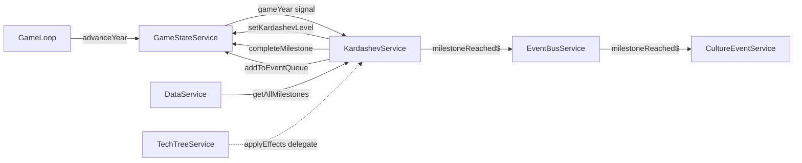

# Plan — `src/app/core/systems/kardashev.service.ts`

**Prompt block:** 3.6  
**Status:** Ready to implement

---

## 1. What this service does

`KardashevService` is a pure **system service** — it holds no state of its own. It:

1. **Recomputes `kardashevLevel`** once per game-year tick from `dysonCoveragePercent` using the
   formula `0.73 + (coverage / 100) * 1.27`.
2. **Checks all Kardashev milestones** each tick and completes any newly satisfied ones.
3. **Completes a milestone** by marking it in `GameStateService`, applying its effects via
   `TechTreeService.applyEffects()`, and emitting `milestoneReached$` on the `EventBusService`.

---

## 2. Architecture fit



- Wired via a single `effect()` on `gameYear` → `untracked(() => this._processYear())`, identical
  to `ResearchService` and `DysonService`.
- No second effect for `dysonCoveragePercent` — coverage is read fresh inside `_processYear()`.
- **No circular dependency**: `KardashevService` → `TechTreeService` → `TerraformingService`;
  none of those depend on `KardashevService`.

---

## 3. Pre-implementation gaps to resolve

| Gap | Detail | Recommendation |
|-----|--------|----------------|
| `deuterium_fusion_online` condition | Milestone JSON uses this string but no tech ID matches it. Closest techs are `earth_deuterium_extraction` and `earth_fusion_ignition_theory`. | Map `deuterium_fusion_online` → `completedTechs().includes('earth_fusion_ignition_theory')`. Add a `// NOTE:` comment. Align JSON later if needed. |
| `dyson_15_percent` condition | `DysonService` tracks coverage milestones at 10/25/50/100 %, not 15 %. | Parse the percentage from the condition string directly and check `dysonCoveragePercent() >= N`. No reliance on DysonService milestone IDs. |
| `interstellar_seed_ship_launched` | No tech or state for this exists. Milestone `type_3_gesture` will never fire. | Return `false` from `_checkCondition` for this ID. Add a TODO in `docs/agents/TODO.md`. |
| `two_habitable_worlds` threshold | "Habitable" is not defined in code. | Use `terraformingPhase >= HABITABLE_PHASE_THRESHOLD` (constant = `3`). Add a `// NOTE:`. |
| `first_self_sustaining_colony` threshold | `PlanetState.population` field exists but is never mutated by any current service (no colony management system yet). | Return `false` early if no planet has `population > 0`. Use constant `SELF_SUSTAINING_POPULATION = 10_000`. Add a TODO for when colony management is built. |

---

## 4. Layered breakdown

### 4a. Models — no changes needed
`KardashevMilestone` is already defined in `data.service.ts` (not in the models barrel — this is
intentional; it's a data-loading type). Import it as a type from there.

### 4b. JSON data — no changes needed
`public/data/kardashev-milestones.json` already exists and is loaded by `DataService.loadAll()`.

> **However**, the condition `deuterium_fusion_online` does not match any tech ID. The developer
> should verify with the product owner whether this should map to `earth_fusion_ignition_theory`
> only, or to both deuterium techs. The mapping is in `_checkCondition()` only — no JSON edit
> required.

### 4c. GameStateService — no changes needed
Already has:
- `setKardashevLevel(level: number): void`
- `completeMilestone(milestoneId: string): void` (idempotent)
- `addToEventQueue(entry: CultureEventEntry): void`
- `dysonCoveragePercent`, `completedMilestones`, `planets`, `completedTechs` readonly signals

### 4d. EventBusService — no changes needed
`milestoneReached$: Subject<string>` already exists.

### 4e. New file: `src/app/core/systems/kardashev.service.ts`

#### Constants (module-level, not exported)

```ts
/** Kardashev level when dyson coverage = 0 %. */
const KARDASHEV_BASE = 0.73;

/** Kardashev level span from 0 % to 100 % Dyson coverage. */
const KARDASHEV_SPAN = 1.27;

/**
 * Minimum terraformingPhase for a planet to count as "habitable".
 * Two planets at this phase or above satisfy the 'two_habitable_worlds' condition.
 * NOTE: Align with GDD definition when terraforming balance is tuned.
 */
const HABITABLE_PHASE_THRESHOLD = 3;

/**
 * Minimum population for a planet to count as a self-sustaining colony.
 * NOTE: Will need revisiting once ColonyManagementService populates PlanetState.population.
 */
const SELF_SUSTAINING_POPULATION = 10_000;
```

#### Service skeleton

```ts
@Injectable({ providedIn: 'root' })
export class KardashevService {
  private readonly gameState = inject(GameStateService);
  private readonly data      = inject(DataService);
  private readonly eventBus  = inject(EventBusService);
  private readonly techTree  = inject(TechTreeService);

  constructor() {
    effect(() => {
      this.gameState.gameYear(); // reactive dependency
      untracked(() => this._processYear());
    });
  }

  // ---------------------------------------------------------------------------
  // Private — tick handler
  // ---------------------------------------------------------------------------

  /** Called once per game-year tick. */
  private _processYear(): void { ... }

  // ---------------------------------------------------------------------------
  // Private — Kardashev level
  // ---------------------------------------------------------------------------

  private _updateLevel(): void { ... }

  // ---------------------------------------------------------------------------
  // Private — milestone checking
  // ---------------------------------------------------------------------------

  private _checkMilestones(): void { ... }
  private _checkCondition(conditionId: string): boolean { ... }
  private _completeMilestone(milestone: KardashevMilestone): void { ... }
}
```

#### Method-by-method spec

**`_processYear(): void`**
```
1. Call _updateLevel()
2. Call _checkMilestones()
```
No parameters. Reads signals inside (allowed because it is called from within `untracked()`).

**`_updateLevel(): void`**
```
const coverage = this.gameState.dysonCoveragePercent();
const level = KARDASHEV_BASE + (coverage / 100) * KARDASHEV_SPAN;
this.gameState.setKardashevLevel(level);
```
No rounding — the HUD pipe (`kardashev.pipe.ts`) handles display formatting.

**`_checkMilestones(): void`**
```
const completed = this.gameState.completedMilestones();
for (const milestone of this.data.getAllMilestones()) {
  if (completed.includes(milestone.id)) continue;
  if (milestone.conditions.every(c => this._checkCondition(c))) {
    this._completeMilestone(milestone);
  }
}
```

**`_checkCondition(conditionId: string): boolean`**

Match against known condition IDs with a switch or series of if-checks:

| Condition pattern | Implementation |
|---|---|
| `deuterium_fusion_online` | `this.gameState.completedTechs().includes('earth_fusion_ignition_theory')` |
| `dyson_XX_percent` (regex: `/^dyson_(\d+)_percent$/`) | Parse `N`, check `this.gameState.dysonCoveragePercent() >= N` |
| `two_habitable_worlds` | Count planets where `state.terraformingPhase >= HABITABLE_PHASE_THRESHOLD`; return count >= 2 |
| `first_self_sustaining_colony` | Any planet `state.population >= SELF_SUSTAINING_POPULATION` |
| `interstellar_seed_ship_launched` | `return false` (deferred — see TODO below) |
| unknown | `console.warn(...)`, `return false` |

Use a regex `/^dyson_(\d+)_percent$/` to extract the threshold — this handles both `dyson_15_percent`
and `dyson_100_percent` without a hardcoded list.

**`_completeMilestone(milestone: KardashevMilestone): void`**
```
1. gameState.completeMilestone(milestone.id)           // idempotent guard is inside GSS
2. techTree.applyEffects(milestone.effects, '')        // delegate effect processing (e.g. emit_event)
3. eventBus.milestoneReached$.next(milestone.id)       // notify CultureEventService and future listeners
```

Note: `TechTreeService.applyEffects()` already handles `emit_event` effects by calling
`gameState.addToEventQueue()`. The `milestoneReached$.next()` call fires *after* the queue write,
so `CultureEventService`'s subscription sees the event already in the queue.

The `planetId` passed to `applyEffects` is `''` — milestone effects in the current JSON are all
`emit_event` which ignores `planetId`. If milestone effects ever include planet-specific types,
the condition data would need to carry a planetId. This can stay as-is for now.

#### Imports

```ts
import { Injectable, DestroyRef, effect, inject, untracked } from '@angular/core';
import type { KardashevMilestone } from '@app/core/services/data.service'; // type-only import
import { DataService } from '@app/core/services/data.service';
import { EventBusService } from '@app/core/services/event-bus.service';
import { GameStateService } from '@app/core/services/game-state.service';
import { TechTreeService } from './tech-tree.service';
```

Note: `DestroyRef` is not needed — `effect()` auto-disposes on destroy. Remove if the linter
flags it as unused.

### 4f. App wiring

`KardashevService` is `providedIn: 'root'` and tree-shakeable. Its `effect()` only runs when the
service is instantiated. Per the Block 14 plan, system services are eagerly injected in
`GameShellComponent` (not yet built). 

**Until `GameShellComponent` exists**: No extra wiring needed for this block. The developer for
Block 14 will add `inject(KardashevService)` to the shell. Add a TODO in `TODO.md`.

### 4g. Tests: `src/app/core/systems/kardashev.service.spec.ts`

Use Vitest + Angular testing utilities. Mock `GameStateService`, `DataService`,
`EventBusService`, `TechTreeService`.

Key test cases:

| Test | What to verify |
|---|---|
| Level formula at 0% | `setKardashevLevel(0.73)` called |
| Level formula at 100% | `setKardashevLevel(2.00)` called |
| Level formula at 50% | `setKardashevLevel(≈1.365)` called |
| Already completed milestone | `completeMilestone` NOT called again |
| `type_1` conditions met | `completeMilestone('type_1')`, `applyEffects(...)`, `milestoneReached$.next('type_1')` called in order |
| `deuterium_fusion_online` true | `completedTechs` includes `earth_fusion_ignition_theory` |
| `dyson_15_percent` at 14.9% | condition returns `false` |
| `dyson_15_percent` at 15.0% | condition returns `true` |
| `two_habitable_worlds` — 1 planet at phase 3 | condition returns `false` |
| `two_habitable_worlds` — 2 planets at phase 3 | condition returns `true` |
| Unknown condition string | `console.warn` called, returns `false` |
| `interstellar_seed_ship_launched` | always `false`, does not throw |

---

## 5. Deferred work (add to TODO.md)

```
### KardashevService — interstellar_seed_ship_launched condition
- File: src/app/core/systems/kardashev.service.ts
- Location: _checkCondition(), 'interstellar_seed_ship_launched' case
- TODO: Implement when a state flag or tech for interstellar seed ships is added
- Depends on: late-game interstellar feature (Block TBD)
- Prompt block: TBD
- Added: 2026-06-11

### KardashevService — first_self_sustaining_colony condition
- File: src/app/core/systems/kardashev.service.ts
- Location: _checkCondition(), 'first_self_sustaining_colony' case
- TODO: Revisit SELF_SUSTAINING_POPULATION threshold once ColonyManagementService
  populates PlanetState.population. Currently always false if no service sets population.
- Depends on: Colony management system (Block TBD)
- Prompt block: TBD
- Added: 2026-06-11

### KardashevService — eager instantiation in GameShellComponent
- File: src/app/features/game-shell/game-shell.component.ts
- Location: Constructor / inject() calls
- TODO: Add inject(KardashevService) so the service's effect() is active during the game
- Depends on: GameShellComponent (Block 14)
- Prompt block: 14
- Added: 2026-06-11
```

---

## 6. Out of scope for this block

- `KardashevBarComponent` (HUD widget — separate block)
- `kardashev.pipe.ts` (Block 12.2)
- Actual colonist/population mechanics (`population` field always 0 until colony system)
- Interstellar seed ship state
- AudioService notifications on milestone (no AudioService yet — tracked in TODO.md)

---

## 7. Milestone breakdown

### Milestone A — Core service (no tests)
1. Create `src/app/core/systems/kardashev.service.ts` with constants, constructor `effect()`,
   `_processYear()`, `_updateLevel()`, `_checkMilestones()`, `_checkCondition()`,
   `_completeMilestone()`.
2. Add TODO entries to `docs/agents/TODO.md`.

### Milestone B — Tests
3. Create `src/app/core/systems/kardashev.service.spec.ts` with the test matrix above.

### Verification checklist
- [ ] `ng build` — no TypeScript errors
- [ ] `ng test kardashev` — all specs green
- [ ] Manual: start a new game in browser, open devtools, confirm `kardashevLevel` signal starts
      at `0.73` (0 % Dyson coverage at game start)
- [ ] Manual: unlock `earth_fusion_ignition_theory` + have ≥ 15 % Dyson coverage → confirm
      `type_1` milestone fires and culture event `ce_type1_reached` appears in the queue
