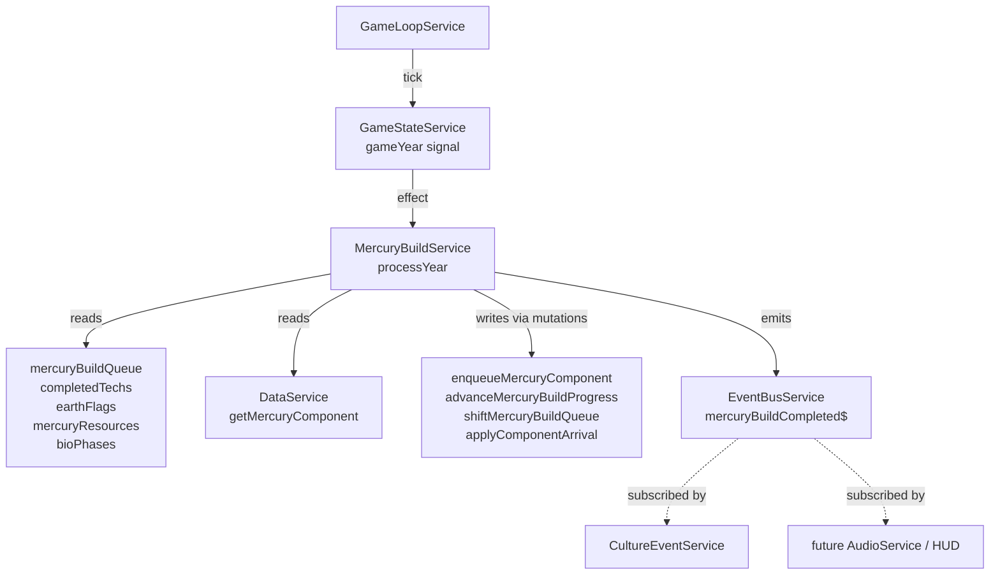

# Plan — `MercuryBuildService` (Block 3.8)

**Feature**: Mercury orbital component build queue — manages queued construction of ODN, precipitation
engines, atmospheric catalyst ships, and bioreactors; applies their arrival effects to `PlanetBioState`.

**Status**: Ready to implement  
**Depends on**: `GameStateService`, `DataService`, `EventBusService` — all exist ✓

---

## TODO check

No active TODOs in `docs/agents/TODO.md` are unblocked by this feature. One new TODO is added at
the end of this plan (AudioService integration).

---

## Architecture & data flow



**Signals read** (all inside `untracked()`):
- `gameState.gameYear()` — triggers `processYear()` via `effect()`
- `gameState.mercuryBuildQueue()` — first entry is processed each tick
- `gameState.mercuryResources()` — cost check before enqueuing
- `gameState.completedTechs()` / `gameState.earthFlags()` — unlock condition check
- `gameState.bioPhases()` — max-instance check via existing built counts

**Mutations called on `GameStateService`** (new methods — see §3 below):
- `enqueueMercuryComponent(entry)` — appends to queue
- `advanceMercuryBuildProgress()` — increments `progressYears` of the head entry
- `shiftMercuryBuildQueue()` — removes and returns the head entry
- `applyComponentArrival(planetId, componentId)` — flips `odnBuilt` / increments counters in `PlanetBioState`

**Event emitted**: `eventBus.mercuryBuildCompleted$.next(componentId)` — already declared in
`EventBusService` ✓

---

## Layered breakdown

### Layer 1 — Models

**No changes.** `MercuryQueueEntry` is already defined in `game-state.model.ts`:

```ts
// already exists — no edit needed
export interface MercuryQueueEntry {
  componentId: string;
  targetPlanet: string;
  progressYears: number;
  totalYears: number;
}
```

---

### Layer 2 — JSON data (`public/data/mercury-components.json`) — **NEW FILE**

Create `public/data/mercury-components.json` with the four orbital component definitions.

**Interface** (defined inline in `DataService` — see Layer 3):
```ts
export interface MercuryComponent {
  id: string;
  displayName: string;
  description: string;
  buildTimeYears: number;
  cost: ResourceStore;               // same type as grid buildings
  unlockCondition: string | null;    // a completedTech id or earthFlag key, or null
  maxInstances: number | null;       // null = unlimited
  targetEffect: 'odn' | 'precipitationEngine' | 'atmosphericCatalystShip' | 'bioreactor';
}
```

Placeholder content (tune build times and costs after playtesting):

| id | displayName | buildTimeYears | cost (ore/rare/polar) | unlockCondition | maxInstances | targetEffect |
|---|---|---|---|---|---|---|
| `odn` | Orbital Deployment Network | 40 | 0 / 60 / 20 | `null` | 1 | `odn` |
| `precipitationEngine` | Precipitation Engine | 30 | 20 / 30 / 10 | `null` | `null` | `precipitationEngine` |
| `atmosphericCatalystShip` | Atmospheric Catalyst Ship | 35 | 15 / 40 / 15 | `null` | `null` | `atmosphericCatalystShip` |
| `bioreactor` | Orbital Bioreactor | 25 | 30 / 20 / 0 | `null` | `null` | `bioreactor` |

> **NOTE**: `unlockCondition` for all components is `null` for now. Populate once tech-tree IDs
> are finalised. The service already handles non-null conditions via `completedTechs` and
> `earthFlags` checks.

---

### Layer 3 — `DataService` — **EXTEND**

**File**: `src/app/core/services/data.service.ts`

**What changes**:
1. Add `MercuryComponent` interface (export it, like `MercuryBuilding`).
2. Add `private mercuryComponents: MercuryComponent[] = []` private field.
3. Add `this.fetchJson<MercuryComponent[]>('/data/mercury-components.json')` to the `Promise.all`
   in `loadAll()` and assign the result.
4. Add two typed accessors:
   - `getMercuryComponent(id: string): MercuryComponent | undefined`
   - `getAllMercuryComponents(): MercuryComponent[]`

**Pitfall**: `loadAll()` uses a destructured `Promise.all` array — add the new fetch as the **last**
item and assign it to a new variable to avoid shifting existing destructure indices.

---

### Layer 4 — `GameStateService` — **EXTEND (mutation methods only)**

**File**: `src/app/core/services/game-state.service.ts`

Add four mutation methods to the "Mercury / Dyson mutations" section:

```ts
// Appends an entry to the orbital component build queue.
enqueueMercuryComponent(entry: MercuryQueueEntry): void {
  this._mercuryBuildQueue.update((q) => [...q, entry]);
}

// Increments progressYears of the first queue entry by 1.
// No-op if queue is empty.
advanceMercuryBuildProgress(): void {
  this._mercuryBuildQueue.update((q) => {
    if (q.length === 0) return q;
    const [first, ...rest] = q;
    return [{ ...first, progressYears: first.progressYears + 1 }, ...rest];
  });
}

// Removes and returns the first queue entry (the completed build).
// No-op if queue is empty — returns undefined.
shiftMercuryBuildQueue(): MercuryQueueEntry | undefined {
  let shifted: MercuryQueueEntry | undefined;
  this._mercuryBuildQueue.update((q) => {
    if (q.length === 0) return q;
    const [first, ...rest] = q;
    shifted = first;
    return rest;
  });
  return shifted;
}

// Applies a completed orbital component's arrival to a planet's PlanetBioState.
// Silent no-op for unknown planetId or unrecognised componentId.
applyComponentArrival(planetId: string, componentId: string): void {
  this._bioPhases.update((phases) => {
    const planet = phases[planetId];
    if (!planet) return phases;
    switch (componentId) {
      case 'odn':
        return { ...phases, [planetId]: { ...planet, odnBuilt: true } };
      case 'precipitationEngine':
        return { ...phases, [planetId]: { ...planet, precipitationEnginesBuilt: planet.precipitationEnginesBuilt + 1 } };
      case 'atmosphericCatalystShip':
        return { ...phases, [planetId]: { ...planet, atmosphericCatalystShipsBuilt: planet.atmosphericCatalystShipsBuilt + 1 } };
      case 'bioreactor':
        return { ...phases, [planetId]: { ...planet, bioreactorBatchesActive: planet.bioreactorBatchesActive + 1 } };
      default:
        return phases;
    }
  });
}
```

**Pitfall**: `applyComponentArrival` uses a `switch` with `string` cases — TypeScript strict mode
is fine because `componentId` is `string`. The `default:` branch returns unchanged state rather
than throwing, so a mis-typed ID fails silently (consistent with the pattern elsewhere in the
service).

---

### Layer 5 — `MercuryBuildService` — **NEW FILE**

**File**: `src/app/core/systems/mercury-build.service.ts`

#### Responsibility

Processes the Mercury orbital build queue one entry per game-year. Validates and enqueues new
build requests from the UI. Applies component-arrival bio-state effects and emits the event-bus
notification.

#### Full interface

```ts
@Injectable({ providedIn: 'root' })
export class MercuryBuildService {
  private readonly gameState = inject(GameStateService);
  private readonly data      = inject(DataService);
  private readonly eventBus  = inject(EventBusService);

  // Called via effect — see constructor
  processYear(_year: number): void { ... }

  // Public API for the Mercury HUD / build selector UI
  queueComponent(componentId: string, targetPlanet: string): boolean { ... }

  // Private helpers
  private _completeBuild(entry: MercuryQueueEntry): void { ... }
  private _unlockConditionMet(condition: string): boolean { ... }
  private _deductCosts(cost: ResourceStore): boolean { ... }
  private _countQueuedAndBuilt(componentId: string, targetPlanet: string): number { ... }
}
```

#### `constructor()`

```ts
constructor() {
  effect(() => {
    const year = this.gameState.gameYear();
    untracked(() => this.processYear(year));
  });
}
```

#### `processYear(_year: number): void`

```
1. Read queue — if empty, return immediately.
2. Call gameState.advanceMercuryBuildProgress().
3. Re-read queue[0] (post-update, synchronous signal).
4. If first.progressYears >= first.totalYears:
   a. _completeBuild(first)      ← bio-state update + event emit
   b. gameState.shiftMercuryBuildQueue()
```

**Pitfall — re-read after advance**: Step 3 re-reads the signal (not the stale local ref from
step 1). After `advanceMercuryBuildProgress()` the signal is updated synchronously, so
`this.gameState.mercuryBuildQueue()[0]` reflects the incremented `progressYears`. Use this
re-read value for the completion check.

**Pitfall — one entry per tick**: Only the head entry advances. The queue is not drained in a
single year. This is intentional — one component ships per year-tick when complete.

#### `queueComponent(componentId, targetPlanet): boolean`

```
1. Look up component via data.getMercuryComponent(componentId).
   → return false if not found.
2. If component.unlockCondition is set: _unlockConditionMet(condition).
   → return false if not met.
3. If component.maxInstances is not null:
   count = _countQueuedAndBuilt(componentId, targetPlanet).
   → return false if count >= component.maxInstances.
4. _deductCosts(component.cost).
   → return false if resources insufficient (costs NOT deducted on false).
5. gameState.enqueueMercuryComponent({
     componentId, targetPlanet,
     progressYears: 0, totalYears: component.buildTimeYears
   }).
6. return true.
```

**Order matters**: Step 4 (deduct costs) comes last among the validation steps — we don't want
to deduct resources and then fail the max-instance check.

#### `_completeBuild(entry): void`

```
1. gameState.applyComponentArrival(entry.targetPlanet, entry.componentId).
2. eventBus.mercuryBuildCompleted$.next(entry.componentId).
```

Order: bio-state update fires *before* the event emission so that any immediate subscriber
(e.g. `BioPhaseService` — if it ever subscribes to this event) sees the updated state.

#### `_unlockConditionMet(condition): boolean`

```
return gameState.completedTechs().includes(condition)
    || gameState.earthFlags()[condition] === true;
```

#### `_deductCosts(cost): boolean`

```
const current = gameState.mercuryResources();
if (any resource < required) return false;
gameState.updateMercuryResources({
  commonOre:      -cost.commonOre,
  rareMetals:     -cost.rareMetals,
  polarVolatiles: -cost.polarVolatiles,
});
return true;
```

#### `_countQueuedAndBuilt(componentId, targetPlanet): number`

```
inQueue = mercuryBuildQueue()
  .filter(e => e.componentId === componentId && e.targetPlanet === targetPlanet)
  .length;

bio = bioPhases()[targetPlanet];
built = switch (componentId) {
  'odn':                   bio?.odnBuilt ? 1 : 0
  'precipitationEngine':   bio?.precipitationEnginesBuilt ?? 0
  'atmosphericCatalystShip': bio?.atmosphericCatalystShipsBuilt ?? 0
  'bioreactor':            bio?.bioreactorBatchesActive ?? 0
  default: 0
}

return inQueue + built;
```

---

### Layer 6 — Shared utils / pipes / components

No changes needed.

---

### Layer 7 — Feature components

No changes in this block. The Mercury HUD / build-selector UI that calls `queueComponent()` is
owned by a later prompt block (Block 9 — Mercury feature components). A stub public API is
sufficient for now.

---

### Layer 8 — Styles / tokens

No changes.

---

### Layer 9 — Assets

No visual or audio assets required by this service.

---

### Layer 10 — App wiring

`MercuryBuildService` is `providedIn: 'root'`. Angular instantiates it eagerly the first time any
component or service injects it. Since nothing currently injects it, add it to the `providers`
array (or inject it in `GameShellComponent`) to ensure the `effect()` runs. Follow the same
pattern as `BioPhaseService` — it must be injected somewhere in the game shell's provider tree.

> **NOTE**: If other system services (BioPhaseService, KardashevService, etc.) are already
> eagerly injected in `GameShellComponent`, add `MercuryBuildService` to the same list.

---

### Layer 11 — Tests (`mercury-build.service.spec.ts`)

Co-locate with the service. Use `TestBed` with signal-based fakes for `GameStateService`.

Key scenarios:

**`queueComponent`**
- Returns `false` if `componentId` is not in `DataService`
- Returns `false` if `unlockCondition` not in `completedTechs` or `earthFlags`
- Returns `false` if any resource is insufficient (costs must NOT be deducted)
- Returns `false` if `maxInstances` already reached (counting queue + built)
- Returns `true`, deducts resources, and enqueues when all checks pass

**`processYear`**
- No-ops when `mercuryBuildQueue` is empty
- Increments `progressYears` of head entry on each tick
- Calls `applyComponentArrival` and shifts the queue when `progressYears >= totalYears`
- Does NOT advance a second entry in the same tick (only head progresses)

**`_completeBuild`**
- Sets `odnBuilt: true` on target planet's bio state when `componentId === 'odn'`
- Increments `precipitationEnginesBuilt` by 1 for `'precipitationEngine'`
- Emits `mercuryBuildCompleted$` with the `componentId`
- Bio-state mutation fires *before* event emission

**`_unlockConditionMet`**
- Returns `true` if condition string is in `completedTechs`
- Returns `true` if condition string key is `true` in `earthFlags`
- Returns `false` if neither

---

## Milestones

### Milestone A — Data & DataService
1. Create `public/data/mercury-components.json` with four component definitions.
2. Add `MercuryComponent` interface to `DataService`.
3. Add `loadAll()` fetch + `getMercuryComponent` / `getAllMercuryComponents` accessors.
4. **Verify**: `ng build` clean; `DataService` unit test confirms `getMercuryComponent('odn')` returns a non-null result.

### Milestone B — GameStateService mutations
5. Add `enqueueMercuryComponent`, `advanceMercuryBuildProgress`, `shiftMercuryBuildQueue`,
   `applyComponentArrival` methods.
6. **Verify**: `ng build` clean; existing `GameStateService` tests still pass.

### Milestone C — MercuryBuildService
7. Create `src/app/core/systems/mercury-build.service.ts`.
8. Wire the `effect()` and implement all methods.
9. Ensure `MercuryBuildService` is injected in `GameShellComponent` (or wherever system services
   are bootstrapped) so the effect actually runs.
10. **Verify**: `ng build` clean.

### Milestone D — Tests
11. Create `mercury-build.service.spec.ts` covering all scenarios listed above.
12. **Verify**: `ng test` (Vitest) green — all new specs pass, no regressions.

---

## Verification checklist

- [ ] `ng build` — zero errors, zero warnings
- [ ] `ng test` (Vitest) — all tests green
- [ ] Manual: start a new game, open Mercury panel, queue an ODN for Mars — resource counter
      decreases; queue entry appears with `progressYears: 0`
- [ ] Manual: advance years until `progressYears >= totalYears` — `bioPhases.mars.odnBuilt`
      becomes `true`; `mercuryBuildCompleted$` fires (verify via console log / dev event panel)
- [ ] Manual: attempt to queue a second ODN for Mars — `queueComponent` returns `false` (ODN
      `maxInstances: 1`)
- [ ] Manual: attempt to queue with insufficient resources — returns `false`, resources unchanged

---

## Out of scope / deferred

| Deferred | Reason |
|---|---|
| Mercury HUD build-selector UI | Block 9 (Mercury feature components) |
| Audio on build-complete | Depends on AudioService (not yet implemented — see TODO) |
| Component priority rearrangement (player re-orders queue) | Post-V1 nice-to-have |
| ODN / engine visual effects on the Orrery | Block 9 |

---
