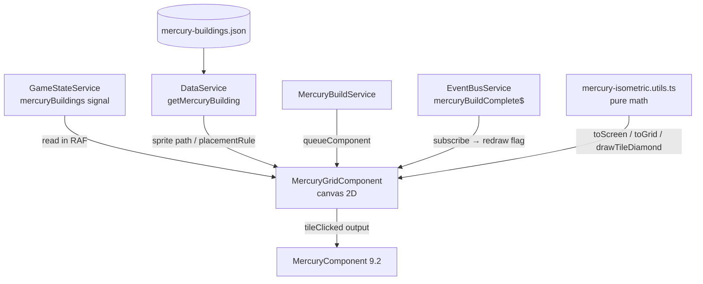

# Technical Implementation Plan: Block 9 — Mercury Grid

**Prompt block**: 9.1 (+ pre-empts 12.3 for isometric utils)  
**Date**: 2026-06-13  
**Scope**: `mercury-grid.component.ts` — Canvas 2D isometric tile renderer for the Mercury surface.  
**Adjacent blocks built separately**: 9.2 `mercury.component.ts`, 9.3 `building-selector.component.ts`.

---

## 1. Architecture & Strategy

### System context

`MercuryGridComponent` is a pure canvas renderer — it reads `GameStateService.mercuryBuildings()`
and calls `GameStateService.placeMercuryBuilding()` on click. It lives at
`src/app/features/mercury/mercury-grid/`. Its parent `MercuryComponent` (9.2) owns the tab layout,
passes down `selectedBuilding` and `selectedBuildingId` as inputs, and handles the
`BuildingSelectorComponent` (9.3). The grid is self-contained: no service can poke its canvas.

### Architecture diagram



### Key design decisions

- **`mercury-isometric.utils.ts` created now (pre-empts Block 12.3)**: all five pure math functions
  (`toScreen`, `toGrid`, `drawTileDiamond`, `isInBounds`, `sortByDepth`) are created in
  `src/app/shared/utils/mercury-isometric.utils.ts`. Block 12.3 can confirm/adjust the file;
  it already matches that prompt's spec exactly.

- **Five terrain types, not three**: prompt had `polar | flat | crater_rim`. Add `crater` for the
  permanently-shadowed fusion reactor pit. The 12×10 grid layout:
  - rows 0–1: `polar` (permanently shadowed, cool blue-grey)
  - rows 2–7: `flat` (sunlit equatorial plains, warm amber-tan)
  - rows 8–9: `crater_rim` (partial shadow, warm-grey) **except** cols 4–8 row 8 and cols 5–7
    row 9 which are `crater` (deep shadow, cold blue-black).

- **Terminator tint is purely cosmetic**: the tile fill colour is determined by terrain type at draw
  time. No state, no signal, no effect. Workers (dots) and building sprites draw on top — no
  additional logic needed. It only affects `drawTileDiamond`'s `fillColor` argument.

- **Light/shade placement rules are purely data**: `placementRule` on `MercuryBuilding` JSON
  enforces which terrain accepts which building. The grid never validates this itself — validation
  belongs in `BuildingSelectorComponent` (9.3). The grid only checks `isInBounds` and whether a
  tile is already occupied.

- **`selectedBuildingId` as `input<string | null>(null)`**: the prompt mentions `selectedBuilding`
  in hover/click logic but doesn't define it as a signal input. It must come from the parent
  (`MercuryComponent` 9.2) as an `input()`. The grid is a dumb renderer; the parent owns selection.

- **Workers stub with empty array**: `GameStateService` has no `mercuryWorkers` signal. The RAF
  loop's `drawWorkers()` method reads an empty local array and renders nothing. A TODO is added to
  `docs/agents/TODO.md`. No functional regression.

- **Sprite path convention** (no `spriteUrl` field on `MercuryBuilding`): derive as
  `/assets/svg/buildings/{buildingId}.svg` where `buildingId` is kebab-cased
  (e.g. `mining_outpost` → `mining-outpost.svg`). Documented with `// NOTE:` in the draw code.

- **Image cache as a plain `Map<string, HTMLImageElement>`**: live in the component instance,
  created once, cleared in `ngOnDestroy`. Never a service-level cache (sprites are only used by
  this canvas).

- **`ORIGIN_Y = 80`**: ARCHITECTURE.md is canonical; prompt value of `60` is overridden.

### Data flow

```
RAF callback fires (~60fps)
  │
  ├─ read once: buildings = gameState.mercuryBuildings()    ← snapshot, no mid-render signal calls
  ├─ read once: selectedId = selectedBuildingId()           ← from input signal
  │
  ├─ clearRect(canvas)
  ├─ sortByDepth(allTiles)
  ├─ for each tile: drawTile(col, row, terrain, building?)
  │     └─ drawTileDiamond(ctx, cx, cy, terrainColor(terrain))   ← terminator tint here
  │     └─ if building: drawBuildingSprite or placeholder rect
  │     └─ if building.status === 'building': drawConstructionOverlay
  ├─ drawWorkers()    ← stub, draws nothing
  └─ if hoverTile && selectedId: drawHoverPreview(hoverTile, selectedId)

mousemove → toGrid(x, y) → hoverTile (local, not a signal)
click     → toGrid(x, y) → emit tileClicked output
                         → if empty && selectedId: gameState.placeMercuryBuilding(...)

EventBusService.mercuryBuildComplete$
  └─ takeUntilDestroyed → sets needsRedraw flag (RAF always runs; this is a no-op)
```

---

## 2. Subtasks

### Milestone 1 — Isometric utilities

- [ ] **`src/app/shared/utils/mercury-isometric.utils.ts`** — Pure math, no imports.
  Export: `TILE_W = 64`, `TILE_H = 32`, `HALF_W`, `HALF_H`.
  - `toScreen(col, row, originX, originY): { x, y }` — `x = originX + (col - row) * HALF_W`, `y = originY + (col + row) * HALF_H`
  - `toGrid(screenX, screenY, originX, originY): { col, row }` — inverse transform; use `Math.round`
  - `drawTileDiamond(ctx, cx, cy, fillColor, strokeColor?): void` — path: top → right → bottom → left → close
  - `isInBounds(col, row, cols, rows): boolean`
  - `sortByDepth<T extends { col: number; row: number }>(items: T[]): T[]`
  - **No spec needed** — pure functions, spec is trivial and can be added in Block 12.3 if needed.

### Milestone 2 — Terrain map & terrain colours

- [ ] **Terrain type union**: `type TerrainType = 'polar' | 'flat' | 'crater_rim' | 'crater'`
  — defined locally at top of component file (not in models — it's a rendering concept).

- [ ] **`TERRAIN_MAP`**: `readonly` 2D `const` array `[GRID_ROWS][GRID_COLS]` of `TerrainType`.
  Layout:
  ```ts
  const TERRAIN_MAP: readonly TerrainType[][] = [
    // row 0 — polar
    [...Array(12).fill('polar')],
    // row 1 — polar
    [...Array(12).fill('polar')],
    // rows 2–7 — flat
    ...[2,3,4,5,6,7].map(() => [...Array(12).fill('flat')]),
    // row 8 — crater_rim except cols 4–8 = crater
    ['crater_rim','crater_rim','crater_rim','crater_rim','crater','crater','crater','crater','crater','crater_rim','crater_rim','crater_rim'],
    // row 9 — crater_rim except cols 5–7 = crater (narrower opening)
    ['crater_rim','crater_rim','crater_rim','crater_rim','crater_rim','crater','crater','crater','crater_rim','crater_rim','crater_rim','crater_rim'],
  ];
  ```

- [ ] **`TERRAIN_COLORS`**: `Record<TerrainType, string>` constant mapping terrain to fill hex.
  | Terrain | Fill | Stroke | Rationale |
  |---|---|---|---|
  | `polar` | `#5a7a9a` | `#4a6a8a` | Cool blue-grey — permanently shadowed craters, ice |
  | `flat` | `#c4a46b` | `#b09050` | Warm amber-tan — baking in direct sunlight |
  | `crater_rim` | `#9a8870` | `#8a7860` | Warm grey — partial shadow at crater edge |
  | `crater` | `#2a3550` | `#1a2540` | Cold blue-black — deep permanent shadow (fusion reactor site) |

### Milestone 3 — Mercury buildings JSON

- [ ] **`public/data/mercury-buildings.json`** — Populate with at least 3 seed buildings so the
  feature is playable. Currently `[]`.

  ```jsonc
  [
    {
      "id": "mining_outpost",
      "displayName": "Mining Outpost",
      "description": "Extracts common ore from Mercury's iron-rich plains.",
      "category": "extraction",
      "cost": { "commonOre": 0, "rareMetals": 10, "polarVolatiles": 0 },
      "energyDrawGw": 2,
      "buildTimeYears": 3,
      "repeatable": true,
      "maxInstances": null,
      "unlockCondition": null,
      "placementRule": "flat",
      "effects": [{ "type": "resource_rate", "resourceId": "commonOre", "rate": 5 }]
    },
    {
      "id": "volatiles_extractor",
      "displayName": "Volatiles Extractor",
      "description": "Harvests polar ice volatiles for export.",
      "category": "extraction",
      "cost": { "commonOre": 20, "rareMetals": 15, "polarVolatiles": 0 },
      "energyDrawGw": 3,
      "buildTimeYears": 4,
      "repeatable": true,
      "maxInstances": 4,
      "unlockCondition": null,
      "placementRule": "polar",
      "effects": [{ "type": "resource_rate", "resourceId": "polarVolatiles", "rate": 3 }]
    },
    {
      "id": "fusion_reactor",
      "displayName": "Fusion Reactor",
      "description": "Provides sustained power output from the permanently shadowed crater basin.",
      "category": "power",
      "cost": { "commonOre": 40, "rareMetals": 60, "polarVolatiles": 10 },
      "energyDrawGw": -50,
      "buildTimeYears": 8,
      "repeatable": false,
      "maxInstances": 1,
      "unlockCondition": "earth_fusion_power",
      "placementRule": "crater",
      "effects": [{ "type": "dyson_panels_per_year", "amount": 0 }]
    },
    {
      "id": "solar_array",
      "displayName": "Solar Array",
      "description": "Dense photovoltaic panels exploiting Mercury's intense solar flux.",
      "category": "power",
      "cost": { "commonOre": 15, "rareMetals": 5, "polarVolatiles": 0 },
      "energyDrawGw": -8,
      "buildTimeYears": 2,
      "repeatable": true,
      "maxInstances": null,
      "unlockCondition": null,
      "placementRule": "flat",
      "effects": [{ "type": "dyson_panels_per_year", "amount": 1 }]
    }
  ]
  ```

  **Pitfall**: `energyDrawGw` is negative for power producers (subtracts from consumption sum =
  positive net output). Fusion reactor `maxInstances: 1` enforces the single-crater constraint.

### Milestone 4 — Placeholder building sprites

One placeholder SVG per building ID at the exact path the component will resolve:

| Building ID | Path | Size |
|---|---|---|
| `mining_outpost` | `public/assets/svg/buildings/mining-outpost.svg` | 48×64 |
| `volatiles_extractor` | `public/assets/svg/buildings/volatiles-extractor.svg` | 48×64 |
| `fusion_reactor` | `public/assets/svg/buildings/fusion-reactor.svg` | 48×64 |
| `solar_array` | `public/assets/svg/buildings/solar-array.svg` | 48×64 |

Use `create-placeholder-svg` skill. Each: a simple geometric shape (box + icon hint) with a
dashed border, `<!-- PLACEHOLDER -->` comment, building name as visible text label.

### Milestone 5 — Core component

- [ ] **`src/app/features/mercury/mercury-grid/mercury-grid.component.ts`**

  ```ts
  // Inputs
  selectedBuildingId = input<string | null>(null)

  // Outputs
  tileClicked = output<{ col: number; row: number; hasBuilding: boolean }>()

  // ViewChild
  @ViewChild('mercuryCanvas') private canvasRef!: ElementRef<HTMLCanvasElement>

  // Private state (not signals — canvas-local, not game state)
  private ctx!: CanvasRenderingContext2D
  private rafId = 0
  private hoverTile: { col: number; row: number } | null = null
  private imageCache = new Map<string, HTMLImageElement>()
  ```

  **Key implementation notes:**

  **RAF lifecycle (OnPush-safe)**:
  ```ts
  ngAfterViewInit(): void {
    this.ctx = this.canvasRef.nativeElement.getContext('2d')!;
    this.rafId = requestAnimationFrame(() => this.renderLoop());
    // Wire EventBus: redraw trigger on build complete (canvas already redraws every frame)
    this.eventBus.mercuryBuildComplete$
      .pipe(takeUntilDestroyed(this.destroyRef))
      .subscribe(() => { /* RAF loop handles it automatically */ });
  }

  ngOnDestroy(): void {
    cancelAnimationFrame(this.rafId);
    this.imageCache.clear();
  }

  private renderLoop(): void {
    this.drawFrame();
    this.rafId = requestAnimationFrame(() => this.renderLoop());
  }
  ```

  **Signal reads — snapshot at top of frame only**:
  ```ts
  private drawFrame(): void {
    const canvas = this.canvasRef.nativeElement;
    const buildings = this.gameState.mercuryBuildings();   // read once
    const selectedId = this.selectedBuildingId();           // read once
    // ... rest of draw uses these locals only
  }
  ```

  **`drawTile(col, row, terrain, building?)`**:
  ```ts
  const { x, y } = toScreen(col, row, originX, ORIGIN_Y);
  drawTileDiamond(this.ctx, x, y, TERRAIN_COLORS[terrain].fill, TERRAIN_COLORS[terrain].stroke);
  if (building) {
    this.drawBuildingSprite(x, y, building);
    if (building.status === 'building') {
      this.drawConstructionOverlay(x, y, building.buildProgressYears / building.totalBuildYears);
    }
  }
  ```

  **Sprite loading & caching**:
  ```ts
  private drawBuildingSprite(cx: number, cy: number, building: PlacedBuilding): void {
    // NOTE: sprite path derived by convention: /assets/svg/buildings/{kebab(buildingId)}.svg
    const key = building.buildingId;
    const img = this.imageCache.get(key);
    if (!img) {
      const newImg = new Image();
      newImg.src = `/assets/svg/buildings/${key.replaceAll('_', '-')}.svg`;
      newImg.onload = () => this.imageCache.set(key, newImg);
      this.imageCache.set(key, newImg); // placeholder until loaded
      // Draw placeholder rect this frame
      this.ctx.fillStyle = '#888';
      this.ctx.fillRect(cx - 12, cy - 28, 24, 28);
      return;
    }
    if (!img.complete) {
      this.ctx.fillStyle = '#888';
      this.ctx.fillRect(cx - 12, cy - 28, 24, 28);
      return;
    }
    this.ctx.drawImage(img, cx - 24, cy - 48, 48, 48);
  }
  ```

  **Construction overlay (striped rect)**:
  ```ts
  private drawConstructionOverlay(cx: number, cy: number, progress: number): void {
    // Semi-transparent yellow stripes
    this.ctx.save();
    this.ctx.globalAlpha = 0.5;
    this.ctx.fillStyle = '#f5a623';
    const barW = 40 * progress;
    this.ctx.fillRect(cx - 20, cy + 8, barW, 6);
    this.ctx.strokeStyle = '#fff';
    this.ctx.lineWidth = 0.5;
    this.ctx.strokeRect(cx - 20, cy + 8, 40, 6);
    this.ctx.restore();
  }
  ```

  **Hover preview**:
  ```ts
  private drawHoverPreview(tile: { col: number; row: number }, selectedId: string): void {
    const building = this.data.getMercuryBuilding(selectedId);
    if (!building) return;
    const occupied = this.buildingAtTile(tile.col, tile.row, buildings);
    const terrain = TERRAIN_MAP[tile.row][tile.col];
    const valid = !occupied && (building.placementRule === 'any' || building.placementRule === terrain);
    const { x, y } = toScreen(tile.col, tile.row, originX, ORIGIN_Y);
    this.ctx.save();
    this.ctx.globalAlpha = 0.6;
    drawTileDiamond(this.ctx, x, y, valid ? '#44ff88' : '#ff4444');
    this.ctx.restore();
  }
  ```

  **Mouse event handlers** (added/removed in `ngAfterViewInit`/`ngOnDestroy`):
  ```ts
  private onMouseMove = (e: MouseEvent): void => {
    const { col, row } = toGrid(e.offsetX, e.offsetY, originX, ORIGIN_Y);
    this.hoverTile = isInBounds(col, row, GRID_COLS, GRID_ROWS) ? { col, row } : null;
  };

  private onClick = (e: MouseEvent): void => {
    const { col, row } = toGrid(e.offsetX, e.offsetY, originX, ORIGIN_Y);
    if (!isInBounds(col, row, GRID_COLS, GRID_ROWS)) return;
    const buildings = this.gameState.mercuryBuildings();
    const existing = this.buildingAtTile(col, row, buildings);
    if (existing) {
      this.tileClicked.emit({ col, row, hasBuilding: true });
      return;
    }
    const selectedId = this.selectedBuildingId();
    if (selectedId) {
      this.gameState.placeMercuryBuilding({
        id: crypto.randomUUID(),
        buildingId: selectedId,
        col, row,
        status: 'building',
        buildProgressYears: 0,
        totalBuildYears: this.data.getMercuryBuilding(selectedId)?.buildTimeYears ?? 1,
      });
    }
    this.tileClicked.emit({ col, row, hasBuilding: false });
  };
  ```

  **Pitfalls**:
  - Read all signals **once into locals** at the top of `drawFrame()` — never call signal getters
    mid-render (RAF + zone.js interactions).
  - `originX` must be computed from `canvas.width` at draw time, not cached at init (canvas may
    resize). `const originX = canvas.width / 2`.
  - `hoverTile` is a plain property, not a signal — it's canvas-local transient state.
  - `workers` is an empty array local constant; the stub is `private drawWorkers(): void {}`.
  - Remove canvas listeners in `ngOnDestroy`: `canvas.removeEventListener('mousemove', this.onMouseMove)`.
  - Never call `window.crypto.randomUUID()` — use `crypto.randomUUID()` directly (available in all
    modern browsers; Tauri runs Chromium).

### Milestone 6 — Template & styles

- [ ] **`mercury-grid.component.html`**:
  ```html
  <canvas
    #mercuryCanvas
    class="mercury-grid__canvas"
    [width]="canvasWidth"
    [height]="canvasHeight"
  ></canvas>
  ```
  `canvasWidth = GRID_COLS * TILE_W + TILE_W` and `canvasHeight = (GRID_ROWS + 1) * TILE_H * 2`
  — computed from constants (enough space for the last row's diamond bottom + buildings).

- [ ] **`mercury-grid.component.scss`**:
  ```scss
  :host {
    display: block;
    overflow: hidden;
    background-color: var(--color-surface-deep);
  }

  .mercury-grid__canvas {
    display: block;
    cursor: crosshair;
    image-rendering: pixelated;  // keep sprites crisp
  }
  ```

### Milestone 7 — Tests

- [ ] **`mercury-grid.component.spec.ts`** — shallow rendering tests:
  - Component creates with mocked services.
  - `ngOnDestroy` cancels RAF (spy on `cancelAnimationFrame`).
  - `ngOnDestroy` removes mouse listeners (spy on `removeEventListener`).
  - Click on occupied tile emits `tileClicked` with `hasBuilding: true`.
  - Click on empty tile with `selectedBuildingId` set calls `gameState.placeMercuryBuilding`.
  - Click outside grid bounds does nothing.
  - No `toScreen`/`toGrid` tests here — those belong in the utils spec.

- [ ] **`mercury-isometric.utils.spec.ts`**:
  - `toScreen(0, 0, 400, 80)` → `{ x: 400, y: 80 }` (origin)
  - `toScreen(1, 0, 400, 80)` → `{ x: 432, y: 112 }` (+HALF_W, +HALF_H)
  - `toGrid` is inverse of `toScreen` for integer coords
  - `isInBounds` edge cases (0, COLS-1, ROWS-1, negatives, out-of-range)
  - `sortByDepth` sorts ascending by col+row

---

## 3. Out of scope / deferred

- `mercury.component.ts` (9.2) and `building-selector.component.ts` (9.3) — separate plan items.
- Worker/vehicle state and animated movement — no `mercuryWorkers` signal exists yet (see TODO.md).
- Building progress advancement (MercuryBuildService already handles this on game year tick).
- Responsive canvas resize / `ResizeObserver` — fixed canvas size for now; post-playtest.
- IntersectionObserver pause when grid is hidden — out of scope; low priority for Mercury panel.

---

## 4. Verification checklist

- [ ] `npx ng build` — zero errors, zero new warnings
- [ ] `npx vitest run` — all existing tests pass, new specs green
- [ ] Open Mercury view: 12×10 isometric grid renders with correct terrain colour bands
- [ ] Polar rows (top) are cool blue-grey; flat rows are warm amber; crater rows are dark with a
  pocket of deep blue-black tiles around cols 4–8 rows 8–9
- [ ] Hover with a building selected: green preview on valid terrain, red on invalid
- [ ] Click on valid tile: building appears in `building` status with construction overlay
- [ ] Fusion reactor can only be placed on `crater` tiles (cols 4–8 row 8 or cols 5–7 row 9)
- [ ] After game year tick, `buildProgressYears` increments and overlay updates
- [ ] Console is clean — no uncaught errors, no "signal called inside effect" warnings

---

## 5. TODO.md additions

Add to `docs/agents/TODO.md`:

```
### MercuryGridComponent — Worker/vehicle rendering

- **File**: `src/app/features/mercury/mercury-grid/mercury-grid.component.ts`
- **Location**: `drawWorkers()` stub method
- **TODO**: Implement worker movement animations. Requires a `mercuryWorkers` signal in
  GameStateService. Workers should move between tiles over time (path-following), rendered as
  coloured moving dots in the RAF loop. Shade-aware: workers in crater tiles tint darker.
- **Depends on**: `mercuryWorkers: Signal<MercuryWorker[]>` added to GameStateService and
  serialized in SaveService
- **Prompt block**: TBD (post-Block 9)
- **Added**: 2026-06-13
```
