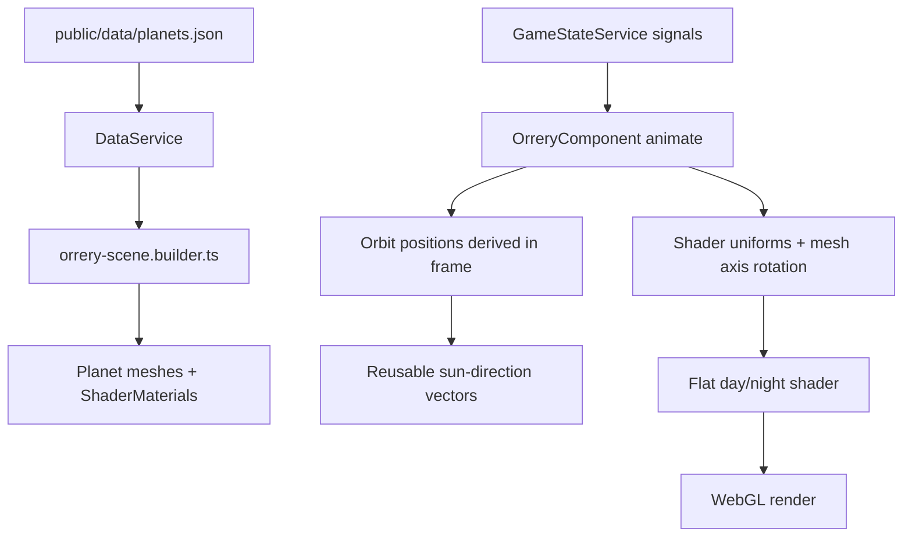

# Technical Implementation Plan: Orrery Day/Night Lighting

## 1. Architecture & Strategy

### System context

Block 18-3 replaces the current realistic-ish planet lighting in the Three.js orrery with a stylized, flat day/night material. It is an intended continuation of Block 6: `OrreryComponent` already owns the RAF loop and has a TODO for future planet surface shader uniforms, while `orrery-scene.builder.ts` owns mesh/material construction and scene disposal.

This feature is frontend-only rendering. It reads static `PlanetData` from `DataService` and runtime planet visual state from `GameStateService.planets()` once per RAF frame; it does not mutate game state and does not add save data.

### Architecture diagram

### Key design decisions

- **Use a custom `ShaderMaterial` for visible planet meshes**: `MeshStandardMaterial` depends on scene lights and creates the muddy gradient/specular behavior this prompt wants to remove. A shader lets the base texture stay visible everywhere, applies a flat shadow mask to the night hemisphere, reveals optional city lights only through that mask, and adds a narrow rim near the terminator.
- **Keep orbit rings and hit areas unchanged**: the existing interaction and raycasting shape is sound. Only the visible planet material and per-frame planet rotation/uniform updates need to change.
- **Keep `axisSpinSpeed` as non-negative speed and add a direction field**: `axisSpinSpeed` already exists in `PlanetInitialState` / `PlanetVisualParams` and data, but it cannot represent retrograde rotation. Add `axisRotationDirection: 'prograde' | 'retrograde'` to static initial state and runtime visual params instead of making speed signed, preserving existing validation semantics.
- **Treat city lights as a general night-side visual, not Earth-only**: validation and tests currently reject `cityLightsTexture` on Mars/Venus. This must be intentionally relaxed for `earth | mars | venus`.
- **Preallocate uniforms and scratch vectors**: `animate()` should read signals once at the top, compute planet positions, then update existing `Vector3`, `Color`, and numeric uniform values without allocating inside the loop.

### Data flow

`OrreryComponent.ngAfterViewInit()` asks `DataService.getAllPlanets()` for static planet content and passes each `PlanetData` into `buildPlanetObjects()`. The builder loads the base texture and optional city-lights texture and returns a visible planet mesh using the new shader material plus the existing hit mesh and orbit material.

In `OrreryComponent._animate()`:

1. Read `isPaused`, `planetsState`, and `dysonCoveragePercent` into locals at the top.
2. Advance render-only orbit angles if not paused, as the component already does.
3. Set visible and hit mesh positions once per planet.
4. Reuse the position to compute sun direction for each planet. Since sun is at origin and the shader wants the lit hemisphere facing the sun, the world-space direction from planet to sun is `-planetPosition.normalized()`.
5. Transform/reuse that direction consistently with shader space. The cleanest implementation is to pass a world-space normal from the vertex shader and a world-space `uSunDirection`; avoid object-space confusion once the planet mesh rotates.
6. Update shader uniforms for lock/hover tint, lit brightness, night shadow opacity/tint, rim width, city-lights intensity, and master toggle.
7. Rotate each visible mesh around its axis using `axisSpinSpeed` and `axisRotationDirection`; do not rotate hit areas.

No system service reacts via `effect()` for this feature. No mutation methods are called.

### Patterns & conventions to follow

- Keep Three.js setup/disposal in the existing builder/component split.
- Signals are read once at the top of RAF, never mid-render.
- Use typed interfaces for shader options and material ownership; no `any`.
- Keep texture paths in JSON and model interfaces, not TypeScript constants except default shader tuning.
- Use placeholder SVG assets for missing city-lights maps, 2:1 equirectangular `1024x512`.
- Preserve the existing `disposeScene()` traversal, but extend it so ShaderMaterial uniform textures are disposed too.

## 2. Subtasks

### Milestone 1 — Data Model and Planet JSON

- [ ] `src/app/core/models/planet.model.ts` — add `PlanetRotationDirection = 'prograde' | 'retrograde'`; add `axisRotationDirection` to `PlanetInitialState` and `PlanetVisualParams`; update comments so `axisSpinSpeed` is explicitly a visual orrery spin speed, not a gameplay value. Also update `PlanetVisualData.cityLightsTexture` comment from Earth-only to Earth/Mars/Venus night-side overlay.
- [ ] `src/app/core/models/planet.validation.ts` — validate `axisRotationDirection` as one of the two allowed strings; keep `axisSpinSpeed` non-negative. Change city-lights validation to allow `earth`, `mars`, and `venus`, and still reject Mercury unless design later says otherwise.
- [ ] `src/app/core/models/planet.model.spec.ts` — update validation specs: Mars/Venus city lights are accepted; Mercury city lights are rejected; invalid rotation direction fails; sanitized state preserves/clamps direction by fallback only if the project has an existing sanitize policy for enum fields.
- [ ] `src/app/core/services/game-state.service.ts` — copy `planet.initialState.axisRotationDirection` into `visualParams.axisRotationDirection` in `buildInitialPlanetsRecord()`.
- [ ] `public/data/planets.json` — add `axisRotationDirection` to each planet initial state. Recommended values: Earth `prograde`, Mercury `prograde`, Mars `prograde`, Venus `retrograde`. Keep current `axisSpinSpeed` values unless the developer chooses to retune them visually in the same pass.
- [ ] `public/data/planets.json` — add `visual.cityLightsTexture` paths for Mars and Venus, and preferably move Earth to the same SVG texture family. Proposed paths:
  - `/assets/svg/planets/textures/earth-city-lights-texture.svg`
  - `/assets/svg/planets/textures/mars-city-lights-texture.svg`
  - `/assets/svg/planets/textures/venus-city-lights-texture.svg`

Pitfall: current Earth data points at `/assets/textures/planets/earth_city_lights.png`, which does not appear in the SVG asset search and may be missing in browser builds. The orrery should consume the new SVG path family unless a real PNG is confirmed to exist.

### Milestone 2 — Shader Material Builder

- [ ] `src/app/features/orrery/orrery-scene.builder.ts` — introduce `OrreryDayNightLightingOptions` with defaults:
  - `enabled: true`
  - `highlightRimWidth: 0.04`
  - `litSideBrightness: 1.0`
  - `darkSideShadowOpacity: 0.5`
  - `darkSideShadowTint: '#000000'`
  - `cityLightsIntensity: 1.0`
- [ ] `src/app/features/orrery/orrery-scene.builder.ts` — introduce a planet material return type that can be updated by RAF, e.g. `type OrreryPlanetMaterial = THREE.ShaderMaterial` plus an accessor/interface for uniforms. Avoid exposing raw stringly uniform names throughout the component if a small typed wrapper keeps the loop readable.
- [ ] `src/app/features/orrery/orrery-scene.builder.ts` — replace visible planet `MeshStandardMaterial` with a `ShaderMaterial` created by a helper such as `createPlanetDayNightMaterial(planetData, options)`. It should load:
  - `uBaseTexture` from `planetData.visual.orreryTexturePath` when present.
  - `uCityLightsTexture` from `planetData.visual.cityLightsTexture` when present.
  - `uHasBaseTexture` / `uHasCityLightsTexture` booleans so color-only planets still render.
  - `uBaseColor`, `uTintColor`, `uSunDirection`, `uLitBrightness`, `uShadowOpacity`, `uShadowTint`, `uRimWidth`, `uCityLightsIntensity`, `uLightingEnabled`.
- [ ] `src/app/features/orrery/orrery-scene.builder.ts` — shader behavior:
  - Vertex shader passes `vUv` and a normalized world-space normal.
  - Fragment shader computes `sunAmount = dot(normalize(vWorldNormal), normalize(uSunDirection))`.
  - Lit mask is flat: `sunAmount >= 0.0` gets base texture/color multiplied by `uLitBrightness`, without a Lambert falloff.
  - Night mask applies `mix(base, uShadowTint, uShadowOpacity)` where `sunAmount < 0.0`.
  - City lights sample is added or screened only where night mask is active. Do not show it on lit side.
  - Rim is a narrow band on the lit-side edge around `sunAmount` near `0.0`, using configured width. Keep it graphic; if `smoothstep` is used, it should be very tight, not a broad gradient.
- [ ] `src/app/features/orrery/orrery-scene.builder.ts` — keep hit-area `MeshBasicMaterial` and orbit ring material unchanged.
- [ ] `src/app/features/orrery/orrery-scene.builder.spec.ts` — update tests to assert textured planets now get `ShaderMaterial`, base/city textures are loaded/configured, options become uniforms, and missing texture paths still render via base color.

Pitfall: do not use `MeshStandardMaterial` color/emissive logic for planet hover after this change. Hover/locked tint must become shader uniforms or a wrapper method.

### Milestone 3 — Orrery RAF Updates and Rotation

- [ ] `src/app/features/orrery/orrery.component.ts` — change `_planetMaterials` to store the shader material or typed material handle returned by the builder. Keep `_planetMeshes`, `_hitAreaMeshes`, `_orbitMaterials`, and `_planetAngles` maps.
- [ ] `src/app/features/orrery/orrery.component.ts` — add reusable scratch vectors/colors as class fields, for example one temporary `THREE.Vector3` for planet position and one per material uniform created at build time. Do not allocate vectors inside `_animate()`.
- [ ] `src/app/features/orrery/orrery.component.ts` — in `_animate()`, after positions are set, update each shader material:
  - `uSunDirection` from the already computed planet position toward origin.
  - `uTintColor` / lock/hover state based on the same logic currently applied to `mat.color` and `mat.emissiveIntensity`.
  - `uCityLightsIntensity` from `planetsState[id]?.visualParams.cityLightsIntensity ?? 0`, multiplied by the builder default. Earth starts at `1`; Mars/Venus can remain `0` until terraforming/colonization systems raise it later unless the visual overhaul wants them visible as placeholders immediately.
  - `uLightingEnabled` from the master toggle default.
- [ ] `src/app/features/orrery/orrery.component.ts` — rotate each visible planet mesh when not paused using `visualParams.axisSpinSpeed` and `visualParams.axisRotationDirection`; if a planet is locked and has no runtime state, fall back to static `PlanetData.initialState` values cached during setup.
- [ ] `src/app/features/orrery/orrery.component.ts` — keep the RAF rule: signal reads only at the top, no signal getters inside hover cursor checks during RAF. Existing event handlers can still read on interaction.
- [ ] `src/app/features/orrery/orrery.component.spec.ts` — replace the “textured planets stay white” test with shader-uniform assertions: locked hover sets grey tint, unlocked hover increases rim/tint or equivalent, and `_animate()` updates the sun-direction uniform without allocating new material objects.

Pitfall: if the shader uses world-space normals, planet mesh rotation affects the texture and normal orientation correctly. If object-space normals are used instead, sun direction must be transformed into object space each frame; that is easier to get wrong and can make the night side rotate with the texture instead of staying sun-facing.

### Milestone 4 — Lighting Rig Cleanup and Disposal

- [ ] `src/app/features/orrery/orrery-scene.builder.ts` — replace `createLights()` with a clearly named minimal scene-light function, or retune it to no-op/very low ambient. Since planet appearance is shader-controlled, remove the strong directional light from planet influence. The sun mesh can remain emissive via its own material.
- [ ] `src/app/features/orrery/orrery-scene.builder.ts` — document in the function comment that planets are shader-lit and scene lights are only for non-shader meshes if retained.
- [ ] `src/app/features/orrery/orrery-scene.builder.ts` — extend `disposeMaterial()` so it disposes textures held in `ShaderMaterial.uniforms` (`uBaseTexture`, `uCityLightsTexture`, and any future uniform texture) in addition to standard material slots. Keep the `Set<THREE.Texture>` duplicate guard.
- [ ] `src/app/features/orrery/orrery.component.ts` — no special `ngOnDestroy` branch should be necessary if `disposeScene()` handles shader uniform textures correctly, but clear all maps as today.
- [ ] `src/app/features/orrery/orrery-scene.builder.spec.ts` — add disposal coverage for `ShaderMaterial` uniform textures.

Pitfall: Three.js does not automatically dispose textures in shader uniforms. Relying on `material.dispose()` alone leaks GPU texture memory.

## 3. Assets (placeholders)

Create these as obvious placeholders via the `create-placeholder-svg` workflow. They should be equirectangular city-lights textures: `viewBox="0 0 1024 512"`, `width="1024"`, `height="512"`, `preserveAspectRatio="none"`, with `<!-- PLACEHOLDER: replace with final ... -->`, a dark background, scattered light dots, dashed border, and a faint label.

- [ ] `public/assets/svg/planets/textures/earth-city-lights-texture.svg` — Earth night city lights placeholder, `1024x512`.
- [ ] `public/assets/svg/planets/textures/mars-city-lights-texture.svg` — Mars colony/night lights placeholder, `1024x512`.
- [ ] `public/assets/svg/planets/textures/venus-city-lights-texture.svg` — Venus sky-city/night lights placeholder, `1024x512`.

Do not create a separate dark-side replacement texture. The dark side is the shader’s semi-transparent shadow overlay over the base texture.

## 4. Cross-cutting Concerns

### Edge cases & pitfalls

- Locked planets may not exist in `GameStateService.planets()` yet; use static data fallback for base color, rotation direction, and speed.
- If `cityLightsTexture` is present but texture loading fails, the shader should still render the base texture/color and simply skip city lights. Three.js loader errors can be handled later if the current texture-loading pattern remains fire-and-forget.
- `sunAmount === 0` is the terminator; make the rim narrow and deterministic. Do not add a broad soft gradient or specular shine.
- Hover and locked states currently use `color`/`emissiveIntensity`; after shader migration they must be represented by uniforms.
- Avoid per-frame `Object.entries()` if the developer decides to optimize further, but preserving current structure is acceptable. The non-negotiable part is no new `Vector3`, `Color`, textures, materials, arrays, or signal reads inside the loop.

### Save/load

No new serialized game-state fields are required beyond adding `axisRotationDirection` into runtime visual params. It is derived from static JSON when a new game starts. Existing saves may need a default during save hydration/sanitization if they lack `visualParams.axisRotationDirection`; default to `retrograde` only for Venus and `prograde` for others using planet id.

### Memory & performance

- Reuse shader materials and uniforms for the lifetime of the orrery scene.
- Reuse scratch vectors/colors in RAF.
- Dispose base textures, city-lights textures, shader materials, geometries, background texture, starfield point texture, and renderer via `disposeScene()`.
- Keep the IntersectionObserver pause behavior intact.

### Accessibility & motion

This feature is visual only and has no new UI controls. The “configurability” requirement should be implemented as typed builder/material parameters and constants, not an in-game settings panel in this block.

## 5. Out of Scope / Deferred

- Block 18-4: pixelate post-process, sun glow overhaul, atmosphere glow.
- Block 18-5: orbit-ring interaction changes and removing planet gray-out.
- Procedural final planet texture generation.
- Selected-planet orbit-view zoom and panel composition from the existing TODO; this block only prepares the shader/city-lights material support that that later orbit view can reuse.
- Audio, Tauri, save-slot UI, or any backend work.

## 6. Verification

- [ ] `ng build` succeeds with 0 errors.
- [ ] `npx vitest run src/app/core/models/planet.model.spec.ts` passes. This is the one Vitest slice known to resolve without the project-wide `@app/*` alias issue.
- [ ] `npx vitest run src/app/features/orrery/orrery-scene.builder.spec.ts src/app/features/orrery/orrery.component.spec.ts` is attempted; if it fails on the known `@app/*` Vitest alias issue, record that and rely on `ng build` for compile validation.
- [ ] Manual check: start the app, view the orrery, confirm planets have flat lit hemispheres facing the sun, dark hemispheres have the base texture under a roughly 50% black overlay, city lights are visible only on the night side for Earth/Mars/Venus where intensity allows, and the rim is a thin bright terminator band.
- [ ] Manual check: pause/unpause and confirm orbit/rotation behavior pauses consistently with the existing orrery behavior.
- [ ] Manual check: hover locked and unlocked planets and confirm the existing interaction feedback still reads clearly.
- [ ] Ask the user to playtest the visual feel manually; no automated E2E for this block.

## 7. References

- Prompt block: `docs/agents/prompts/18-3-orrery-daynight-lighting.txt`
- Architecture: `docs/agents/ARCHITECTURE.md` — Canvas components / OrreryComponent, Visual value pattern, cleanup rules
- GDD: `docs/GDD/main-gdd.md` — peaceful cosmic visual tone, Kurzgesagt inspiration
- Existing code: `src/app/features/orrery/orrery-scene.builder.ts`, `src/app/features/orrery/orrery.component.ts`, `src/app/core/models/planet.model.ts`, `public/data/planets.json`
