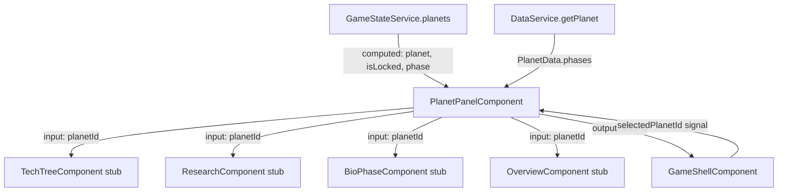

# Technical Implementation Plan: Planet Panel (Block 7.1)

## 1. Architecture & Strategy

### System context

`PlanetPanelComponent` is the root container for all per-planet detail. It lives at
`src/app/features/planet-panel/` and is already wired into `GameShellComponent` as a stub.
It depends on Blocks 0–6 (models, GameStateService, DataService, EventBusService, GameShell wiring —
all exist). The tab-content children (Blocks 7.2–7.5) and the vignette (Block 13.1) are out of scope
here; this block creates functional stubs for them so the shell compiles and the panel itself is
complete.

### Architecture diagram



### Key design decisions

- **Slide state owned by the component**: the component adds `.is-open` on its own root element via
  `[class.is-open]="planetId() !== null"`. The GameShell template currently also sets `[class.is-open]`
  on `<app-planet-panel>` — that attribute binding must be **removed** from the shell template.
  Only one owner of this class; keeping it inside the component makes the panel self-contained and
  reusable in future layouts.

- **Close via `output()`**: `GameShellComponent` already has `closePlanetPanel()` which sets
  `selectedPlanetId` to `null`. PlanetPanel emits `closed = output<void>()`. The shell template
  binds `(closed)="closePlanetPanel()"`. No EventBus needed — this is a direct parent→child→parent
  UI interaction, not a cross-feature event.

- **`initial-load` timeout**: a one-shot 800ms `setTimeout` applies the class, then removes it.
  AGENTS.md bans game timers in components, not one-shot CSS class flips. Allowed here, but the
  timeout ID **must** be stored and `clearTimeout`-ed in `ngOnDestroy` to prevent firing on a
  destroyed component.

- **Locked detection**: a planet is locked if `gameState.planets()[planetId()]` returns `undefined`
  (no entry means the planet hasn't been initialised/unlocked). This matches the logic in
  `PlanetsPanelComponent._buildRow()`.

- **`moonTabActive` input**: `GameShellComponent` has a `// TODO` noting it needs a `moonTabActive`
  input on PlanetPanel. This block resolves that TODO. Add
  `moonTabActive = input<boolean>(false)` and pass it down to `ResearchComponent` stub so it can
  auto-select the Moon/research sub-tab (Block 7.4 will consume it).

- **`PlanetPhase.description`**: the prompt says to show "phase description" but `PlanetPhase` only
  has `displayName`. Add `description?: string` to `PlanetPhase` in `planet.model.ts` and add
  placeholder strings to `planets.json`. If the field is absent, show nothing — no broken UI.

- **Overview tab**: not in the canonical PROMPTS.md blocks 7.2–7.5, but referenced in the prompt.
  Create a minimal stub (`app-planet-overview`) that shows three key stats from `PlanetState`
  (atmospherePressure, temperatureCelsius, population). It can be expanded by a later polish block.

### Data flow

```
planetId input (string | null)
  └─ computed: planet  = gameState.planets()[planetId()!]      (PlanetState | undefined)
  └─ computed: isLocked = planetId() !== null && !planet()
  └─ computed: data    = dataService.getPlanet(planetId()!)    (PlanetData)
  └─ computed: phaseName = data().phases[planet().terraformingPhase]?.displayName
  └─ computed: phaseDesc = data().phases[planet().terraformingPhase]?.description
```

Signals are read-only in the component; no mutation methods are called from the panel container itself
(mutations happen inside the child tab components in Blocks 7.2–7.5).

The `initial-load` CSS class is local UI state, not `GameStateService` state (it's ephemeral animation
scaffolding, not persisted).

### Patterns & conventions to follow

- Standalone + OnPush; signals only; `inject()`; `input()`/`output()`.
- `@if`/`@for` with `track` for any lists.
- `--transition-panel` token for the slide, `--transition-initial` for the atmosphere bars.
- No content hardcoded in TypeScript — planet names, phase names, descriptions from JSON.
- Close timeout id cleared in `ngOnDestroy`.

---

## 2. Subtasks

### Milestone 1 — Model patch

- [ ] **`src/app/core/models/planet.model.ts`** — Add `description?: string` to `PlanetPhase`.
  No other changes. Simple one-liner. No test change needed (existing interface tests still pass).

- [ ] **`public/data/planets.json`** — Add a short `description` string to each phase entry for all
  four planets. Placeholder text is fine (e.g. `"Earth's industrial heartbeat defines this era."`);
  the content author will refine later.

### Milestone 2 — Child component stubs

Four minimal stubs that compile and accept the `planetId` input. Each gets a `*.component.ts` only
(no template file needed yet — inline empty `template: ''`). They exist so the parent's imports array
resolves. Block 7.2–7.5 replace them.

- [ ] **`src/app/features/planet-panel/tech-tree/tech-tree.component.ts`** (stub)
  ```ts
  // Key signatures:
  readonly planetId = input.required<string>();
  // template: '' — Block 7.2 will replace
  ```

- [ ] **`src/app/features/planet-panel/research/research.component.ts`** (stub)
  ```ts
  readonly planetId = input.required<string>();
  readonly moonTabActive = input<boolean>(false); // consumed in Block 7.4
  // template: ''
  ```

- [ ] **`src/app/features/planet-panel/bio-phase/bio-phase.component.ts`** (stub)
  ```ts
  readonly planetId = input.required<string>();
  // template: ''
  ```

- [ ] **`src/app/features/planet-panel/overview/overview.component.ts`** (stub + minimal template)
  Shows `atmospherePressure` (bar/atm), `temperatureCelsius` (°C), `population` from the
  `PlanetState` signal. Reads `gameState.planets()[planetId()]` directly. Inline template is fine
  here (3 stat lines). Kept under 80 lines. Selector: `app-planet-overview`.

  ```ts
  readonly planetId = input.required<string>();
  private readonly gameState = inject(GameStateService);
  readonly planet = computed(() => this.gameState.planets()[this.planetId()]);
  ```

### Milestone 3 — PlanetPanelComponent

- [ ] **`src/app/features/planet-panel/planet-panel.component.ts`** — Replace stub.

  Key class shape:
  ```ts
  readonly planetId     = input<string | null>(null);
  readonly moonTabActive = input<boolean>(false);
  closed                = output<void>();

  private readonly gameState = inject(GameStateService);
  private readonly data      = inject(DataService);

  private initialLoadTimeoutId: ReturnType<typeof setTimeout> | null = null;

  // Derived
  readonly planet    = computed(() => planetId() ? gameState.planets()[planetId()!] : null);
  readonly isLocked  = computed(() => planetId() !== null && !this.planet());
  readonly planetData = computed(() => planetId() ? data.getPlanet(planetId()!) : null);
  readonly phaseName = computed(() => {
    const p = this.planet(); const d = this.planetData();
    return d?.phases[p?.terraformingPhase ?? 0]?.displayName ?? '';
  });
  readonly phaseDesc = computed(() => {
    const p = this.planet(); const d = this.planetData();
    return d?.phases[p?.terraformingPhase ?? 0]?.description ?? null;
  });

  readonly activeTab = signal<'tech-tree' | 'research' | 'bio-phases' | 'overview'>('tech-tree');
  readonly isEarth   = computed(() => this.planetId() === 'earth');

  ngOnChanges(): void { /* handles initial-load class */ }
  ngOnDestroy(): void { clearTimeout(this.initialLoadTimeoutId ?? undefined); }

  close(): void { this.closed.emit(); }
  ```

  `initial-load` logic: in an `effect()` that tracks `planetId()`, when `planetId()` changes from
  `null` to a non-null value, add the `initial-load` CSS class to the host, then schedule its
  removal after 800ms. Use `inject(ElementRef)` to access the host element; add/remove the class
  via `renderer.addClass`/`renderer.removeClass` (inject `Renderer2`). Clear the previous timeout
  before setting a new one.

  **Pitfall:** `effect()` runs during detection; wrap the `setTimeout` call itself in `untracked()`
  to prevent any signal reads inside the callback from creating new subscriptions.

- [ ] **`src/app/features/planet-panel/planet-panel.component.html`**

  Structure:
  ```
  <div class="planet-panel" [class.is-open]="planetId() !== null">
    @if (planetId() !== null) {
      <header class="planet-panel__header">
        <button class="planet-panel__close" (click)="close()">←</button>
        <h2>{{ planetData()?.displayName }}</h2>
        <span class="planet-panel__phase">{{ phaseName() }}</span>
        @if (phaseDesc()) {
          <p class="planet-panel__phase-desc">{{ phaseDesc() }}</p>
        }
      </header>

      @if (isLocked()) {
        <div class="planet-panel__locked">
          <p>This planet is not yet accessible.</p>
        </div>
      } @else {
        <nav class="planet-panel__tabs" role="tablist">
          <button role="tab" [class.is-active]="activeTab() === 'tech-tree'"
            (click)="activeTab.set('tech-tree')">Tech Tree</button>
          <button role="tab" [class.is-active]="activeTab() === 'research'"
            (click)="activeTab.set('research')">Research</button>
          <button role="tab" [class.is-active]="activeTab() === 'bio-phases'"
            (click)="activeTab.set('bio-phases')">Bio Phases</button>
          <button role="tab" [class.is-active]="activeTab() === 'overview'"
            (click)="activeTab.set('overview')">Overview</button>
          @if (isEarth()) {
            <button role="tab" [class.is-active]="activeTab() === 'research' && moonTabActive()"
              (click)="activeTab.set('research')">Moon</button>
          }
        </nav>

        <div class="planet-panel__content" role="tabpanel">
          @switch (activeTab()) {
            @case ('tech-tree') {
              <app-tech-tree [planetId]="planetId()!" />
            }
            @case ('research') {
              <app-research [planetId]="planetId()!" [moonTabActive]="moonTabActive()" />
            }
            @case ('bio-phases') {
              <app-bio-phase [planetId]="planetId()!" />
            }
            @case ('overview') {
              <app-planet-overview [planetId]="planetId()!" />
            }
          }
        </div>
      }
    }
  }
  </div>
  ```

  **Note on Moon tab:** The Moon button sets the research tab active; `moonTabActive` is passed to
  `ResearchComponent` so it can scroll/select the Moon sub-section (Block 7.4 implements this).
  The Moon button only appears when `isEarth()` is true. Its active state uses
  `activeTab() === 'research' && moonTabActive()` — a UI-only `isActiveMoonTab` computed is
  cleaner; add it to the class.

- [ ] **`src/app/features/planet-panel/planet-panel.component.scss`**

  ```scss
  .planet-panel {
    // Layout: fixed right-side panel, full viewport height
    position: fixed;
    top: 0;
    right: 0;
    width: 480px;           // or a token if one exists; else define --panel-width locally
    height: 100vh;
    background: var(--color-bg-surface);
    border-left: var(--border-subtle);
    box-shadow: var(--shadow-panel);
    display: flex;
    flex-direction: column;
    z-index: 100;

    transform: translateX(100%);
    transition: var(--transition-panel);  // uses --transition-panel token

    &.is-open { transform: translateX(0); }

    // initial-load variant: first-open atmosphere bars animate ease-out
    &.initial-load .atmosphere-bar {
      transition: var(--transition-initial);  // uses --transition-initial token
    }

    &__header { /* padding, flex layout */ }
    &__close  { /* icon/text button, top-left */ }
    &__phase  { color: var(--color-text-secondary); font-size: var(--text-sm); }
    &__phase-desc { color: var(--color-text-secondary); font-size: var(--text-xs); }
    &__locked { /* centered message */ }
    &__tabs   { display: flex; gap: var(--space-xs); padding: var(--space-sm); }
    &__content { flex: 1; overflow-y: auto; }
  }

  // Tab button states
  .planet-panel__tabs button {
    // base, :hover, .is-active styles — use tokens
    background: transparent;
    color: var(--color-text-secondary);
    border: none;
    padding: var(--space-xs) var(--space-sm);
    cursor: pointer;
    font-family: var(--font-mono);
    font-size: var(--text-xs);

    &.is-active { color: var(--color-text-primary); border-bottom: 2px solid var(--color-accent); }
    &:hover:not(.is-active) { color: var(--color-text-primary); }
  }
  ```

  **Pitfall:** Do NOT set `overflow: hidden` on the root or the slide will clip unexpectedly during
  the transition. The parent (`game-shell`) must not add `overflow: hidden` either — it doesn't currently.

### Milestone 4 — App wiring (GameShell template)

- [ ] **`src/app/features/game-shell/game-shell.component.html`**

  Current:
  ```html
  <app-planet-panel
    class="planet-panel-overlay"
    [class.is-open]="selectedPlanetId() !== null"
    [planetId]="selectedPlanetId()"
  />
  ```

  Replace with:
  ```html
  <app-planet-panel
    [planetId]="selectedPlanetId()"
    [moonTabActive]="moonTabActive()"
    (closed)="closePlanetPanel()"
  />
  ```

  Removes the external `[class.is-open]` (component owns it now) and the `class="planet-panel-overlay"`
  (that class is no longer needed since the panel positions itself with `position: fixed`).
  Adds `moonTabActive` binding and the `(closed)` binding.

  **Check:** the existing `game-shell.component.scss` must not set `overflow: hidden` on its root
  element — confirm this before implementing.

### Milestone 5 — Tests

- [ ] **`src/app/features/planet-panel/planet-panel.component.spec.ts`**

  Cover:
  1. Panel is hidden (no `.is-open` class) when `planetId` is `null`.
  2. Panel slides in (`.is-open` added) when `planetId` is set to `'earth'`.
  3. Locked message shown when `planetId` is set but `gameState.planets()` has no entry for it.
  4. Tabs rendered when planet is unlocked; locked message hidden.
  5. Moon tab rendered only when `planetId === 'earth'`; absent for `'mars'`.
  6. `closed` output emits when close button is clicked.
  7. `activeTab` defaults to `'tech-tree'`.
  8. `initial-load` class is added on open and removed after ~800ms (use `fakeAsync` + `tick(800)`).
  9. `ngOnDestroy` clears the timeout (no leaks — `clearTimeout` spy).

  Use `TestBed` with `MockGameStateService` and `MockDataService` (minimal stubs returning one Earth
  planet state and one PlanetData with 2 phases).

---

## 3. Assets (placeholders)

No new assets required by the container shell itself. Tab children (Blocks 7.2–7.5) will need
icons/vignettes — scoped to those plans.

---

## 4. Cross-cutting concerns

### Edge cases & pitfalls

- `planetId()` is `null` while the panel is sliding out — `@if (planetId() !== null)` guards the
  entire content, so no child component is active during the close animation. The `.is-open` removal
  triggers the CSS transition; content vanishes instantly because the `@if` tears it down. To keep
  content visible during the slide-out, use a local signal `visiblePlanetId` that holds the last
  non-null value, cleared after the transition ends. **Decision:** for Block 7.1, accept the content
  tear-down on close — it's fast (0.25s). If it looks bad during playtesting, the `visiblePlanetId`
  pattern can be added in a polish pass without changing the architecture.

- Phase index out of bounds: `planet.terraformingPhase` could exceed `phases.length - 1` if JSON
  is inconsistent. Guard with `?.[index]?.displayName ?? 'Unknown'`.

- `DataService.getPlanet()` throws for unknown IDs — `planetData = computed(() => planetId() ? data.getPlanet(planetId()!) : null)` is called only when `planetId()` is non-null. Any unlocked planet must have a corresponding JSON entry; if it doesn't, the `getPlanet` throw surfaces immediately as a data bug, which is correct.

- `initial-load` fires on every open, not just the first. That is intentional — the atmosphere bars
  need the ease-out on each panel open.

### Save/load

PlanetPanelComponent holds no serialised state. `selectedPlanetId` lives in `GameShellComponent`
(transient UI signal) and is reset to `null` on load (panel starts closed).

### Memory & performance

- One `setTimeout` per open. Clear in `ngOnDestroy` — mandatory.
- No RAF, no subscriptions. No Three.js. No cleanup beyond the timeout.

### Accessibility & motion

- Close button must have `aria-label="Close planet panel"`.
- Tab buttons use `role="tab"` and the nav uses `role="tablist"`.
- When `reduced-motion` is active, `--transition-panel` resolves to `none` (already handled by
  the token override in `tokens.scss`). The `initial-load` class adds no benefit in reduced-motion
  mode; the 800ms timer still fires but the transition is instant — acceptable.

---

## 5. Out of scope / deferred

| Feature | Block |
|---|---|
| `TechTreeComponent` (full) | Block 7.2 |
| `ForkChoiceModalComponent` | Block 7.3 |
| `ResearchComponent` (full) | Block 7.4 |
| `BioPhaseComponent` (full) | Block 7.5 |
| `VignetteComponent` (full) | Block 13.1 |
| Tab icons / decorative art | Block 3b (ui-ux-specialist) |

---

## 6. Verification

- [ ] `ng build` succeeds (0 TypeScript errors)
- [ ] `npx vitest run` passes (all existing tests + new planet-panel spec)
- [ ] Manual: launch app → click a planet in the orrery → panel slides in from right
- [ ] Manual: panel shows planet name and current phase name
- [ ] Manual: close button slides panel out
- [ ] Manual: click locked planet (Mars before unlock) → panel shows locked message, no tabs
- [ ] Manual: click Earth → Moon tab appears; other planets → Moon tab absent
- [ ] Manual: advance game year → phase name updates reactively without closing/reopening panel
- [ ] Ask user to playtest full open/close cycle and the Moon tab flow

---

## 7. References

- GDD: `docs/GDD/main-gdd.md`
- Architecture: `docs/agents/ARCHITECTURE.md`
- Prompt block: `docs/agents/PROMPTS.md` — Block 7, section 7.1
- Existing shell wiring: `src/app/features/game-shell/game-shell.component.ts` line 52, 109
- Token reference: `src/styles/tokens.scss` — `--transition-panel`, `--transition-initial`
- Locked planet pattern: `src/app/features/hud/planets-panel/planets-panel.component.ts` line 82
