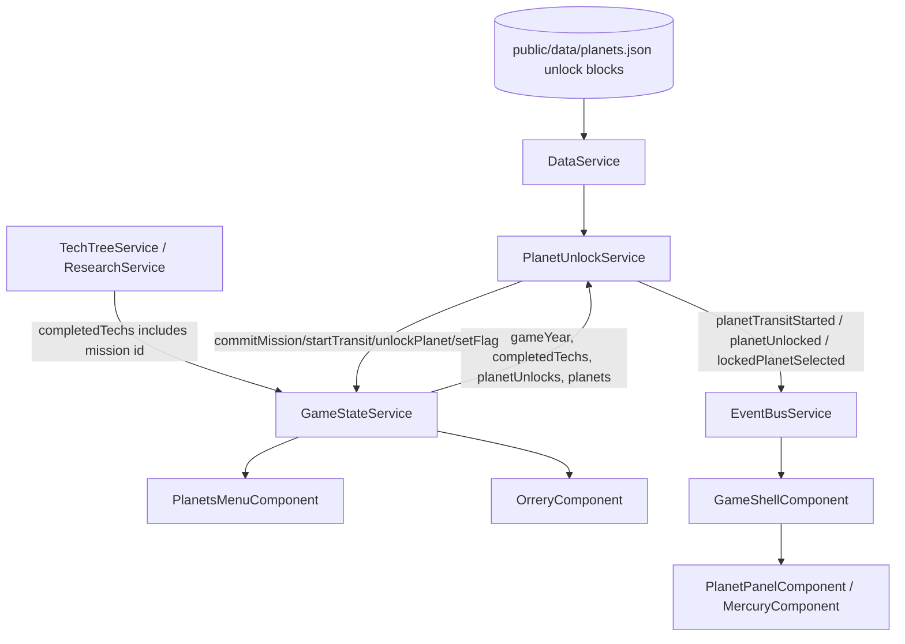

# Technical Implementation Plan: Planet Unlock Chain

## 1. Architecture & Strategy

### System context

Block 19-1 wires the GDD progression path into actual game state: Earth starts playable, Mercury starts locked, the Mercury mission enters an in-transit state, and arrival unlocks Mercury. Mars and Venus unlock later from Mercury industrial progress, while Moon remains an Earth-panel concern rather than an orrery planet.

The current code does not have a real unlock state. `GameStateService.reset()` seeds every planet into `planets`, while `OrreryComponent`, `PlanetsMenuComponent`, and `PlanetPanelComponent` infer locked/unlocked from whether `planets[id]` exists. That inference is the root problem to remove.

### Architecture diagram

### Key design decisions

- **Explicit unlock state, separate from `PlanetState`**: keep all static/dynamic planet simulation state in `planets`, but add persisted unlock metadata keyed by planet id. This avoids deleting Mars/Venus simulation state just to represent locked UI and keeps terraforming services from failing on missing planet records.
- **Data-driven unlock definitions**: replace `unlockCondition: string | null` with a structured `unlock` block in `PlanetData`. IDs, years, transit durations, phase requirements, culture-event ids, and follow-up flags all come from JSON.
- **New `PlanetUnlockService` system**: add a focused system service under `src/app/core/systems/` instead of putting mission/transit logic in components or `TechTreeService`. It reacts to `gameYear`, `completedTechs`, Mercury phase/unlock state, and `DataService` definitions via `effect()` with `untracked()` mutation bodies.
- **Selection is gated centrally**: `GameShellComponent` should reject locked planet selections before opening a panel or Mercury view. Menu and orrery can still emit intent; shell/service decides what is actionable.
- **Mercury phase trigger is GDD-consistent**: Mars and Venus should unlock when Mercury reaches phase 2 / Mercury year 20. Use a data condition that can express both: `type: "phase"`, `planetId: "mercury"`, `phase: 2`, with an optional `minOperationalYears: 20` if the implementation can derive Mercury operational year from unlock arrival. This keeps Venus at the GDD's Year 20 relative to Mercury operations, not absolute year 2053.

### Data flow

- `GameStateService` reads/writes: `gameYear`, `completedTechs`, `planets`, new `planetUnlocks`, new mutation methods for mission transit and unlock transitions, plus `earthFlags` for the deferred Venus opening decision trigger.
- `PlanetUnlockService` reads data from `DataService.getAllPlanets()` and runtime state from `GameStateService`; every mutating `effect()` body is wrapped in `untracked()`.
- Mercury transit progress is pure: `arrivalYear = transitStartYear + transitYears`. No timers. Load at Year N resumes by comparing saved `transitStartYear` with restored `gameYear`.
- UI reads explicit status: `locked`, `mission_available`, `in_transit`, `unlocked`/`active`, rather than interpreting absence of `PlanetState`.

---

## 2. Subtasks

### Milestone 1 — Models, Data, and Save Shape

- [ ] `src/app/core/models/planet.model.ts` — replace `unlockCondition: string | null` with a discriminated `PlanetUnlockDefinition` union:
  - `start_unlocked`
  - `mission` with `missionId`, `transitYears`, `arrivalEventId?`
  - `phase` with `planetId`, `phase`, `minOperationalYears?`, `eventId?`, `setFlag?`
  - `year` with `year`, `eventId?`, `setFlag?` only if an absolute-year condition is still needed later
  - Pitfall: keep `PlanetId` as `'earth' | 'mercury' | 'mars' | 'venus'`; do not add Moon.
  - Test impact: update all `PlanetData` test factories.
- [ ] `src/app/core/models/game-state.model.ts` — add persisted unlock state:
  - `PlanetUnlockStatus = 'locked' | 'mission_available' | 'in_transit' | 'unlocked'`
  - `PlanetUnlockState { planetId; status; missionId?: string; committedYear?: number; transitStartYear?: number; arrivalYear?: number; unlockedYear?: number; firedFlags: string[] }`
  - `SerializedGameState.planetUnlocks: Record<string, PlanetUnlockState>`
  - Optional event payloads: `PlanetUnlockEvent`, `PlanetTransitEvent`, `LockedPlanetSelectedEvent`.
- [ ] `public/data/planets.json` — add structured `unlock` blocks:
  - Earth: `{ "type": "start_unlocked" }`
  - Mercury: `{ "type": "mission", "missionId": "earth_launch_mercury_mission", "transitYears": 4, "arrivalEventId": "ce_mercury_landing" }`
  - Mars: `{ "type": "phase", "planetId": "mercury", "phase": 2, "minOperationalYears": 20, "eventId": "ce_mars_unlocked" }` if the event exists; omit or add data in culture events otherwise.
  - Venus: `{ "type": "phase", "planetId": "mercury", "phase": 2, "minOperationalYears": 20, "eventId": "ce_venus_unlocked", "setFlag": "venus_opening_decision_available" }`.
  - Pitfall: remove the old string `unlockCondition` from data and tests in the same milestone.
- [ ] `src/app/core/models/planet.validation.ts` — validate the new `unlock` union so malformed JSON fails early or reports actionable errors. Check mission ids are non-empty strings, years/durations are non-negative integers, phase conditions reference valid `PlanetId`s, and `start_unlocked` is used intentionally.
- [ ] `src/app/core/services/data.service.spec.ts`, `src/app/features/orrery/*.spec.ts`, `src/app/features/hud/planets-menu/*.spec.ts`, `src/app/shared/**/*.spec.ts` — update fixtures to use `unlock` instead of `unlockCondition` and to use real `PlanetVisualParams` field names where stale fixtures currently drift.

### Milestone 2 — GameStateService Owns Unlock State

- [ ] `src/app/core/services/game-state.service.ts` — add private `_planetUnlocks` signal and public readonly `planetUnlocks` signal.
- [ ] Add computed helpers or public methods:
  - `planetUnlockState(planetId: string)` can be a method returning current state, or keep direct map reads in components.
  - `isPlanetUnlocked(planetId: string): boolean`
  - `isPlanetInTransit(planetId: string): boolean`
  - `getPlanetArrivalYear(planetId: string): number | null`
- [ ] Add typed mutations:
  - `setPlanetMissionAvailable(planetId, missionId)` for start state if needed.
  - `commitPlanetMission(planetId, missionId, transitStartYear, arrivalYear)` idempotent; only valid from `mission_available`/`locked` when the mission id matches data.
  - `unlockPlanet(planetId, unlockedYear)` idempotent; updates status and year but does not create/delete `PlanetState`.
  - `markPlanetUnlockFlagFired(planetId, flagOrEventId)` to prevent duplicate events/flags.
- [ ] `reset()` — seed all `PlanetState`s as today, but seed `planetUnlocks` from `DataService`:
  - Earth `unlocked` at `INITIAL_YEAR`.
  - Mercury `mission_available` or `locked` depending on wording chosen for the cue. Prefer `mission_available`: still locked for normal selection, but action is visible.
  - Mars/Venus `locked`.
- [ ] `serialise()` / `hydrate()` — include `planetUnlocks`; hydrate with a fallback builder for old saves missing the field.
- [ ] `src/app/core/services/save.service.ts` — bump `SAVE_VERSION` and add a migration default for older saves. The fallback must not unlock Mercury by accident.
- [ ] `game-state.service.spec.ts` if present, or add focused tests for reset, commit transit, arrival unlock idempotency, and old-save hydration.

### Milestone 3 — PlanetUnlockService System

- [ ] Add `src/app/core/systems/planet-unlock.service.ts`:
  - Constructor `effect()` reads `gameState.gameYear()`, `gameState.completedTechs()`, `gameState.planets()`, and `gameState.planetUnlocks()`.
  - `untracked(() => this.processUnlocks(year))` performs mutations.
  - Iterate `DataService.getAllPlanets()` for `unlock.type === 'mission'`; when the configured `missionId` appears in `completedTechs`, call `commitPlanetMission(planet.id, missionId, year, year + transitYears)`. No planet ids, mission ids, or transit durations should be hardcoded in the service.
  - For mission arrivals, if `year >= arrivalYear`, call `unlockPlanet`, queue/fire arrival event if not already fired, and emit an event bus notification.
  - For Mars/Venus phase conditions, require source planet unlock plus `sourcePlanet.terraformingPhase >= phase` and, if configured, `year - sourceUnlock.unlockedYear >= minOperationalYears`.
  - For Venus, set `earthFlags['venus_opening_decision_available'] = true` or a dedicated future flag from data; do not open the decision UI.
- [ ] Add `src/app/core/systems/planet-unlock.service.spec.ts`:
  - Mercury starts mission available but not unlocked.
  - Completing `earth_launch_mercury_mission` starts transit with data-driven arrival.
  - Loading at/after arrival unlocks Mercury without duplicate events.
  - Mars/Venus unlock only when Mercury phase and operational-years conditions pass.
  - Unknown planet ids or malformed definitions are no-ops, not crashes.
- [ ] `src/app/core/services/event-bus.service.ts` — add subjects for:
  - `planetTransitStarted$`
  - `planetUnlocked$`
  - `lockedPlanetSelected$`
  These payloads should be typed in `game-state.model.ts`.
- [ ] Eager injection: because a `providedIn: 'root'` system service only runs once injected, inject `PlanetUnlockService` from the existing eager composition root. Today `GameShellComponent` injects only `GameLoopService`, `GameStateService`, `EventBusService`, and `AudioService`; add a private readonly injection there unless Block 21 introduces a central system bootstrap first.

### Milestone 4 — UI Gating and Cues

- [ ] `src/app/features/game-shell/game-shell.component.ts` — gate `planetSelected$`:
  - If selected id is locked or in transit, emit `lockedPlanetSelected$` and keep current view/panel stable.
  - If id is `mercury` and unlocked, switch to Mercury RTS view as today.
  - If id is `earth`, open Earth panel; preserve `moonTabRequested$` behavior.
  - If id is Mars/Venus and unlocked, open normal panel.
  - Tests: locked Mercury no longer opens `MercuryComponent`; unlocked Mercury does.
- [ ] `src/app/features/hud/planets-menu/planets-menu.component.ts/html/scss` — build rows from `planetUnlocks`:
  - Display order should align with the prompt/GDD: Earth, Moon indented, Mercury, Mars, Venus. If the post-18 UI intentionally wants a different order, call it out in review, but the prompt asks Earth -> Moon -> Mercury -> Mars -> Venus.
  - Moon row remains special and emits Earth + moon tab request; it is not sourced from `planets.json` and not a `PlanetId`.
  - Mercury status text: `Mission available` before commit, `En route - arrives Year N` during transit, phase name after unlock.
  - Mars/Venus status text: `Locked` until condition passes.
  - Clicking locked rows should emit a locked cue or no-op; update the current spec that expects locked Mercury to emit normal selection.
- [ ] `src/app/features/orrery/orrery.component.ts` — use `planetUnlocks` snapshot at top of RAF:
  - Locked/in-transit bodies can remain visible, but style them differently and do not treat missing `PlanetState` as locked.
  - `_handleClick()` should either emit `lockedPlanetSelected$` directly for locked ids or keep emitting `planetSelected$` and let shell gate. Prefer shell gating for one source of truth; optionally use cursor/cue locally.
  - Confirm Moon is not in `PLANET_ORBITS` or `planets.json`. If any Moon body exists, remove it from the orrery planet set only; do not implement Earth-panel Moon tab here.
  - Tests: locked planet visual uses explicit status; click behavior no longer opens normal selection.
- [ ] `src/app/features/planet-panel/planet-panel.component.ts/html/scss` — with shell gating, the panel should normally never receive a locked planet. Keep defensive locked template only if already present, but update it to use `planetUnlocks` and show transit arrival details when appropriate.
- [ ] `src/app/features/mercury/mercury.component.ts` or shell wrapper — ensure Mercury base UI is unreachable before Mercury unlock. Do not seed starting zone/build flow here; Block 25 owns starting-build fixes.

### Milestone 5 — Culture Event / Toast Coordination

- [ ] `public/data/culture-events.json` — if `ce_mercury_landing`, `ce_mars_unlocked`, or `ce_venus_unlocked` do not exist, add data-only events with appropriate triggers or queue them directly from `PlanetUnlockService` using ids declared in `planets.json`.
- [ ] Do not keep `ce_mercury_landing` firing from the tech's immediate `emit_event` effect if the GDD wants it on arrival. Move that event id from `tech-tree.json` to Mercury's `unlock.arrivalEventId`, or add a new launch/transit event for tech completion and reserve landing for arrival.
- [ ] `public/data/tech-tree.json` — `earth_launch_mercury_mission` remains the commit source for now. Do not build timed research mechanics from Block 20; this plan only observes completion/commit.

---

## 3. Assets (placeholders)

No new visual or audio assets are required for Block 19-1 if locked/in-transit cues are implemented with existing planet icons, tokens, and text. If a locked cue needs an icon, use an existing UI icon path; only create a placeholder SVG if the implementation references a new asset path.

---

## 4. Cross-cutting concerns

### Edge cases & pitfalls

- Do not use missing `PlanetState` as locked state. Terraforming, visual parameters, bio phases, and future services need stable planet records.
- Mission completion and arrival must be idempotent; system effects run every year and after hydrate.
- `completedTechs` currently represents both tech and research-track completions. The service should match the mission id declared in Mercury's `unlock` block rather than checking a hardcoded id.
- If Mercury phase 2 can be reached before 20 operational years in current mechanics, Mars/Venus still wait for `minOperationalYears` if configured.
- If Mercury never reaches phase 2 because Block 25 is incomplete, Mars/Venus correctly remain locked.
- Locked clicks should not change `activeView` or clear an existing panel accidentally.
- Preserve Three.js cleanup and RAF signal-read rules; read `planetUnlocks` once into a local at the top of `_animate()`.

### Save/load

- Persist `planetUnlocks` alongside `planets`; save data must include mission committed state, transit start year, arrival year, unlocked year, and fired events/flags.
- On older saves, migration should build unlock state from available evidence conservatively:
  - Earth unlocked.
  - Mercury unlocked only if old save has strong evidence such as existing Mercury operational state or completed mission plus a past arrival rule; otherwise mission available/in transit based on completed mission and current year.
  - Mars/Venus unlocked only if their old planet state existed and a compatible completed condition is present. Since old saves currently seeded every planet, do not infer unlock from `planets[id]`.

### Memory & performance

- `PlanetUnlockService` holds no long-lived subscriptions other than Angular effects.
- Components continue using `takeUntilDestroyed` for event-bus subscriptions.
- Orrery remains a fixed small set of rendered bodies; no performance concern beyond avoiding extra signal reads inside RAF loops.

### Accessibility & motion

- Locked and in-transit states need `aria-label` text and should not rely on color alone.
- Buttons for locked rows should use `aria-disabled="true"` if still focusable for cue text; if disabled, provide another reachable explanation.
- Transit countdown is text derived from game year; no animation timer.

---

## 5. Out of Scope / Deferred

- Block 20: research-as-timed-track mechanics and any new research UI for committing the mission.
- Block 19-2 / 19-3: Earth panel tabs, Moon tab implementation, and research link behavior.
- Block 22: Venus Opening Decision UI and spin-choice implementation. This block only sets/fires the data-driven availability flag/event.
- Block 24: full state-gated culture-event/toast overhaul. This block may queue existing events but should not redesign event presentation.
- Block 25: Mercury starting-zone/building flow and starting-build fixes.
- Outer system/Jupiter unlocks are post-V1/late-V1 and not part of this chain.

---

## 6. Verification

- [ ] `ng build` succeeds with the new model/save shape.
- [ ] `ng test` / Vitest passes, or targeted Vitest suites pass with unrelated existing failures documented.
- [ ] Manual new-game check: Earth is openable; Mercury is not openable as a base before mission commit; Mars/Venus are locked; Moon is not an orrery body and only appears as the Earth-menu child row.
- [ ] Manual mission check: complete/commit `Launch Mercury Mission`; Mercury shows en route with an arrival year; advancing to arrival unlocks Mercury and opens the Mercury RTS view only after arrival.
- [ ] Manual save/load check: save during transit, reload, verify arrival year and remaining years are unchanged; save after arrival, reload, verify Mercury remains unlocked and event/flag does not duplicate.
- [ ] Manual later-gate check: set Mercury to phase 2 and advance to configured operational year threshold; Mars and Venus unlock; Venus decision flag is set but no decision UI appears.
- [ ] Ask the user to playtest the flow manually after build/test passes. No E2E.

---

## 7. References

- GDD: `docs/GDD/main-gdd.md` — Planet unlock sequence, Earth/Moon/Mercury sections.
- Architecture: `docs/agents/ARCHITECTURE.md` — state ownership, system-service effects, RAF rules.
- Prompt block: `docs/agents/prompts/19-1-planet-unlock-chain.txt`.
- Current implementation anchors: `GameStateService.reset()`, `OrreryComponent._animate()`, `GameShellComponent` planet selection subscription, `PlanetsMenuComponent.rows()`.