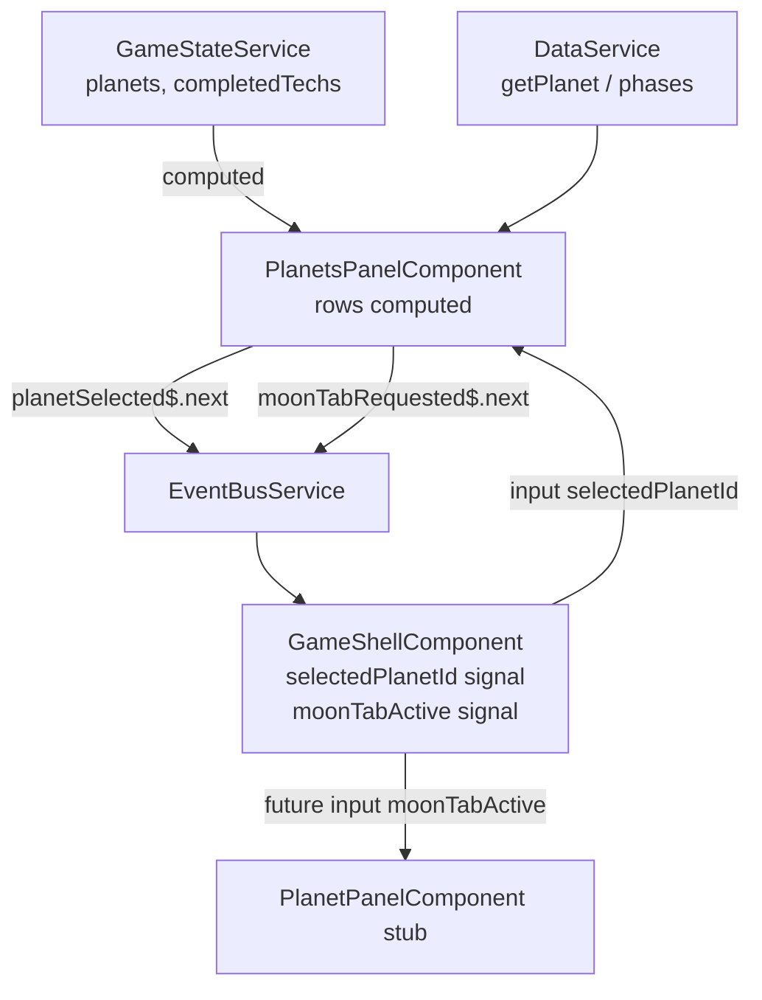

# Technical Implementation Plan: Planets Panel

## 1. Architecture & Strategy

### System context

`PlanetsPanelComponent` is the always-visible left-side HUD strip that lets the player
see and navigate to any planet. It sits below the HUD bar in `GameShellComponent` and is
a read-only consumer of `GameStateService` signals — it never mutates game state, only emits
navigation events via `EventBusService`. The component is already stubbed at
`src/app/features/hud/planets-panel/planets-panel.component.ts`; this plan fills it in.

This is an early HUD block (post-GameShell, pre-PlanetPanel full implementation). The planet
detail panel (`PlanetPanelComponent`) is still a stub — wiring the Moon tab into it is deferred,
but the event-bus plumbing is added now so PlanetPanel can consume it later.

### Architecture diagram



### Key design decisions

- **Pure `computed()` for rows**: Phase name, lock status and selection state all derive from
  `gameState.planets()` and `gameState.completedTechs()` signals. No subscription to
  `terraformingPhaseChanged$` is needed — the signal already re-computes when phase changes.
  `EventBusService` is injected only for `planetSelected$.next()` and `moonTabRequested$.next()`.

- **Phase names in `planets.json`**: Each planet entry gets a `phases: { displayName: string }[]`
  array so names stay in JSON (per the "no hardcoded content" rule). `PlanetData` model gains the
  matching `phases` field. Status is `'flourishing'` when
  `terraformingPhase >= phases.length - 1` AND `phases.length > 1`; `'active'` otherwise (Earth
  has two phases in JSON so phase 0 reads as 'active'; Moon is always 'active' as a special row).

- **Moon as a pseudo-row**: Moon is not a `PlanetId` and has no `PlanetState`. It is rendered as a
  special entry inserted after Earth in the fixed display order. Clicking it emits
  `planetSelected$('earth')` + `moonTabRequested$()` so `GameShellComponent` can pass a tab hint
  to `PlanetPanelComponent` when that panel is implemented.

- **Fixed display order**: A local const `DISPLAY_ORDER` drives row construction so the order is
  never implicit:
  ```ts
  const DISPLAY_ORDER = ['mercury', 'venus', 'earth', 'mars'] as const;
  ```

- **`selectedPlanetId` as `input()`**: Already wired in `game-shell.component.html`. The component
  reads it via `input<string | null>(null)` and uses it inside `rows` computed to set
  `isSelected`.

- **No `DestroyRef` teardown needed in this component**: The only EventBus-aware action is a
  fire-and-forget `.next()` inside click handlers — there are no subscriptions in the component
  itself.

### Data flow

```
DataService.getPlanet(id) ──► PlanetData.phases[n].displayName  ─┐
GameStateService.planets()  ──► PlanetState.terraformingPhase   ─┤──► rows (computed)
GameStateService.planets()  ──► presence check (locked)          ─┘
input selectedPlanetId()    ──► rows[*].isSelected

click handler ──► EventBusService.planetSelected$.next(id)
             ──► EventBusService.moonTabRequested$.next()  [Moon only]
```

### Patterns & conventions to follow

- `ChangeDetectionStrategy.OnPush`; `inject()`; `input<string|null>(null)`; `computed()` for rows.
- `@for (row of rows(); track row.id)` — always track by stable string ID.
- No game logic in the component. No signal mutations. State read-only.
- All planet display names / phase names come from JSON (`DataService`).
- BEM class names: `planets-panel__row`, `planets-panel__row--indented`,
  `planets-panel__row--selected`, `planets-panel__row--locked`,
  `planets-panel__status`, `planets-panel__status--active`,
  `planets-panel__status--flourishing`.
- Design tokens only in SCSS (`--color-text-disabled`, `--color-accent`, `--color-good`,
  `--space-sm`, `--space-xs`, `--transition-ui`, etc.).

---

## 2. Subtasks

### Milestone 1 — Data layer

- [ ] **`public/data/planets.json`** — Add `phases: { displayName: string }[]` to every planet
  object. Suggested phase names:
  - `earth`: `["Industrial Age", "Space Age"]` (Earth stays at 0 for the whole game — the second
    entry means 'active' never tips to 'flourishing' unintentionally)
  - `mercury`: `["Operational Base", "Industrial Hub", "Ring City"]` (3 phases matching
    the 0→1→2 progression)
  - `mars`: `["Barren", "Thin Atmosphere", "Warming", "Wetting", "Flourishing"]`
  - `venus`: `["Hellish", "Cooling", "Thinning", "Temperate", "Flourishing"]`

- [ ] **`src/app/core/models/planet.model.ts`** — Extend `PlanetData`:
  ```ts
  /** Terraforming phase display names, indexed by phase number. */
  phases: { displayName: string }[];
  ```
  No other model changes. No spec update needed (model is an interface, not a class).

### Milestone 2 — EventBus extension

- [ ] **`src/app/core/services/event-bus.service.ts`** — Add one new Subject after `planetSelected$`:
  ```ts
  /** Player clicked the Moon row — open Earth panel at Moon/research tab. */
  readonly moonTabRequested$ = new Subject<void>();
  ```
  No other changes. No spec update needed (thin message bus; tested via consumers).

### Milestone 3 — Component implementation

- [ ] **`src/app/features/hud/planets-panel/planets-panel.component.ts`** — Full implementation.

  Key shape:
  ```ts
  interface PlanetRow {
    readonly id: string;              // 'earth' | 'moon' | 'mercury' | 'mars' | 'venus'
    readonly displayName: string;
    readonly phaseName: string;
    readonly status: 'locked' | 'active' | 'flourishing';
    readonly isIndented: boolean;     // true for Moon only
    readonly isSelected: boolean;
  }

  const DISPLAY_ORDER = ['mercury', 'venus', 'earth', 'mars'] as const;

  @Component({ selector: 'app-planets-panel', standalone: true,
    changeDetection: ChangeDetectionStrategy.OnPush, ... })
  export class PlanetsPanelComponent {
    private readonly gameState = inject(GameStateService);
    private readonly data     = inject(DataService);
    private readonly eventBus = inject(EventBusService);

    readonly selectedPlanetId = input<string | null>(null);

    readonly rows = computed<PlanetRow[]>(() => {
      const planets = this.gameState.planets();
      const selected = this.selectedPlanetId();
      return DISPLAY_ORDER.map((id) => this._buildRow(id, planets, selected));
    });

    onRowClick(id: string): void {
      if (id === 'moon') {
        this.eventBus.planetSelected$.next('earth');
        this.eventBus.moonTabRequested$.next();
      } else {
        this.eventBus.planetSelected$.next(id);
      }
    }

    private _buildRow(
      id: string,
      planets: Record<string, PlanetState>,
      selected: string | null,
    ): PlanetRow { ... }
  }
  ```

  `_buildRow` logic:
  - `id === 'moon'`: `displayName = '  Moon'`, `phaseName = 'Research Base'`,
    `status = 'active'`, `isIndented = true`, `isSelected = selected === 'earth'`
    (Moon shares Earth's selected state since clicking it opens the Earth panel).
  - All others: `planetData = this.data.getPlanet(id)`, `state = planets[id]`.
    - If `!state`: `phaseName = 'Locked'`, `status = 'locked'`.
    - Else: `phase = state.terraformingPhase`,
      `phaseName = planetData.phases[phase]?.displayName ?? 'Unknown'`,
      `status = (phase >= planetData.phases.length - 1 && planetData.phases.length > 1)
        ? 'flourishing' : 'active'`.
  - `isSelected = (id === selected) || (id === 'earth' && selected === 'earth')`.

  **Pitfalls**:
  - `data.getPlanet(id)` throws if the id is not in the data. Moon must be excluded before
    calling it (only `'earth'|'mercury'|'mars'|'venus'` are valid `PlanetId`s).
  - Read `this.selectedPlanetId()` once at the top of `computed` (signal call inside
    `computed` is fine; no risk of mid-render re-entry here since there is no RAF).
  - Locked planets must still be clickable (emit `planetSelected$` to zoom orrery); the
    "locked message" is `PlanetPanelComponent`'s responsibility, not this component's.

- [ ] **`src/app/features/hud/planets-panel/planets-panel.component.html`** — Template.

  ```html
  <nav class="planets-panel" aria-label="Planet navigation">
    @for (row of rows(); track row.id) {
      <button
        class="planets-panel__row"
        [class.planets-panel__row--indented]="row.isIndented"
        [class.planets-panel__row--selected]="row.isSelected"
        [class.planets-panel__row--locked]="row.status === 'locked'"
        [attr.aria-pressed]="row.isSelected"
        [attr.aria-label]="row.displayName"
        (click)="onRowClick(row.id)"
      >
        <span class="planets-panel__status"
          [class.planets-panel__status--active]="row.status === 'active'"
          [class.planets-panel__status--flourishing]="row.status === 'flourishing'"
          aria-hidden="true"
        ></span>
        <span class="planets-panel__name">{{ row.displayName }}</span>
        <span class="planets-panel__phase">{{ row.phaseName }}</span>
      </button>
    }
  </nav>
  ```

- [ ] **`src/app/features/hud/planets-panel/planets-panel.component.scss`** — Styles.

  Structural rules:
  - `.planets-panel` — fixed-width (e.g. `180px`) flex column, full game height, dark background
    (`--color-bg-surface`), subtle right border (`--border-subtle`).
  - `.planets-panel__row` — `display: flex; flex-direction: column; gap: var(--space-xs)`,
    `padding: var(--space-sm)`, `cursor: pointer`, `transition: var(--transition-ui)`.
  - `--locked` modifier: `color: var(--color-text-disabled); opacity: 0.6`.
  - `--selected` modifier: left accent bar (`border-left: 2px solid var(--color-accent)`) +
    background lift (`--color-bg-elevated`).
  - `--indented` modifier: `padding-left: calc(var(--space-md) + var(--space-sm))`.
  - `.planets-panel__status` — small circle (`8px × 8px`), `border-radius: 50%`,
    default colour `--color-text-disabled` (locked),
    `--active` → `background: var(--color-accent)`,
    `--flourishing` → `background: var(--color-good)`.
  - `.planets-panel__name` — `font-size: var(--text-sm)`.
  - `.planets-panel__phase` — `font-size: var(--text-xs); color: var(--color-text-secondary)`.

### Milestone 4 — GameShell wiring

- [ ] **`src/app/features/game-shell/game-shell.component.ts`** — Add `moonTabActive` signal and
  subscribe to `moonTabRequested$`:

  ```ts
  readonly moonTabActive = signal(false);

  // inside ngOnInit:
  this.eventBus.moonTabRequested$
    .pipe(takeUntilDestroyed(this.destroyRef))
    .subscribe(() => this.moonTabActive.set(true));
  ```

  Pass `[moonTabActive]="moonTabActive()"` to `<app-planet-panel>` in the template once
  `PlanetPanelComponent` has the input wired (deferred to PlanetPanel block — see TODO below).
  For now, add the signal and the subscription; leave the template binding as a `// TODO`.

  **Note**: `selectedPlanetId` already subscribes to `planetSelected$`. Keep that subscription
  as-is; no duplication.

### Milestone 5 — Tests

- [ ] **`src/app/features/hud/planets-panel/planets-panel.component.spec.ts`** — Vitest unit tests.

  Test cases:
  - Renders 5 rows (Earth, Moon, Mercury, Mars, Venus) on initialisation.
  - Moon row: `isIndented = true`; `displayName = '  Moon'`; `status = 'active'`.
  - Mercury row: `status = 'locked'` when `planets()` has no `'mercury'` entry.
  - Mars row: `phaseName = 'Warming'` when `terraformingPhase = 2`.
  - Mars row: `status = 'flourishing'` when `terraformingPhase = 4` (phases.length - 1).
  - Earth row: `status = 'active'` when `terraformingPhase = 0` (never flourishing at phase 0
    because `phases.length = 2 > 1` → only flourishing at phase 1 which never happens in game).
  - Clicking Earth row emits `planetSelected$('earth')` and does NOT emit `moonTabRequested$`.
  - Clicking Moon row emits `planetSelected$('earth')` AND `moonTabRequested$`.
  - Clicking locked Mercury row still emits `planetSelected$('mercury')` (orrery zoom works for
    locked planets).
  - `selectedPlanetId` input: row with matching id has `isSelected = true`; others have `false`.
  - Moon row: `isSelected = true` when `selectedPlanetId = 'earth'`.

---

## 3. Assets (placeholders)

No new visual or audio assets are required for this feature. Status dots are pure CSS.

---

## 4. Cross-cutting concerns

### Cleanup
No RAF loop, no subscriptions in this component — nothing to clean up.

### Save / load safety
`rows` derives from signal state only; save/load via `GameStateService.hydrate()` automatically
invalidates and recomputes `rows`. No extra handling needed.

### Accessibility
- `<nav aria-label="Planet navigation">` — landmarks for keyboard/screen reader users.
- Each row is a `<button>` (not a `<div>`) — keyboard-focusable and activatable via Enter/Space.
- `[attr.aria-pressed]="row.isSelected"` — communicates selection state.
- Status dot uses `aria-hidden="true"` (decorative icon; state conveyed by name + class).

### Scope guard (out of scope for this block)
- **PlanetPanel moon tab**: Wiring `moonTabActive` to `PlanetPanelComponent`'s input and opening
  Earth panel at the research tab is deferred — PlanetPanel is still a stub. Added to TODO below.
- **Planet icons** (texture thumbnails per row): Not in the prompt. Deferred to a visual-polish
  pass if desired.
- **Terraforming progress bar** per row: TODO.md mentions this was in an earlier scope note, but
  this prompt does not request it. Deferred.

---

## 5. Verification checklist

- [ ] `ng build` — zero errors, zero warnings
- [ ] `ng test` — all new specs green, no regressions
- [ ] Manual: launch game → panel shows 5 rows in correct order; Earth and Moon always visible;
      Mercury/Mars/Venus dim and labelled "Locked" on new game
- [ ] Manual: click Earth → orrery zooms, Earth panel opens; click Moon → same panel opens
- [ ] Manual: after unlocking Mercury (complete `earth_launch_mercury_mission` tech) → Mercury
      row updates to active with phase name "Operational Base"
- [ ] Manual: advance Mars to phase 4 in a debug run → status dot turns green ("Flourishing")
- [ ] Manual: reduce motion in OS settings → status dot transitions are instant (no animation)
