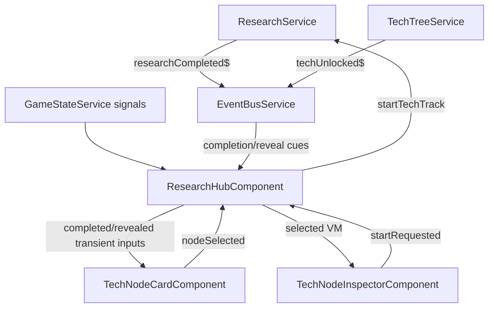
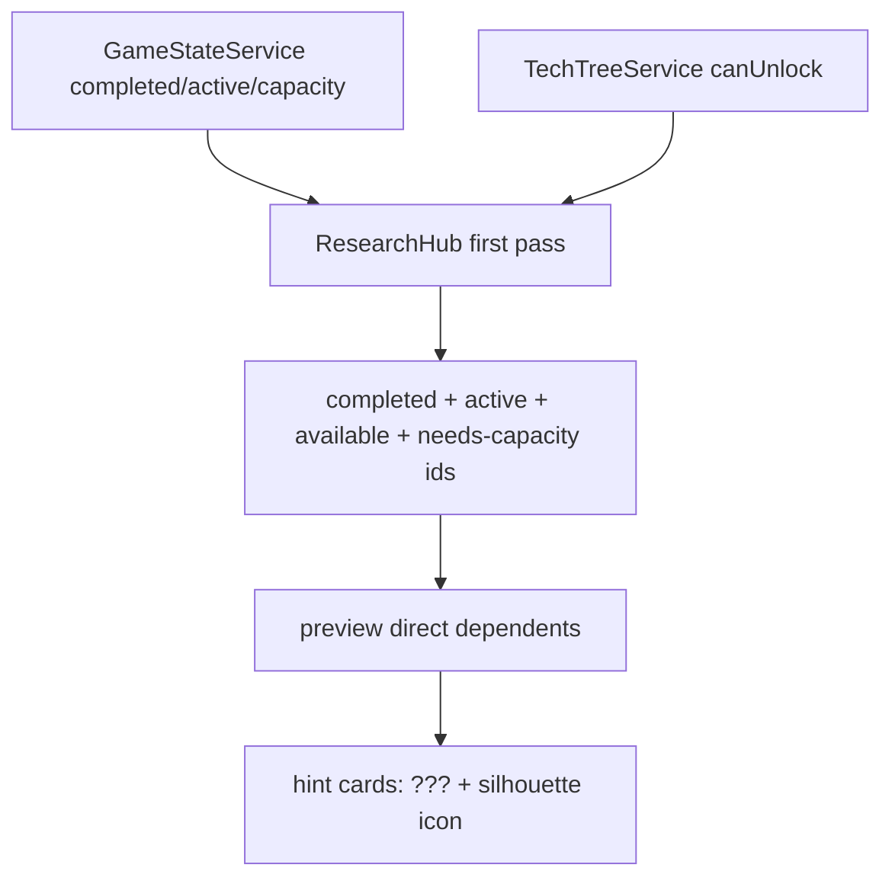

# Technical Implementation Plan: Research Hub Completion Polish

## 1. Architecture & Strategy

### System context

This is Block 20-5, following timed RP-capacity research, completion-year tracking, generic notifications, and the Research Hub inspector. The feature adds local, non-modal Research Hub feedback when research completes and when dependent technologies become newly visible or available.

The controlling surface is `ResearchHubComponent`: it already reads `GameStateService` signals, subscribes to `EventBusService.techUnlocked$`, owns transient card badge timers, and derives node visibility. This plan keeps polish state UI-only in ResearchHub and does not add saved state, modal completion flows, or new culture-event content.

### Architecture diagram

### Key design decisions

- **Use existing completion events; do not add a new EventBus subject**: `researchCompleted$` identifies ordinary track completion, and TechNode completion also produces `techUnlocked$` after `TechTreeService.completeNodeResearch()`. The polish can subscribe to existing subjects and compare before/after visibility maps.
- **Separate transient states**: replace the current single `newlyUnlockedIds` meaning with two explicit UI-only sets: `recentlyCompletedIds` for the completed card pulse, and `recentlyRevealedIds` for dependent reveal/new treatment.
- **Derive reveal from visibility, not another unlock source of truth**: dependent reveal should be calculated by comparing visible node state before completion with visible node state after completion. It must never duplicate `TechTreeService.canUnlock()` or persist availability.
- **Keep inspector selection stable**: Block 20-4 intentionally keeps the selected node until the player chooses another. Completion polish should update the selected node's VM from in-progress to completed, not auto-select dependents.
- **Non-modal by design**: ordinary completion clarity comes from local card highlight plus the existing notification service. Landmark modal policy remains owned by culture event presentation from Block 20-3.

### Data flow

- `ResearchHubComponent` reads `completedTechs`, `completedResearchYears`, `activeResearch`, `gameYear`, `usedRpCapacity`, and `totalRpCapacity` from `GameStateService` through existing computed builders.
- `ResearchHubComponent` subscribes to `eventBus.researchCompleted$` and `eventBus.techUnlocked$` with `takeUntilDestroyed(this.destroyRef)`.
- On completion event:
  - capture visible entries before completion handling when possible;
  - mark the completed `trackId` in `recentlyCompletedIds` if it is a rendered tech node;
  - after Angular has seen updated signals, compare visible entries and mark dependents that transitioned from absent/hidden/hint/needs-prereq to `available` or otherwise newly rendered.
- `TechNodeCardComponent` receives explicit booleans such as `isCompletionRecent` and `isRevealRecent`; it does not compute transient state itself.
- `TechNodeInspectorComponent` receives an updated view model from ResearchHub. Completion year is persisted in `GameStateService.completedResearchYears`, so save/load remains safe.

### Patterns & conventions to follow

- Standalone + OnPush, `input()` / `output()`, `@if` / `@for` with `track`.
- Keep game state in `GameStateService`; transient highlight state remains local to ResearchHub.
- Timers are allowed here only for UI polish and must be stored and cleared in `ngOnDestroy()`.
- Use tokenized SCSS only. Do not hardcode color, spacing, radius, or timing values.
- No direct DOM mutation except the existing SVG line drawing path.

---

## 2. Subtasks

### Milestone 1 — Split Completion and Reveal State in ResearchHub

- [ ] `src/app/features/research-hub/research-hub.component.ts`
  - Replace or narrow the current `newlyUnlockedIds` signal with:
    - `recentlyCompletedIds = signal<ReadonlySet<string>>(new Set())`
    - `recentlyRevealedIds = signal<ReadonlySet<string>>(new Set())`
  - Keep a single timer collection, e.g. `_transientFeedbackTimers: ReturnType<typeof setTimeout>[] = []`, or two named collections if clearer.
  - Add a helper like `_markTransient(setSignal, nodeIds, durationMs)` to avoid duplicated timer code.
  - Duration should be short and readable: roughly 1800-2400 ms, using a local readonly constant. Because this is a TypeScript timer duration rather than CSS, a named constant is acceptable; CSS motion still uses tokens.
  - Subscribe to `eventBus.researchCompleted$` for the just-completed id. Use `takeUntilDestroyed(this.destroyRef)`.
  - Keep the existing `techUnlocked$` subscription for badge/redraw behavior, but reframe it as completion feedback for the unlocked/completed tech node if the event payload is a tech node id.
  - Pitfall: `researchCompleted$` fires for both legacy `ResearchTrack` and TechNode tracks. Only mark cards for ids that exist in `allVisibleEntries()` or `data.getTechNode(id)`.
  - Pitfall: `techUnlocked$` may be emitted after completion effects; do not double-pulse forever if both events arrive for the same id. A set is idempotent; the timer helper can refresh or simply schedule removal once.

- [ ] `research-hub.component.html`
  - Pass separate card inputs:
    - `[isCompletionRecent]="recentlyCompletedIds().has(entry.node.id)"`
    - `[isRevealRecent]="recentlyRevealedIds().has(entry.node.id)"`
  - Stop using a generic `[isNew]` name from the parent unless kept as an alias for reveal only.
  - Apply to Mars, Venus, Earth, and Moon cards consistently.

- [ ] `research-hub.component.spec.ts`
  - Add fake `researchCompleted$` to `makeEventBusFake()` alongside `techUnlocked$`.
  - Use fake timers (`vi.useFakeTimers()`) for transient feedback tests.
  - Assert completion event marks the completed card with a completion class/badge, then clears after timer advance.
  - Assert `ngOnDestroy()` clears active timers via `vi.spyOn(globalThis, 'clearTimeout')` or by checking no later state updates occur after destroy.

### Milestone 2 — Derive Dependent Reveal Feedback

- [ ] `research-hub.component.ts`
  - Add a small local type for tracking visible state snapshots:
    - `type NodeVisibilitySnapshot = ReadonlyMap<string, NodeVisibility>`
  - Add `_visibleStateSnapshot(): Map<string, NodeVisibility>` based on `allVisibleEntries()`.
  - Add `_findNewlyRevealed(previous, next, completedNodeId): string[]`.
  - Reveal criteria:
    - node is not the completed node;
    - node appears in the next visible map and either did not appear before, or moved from `hint` / `needs_capacity` to `available`;
    - optionally require that the node directly lists the completed id in `prerequisites` or `spilloverPrerequisites` to prevent unrelated availability churn from being highlighted.
  - Preferred implementation: on `researchCompleted$`, capture `before = _visibleStateSnapshot()` before signal-driven recomputation is observed, then schedule one microtask or `requestAnimationFrame` callback to compute `after`. Since the event may fire after `GameStateService.completeResearch()` has already mutated state, the safer alternative is to maintain a `previousVisibleSnapshot` updated after each feedback pass and compare it against the current snapshot when `techUnlocked$` arrives.
  - Recommended concrete approach:
    - Initialize `private _lastVisibleSnapshot = new Map<string, NodeVisibility>()` in `ngAfterViewInit()` after `_setInitialSelection()`.
    - On `techUnlocked$`, call `_captureRevealFeedback(nodeId)` that compares `_lastVisibleSnapshot` to the current `allVisibleEntries()` map, marks revealed ids, then refreshes `_lastVisibleSnapshot`.
    - Also refresh `_lastVisibleSnapshot` after manual node selection or line redraw only if visibility has changed; avoid refreshing every scroll.
  - Pitfall: completion may cause selected node's visibility to become `completed`. Do not include the completed node in reveal feedback; it gets the completion treatment.
  - Pitfall: hint-visible nodes remain selectable/readable only as limited clues; reveal treatment should not expose hidden description text.

- [ ] `research-hub.component.spec.ts`
  - Add fixture nodes where completing one node makes a dependent move from hidden to available.
  - Emit `techUnlocked$` or mutate fake `completedTechs` then emit `techUnlocked$`, and assert the dependent gets reveal/new treatment.
  - Add a case where the completed node itself receives completion treatment, not reveal treatment.

### Milestone 3 — Card Visual and Accessible Treatments

- [ ] `src/app/features/research-hub/tech-node-card/tech-node-card.component.ts`
  - Replace `isNew = input<boolean>(false)` with clearer inputs:
    - `isCompletionRecent = input<boolean>(false)`
    - `isRevealRecent = input<boolean>(false)`
  - If backwards compatibility is desired during migration, keep `isNew` temporarily as an alias only in the same milestone, then remove after call sites/specs are updated.
  - Add computed badge label:
    - completion: `Completed`
    - reveal: `New`
  - Keep `isSelectable` unchanged; completed and revealed nodes remain selectable.

- [ ] `tech-node-card.component.html`
  - Apply stable BEM classes:
    - `[class.tech-node--completion-recent]="isCompletionRecent()"`
    - `[class.tech-node--reveal-recent]="isRevealRecent()"`
  - Render separate badges:
    - completion badge with accessible label like `Recently completed`;
    - reveal badge with accessible label like `Newly available`.
  - Do not change card dimensions when badges appear. Badge should be absolutely positioned like the current `New` badge.
  - Keep `aria-current` for selected state. Do not add live regions to every card; the global notification/toast handles announcement-level feedback.

- [ ] `tech-node-card.component.scss`
  - Keep existing completed-node green styling.
  - Replace infinite `gradient-spin` for new/reveal with a short reveal animation that ends. Requirements say no persistent flashing or looping except existing hint pulse.
  - Add two distinct treatments:
    - completion: success outline/pulse plus check/badge. Use `--color-success`, `--color-text-primary`, `--color-bg-elevated`.
    - reveal: accent outline/badge, perhaps a single `box-shadow` bloom and badge pop. Use `--color-accent`, `--color-accent-glow`.
  - Ensure `border` width does not change between normal and highlighted states. Use box-shadow/outline/outline-offset rather than changing from 1px to 2px if it affects layout or line coordinates.
  - Respect reduced motion through global reduced-motion rules; avoid long loops.

- [ ] `tech-node-card.component.spec.ts`
  - Assert completion recent input renders completion class and `Completed`/accessible badge.
  - Assert reveal recent input renders reveal class and `New`/accessible badge.
  - Assert completed nodes remain selectable after highlight state is false.
  - Update old `isNew` tests to new naming.

### Milestone 4 — Inspector Completion Clarity

- [ ] `src/app/features/research-hub/tech-node-inspector/tech-node-inspector.component.html`
  - Change completed stat text from `Completed / Year X` to `Completed in / Year X` or a single phrase that reads clearly as `Completed in Year X`.
  - Keep outcome summary visible for completed nodes.
  - Ensure Start button is absent for `visibility === 'completed'`; this already follows `canStart`, but tests should lock it down.

- [ ] `tech-node-inspector.component.scss`
  - Optional: add a subtle completed status style for `.tech-inspector__status--completed` using `--color-success` and a non-color cue such as border emphasis. Do not introduce a modal, toast, or separate alert.

- [ ] `tech-node-inspector.component.spec.ts`
  - Update completed test to expect `Completed in` and `Year X`.
  - Assert outcome summary remains rendered for completed VM.
  - Add a regression test that a completed VM with `canStart: false` does not render Start.

- [ ] `research-hub.component.spec.ts`
  - Simulate selected in-progress node completing by updating fake `completedTechs`, `completedResearchYears`, and `activeResearch`.
  - Assert inspector updates to completed state and shows completion year while preserving selected node id.

### Milestone 5 — Timer Cleanup and Redraw Integration

- [ ] `research-hub.component.ts`
  - Ensure every transient feedback timer is pushed into a tracked array and cleared in `ngOnDestroy()`.
  - Remove expired timer handles from the array if practical to avoid retaining stale handles during long play sessions with many completions.
  - After marking completion/reveal, call `_scheduleLineRedraw()` only if the treatment can affect visual outline/box-shadow. Since dimensions should not change, redraw is mostly defensive and can stay cheap because it is RAF-throttled.
  - Keep existing `ResizeObserver`, scroll redraw, and `clipLineGapBetweenTreeColumns` behavior untouched.

- [ ] `research-hub.component.spec.ts`
  - Use fake timers to verify both completion and reveal sets are cleared.
  - Assert `ngOnDestroy()` calls `clearTimeout` for pending feedback timers.
  - Assert completed node remains selectable/readable after timer expiry.

---

## 3. Assets (placeholders)

No new visual or audio assets are required. Use existing SVG card/icon treatment and CSS badges. Audio feedback is explicitly out of scope.

---

## 4. Cross-cutting Concerns

### Edge cases & pitfalls

- Completion events can fire for legacy `ResearchTrack` ids and TechNode ids. Only card-highlight tech nodes that exist in `DataService.getTechNode()` and/or current visible maps.
- A selected completed node should stay selected and readable; do not default-select newly available dependents.
- A node may move from `needs_capacity` to `available` because capacity changes, not because a prerequisite completed. Limit reveal feedback to nodes whose prerequisites/spillover prerequisites include the completed id.
- If multiple dependents reveal at once, mark all of them; use one timer batch rather than one timer per node if convenient.
- If completion happens while ResearchHub is closed, no local highlight is needed. The existing notification/culture-event systems cover out-of-hub feedback.

### Save/load

No save migration. All completion/reveal polish state is transient UI-only state in `ResearchHubComponent`. Persisted completion year remains `GameStateService.completedResearchYears` from Block 20-3.

### Memory & performance

- No new intervals.
- Timers must be cleared on destroy.
- RxJS subscriptions use `takeUntilDestroyed(this.destroyRef)`.
- Visibility snapshots are small maps over the current tech tree; recompute only on completion/unlock events, not every scroll tick.

### Accessibility & motion

- Highlight must not rely only on color: use badge text and outline/check treatment.
- Avoid card size changes so SVG connection lines and layout remain stable.
- Animations should be single-shot and short. Existing global reduced-motion rules should effectively collapse them.
- Do not add a modal or per-card live region. Existing notification/toast remains the broader user-facing announcement channel.

---

## 5. Out of Scope / Deferred

- No new culture event content; Block 20-3 owns landmark modal routing and Block 24 owns broader trigger overhaul.
- No research-complete modal.
- No audio feedback; audio system remains a future block.
- No Research Hub layout rework; Block 20-4 owns the current layout and inspector basics.
- No new persistent state or save migration.

---

## 6. Verification

- [ ] `npx ng build --no-progress` succeeds.
- [ ] Focused tests pass:
  - `npx ng test --watch=false --include='src/app/features/research-hub/research-hub.component.spec.ts'`
  - `npx ng test --watch=false --include='src/app/features/research-hub/tech-node-card/tech-node-card.component.spec.ts'`
  - `npx ng test --watch=false --include='src/app/features/research-hub/tech-node-inspector/tech-node-inspector.component.spec.ts'`
- [ ] Full `npx ng test --watch=false` passes.
- [ ] Manual checks:
  - Open Research Hub, start an available tech, advance until completion, and confirm the completed card receives a short completion treatment.
  - Confirm dependent nodes that become visible/available receive a short New/reveal treatment.
  - Keep the completed tech selected and confirm inspector changes to completed, shows `Completed in Year X`, hides Start, and still shows outcomes.
  - Let the highlight expire and confirm the completed node remains selectable/readable.
  - Confirm ordinary completions do not open a research-complete modal.
- [ ] Ask the user to playtest the flow manually; no automated E2E.

---

## 7. References

- Prompt block: `docs/agents/prompts/20-5-research-hub-completion-polish.txt`
- Architecture: `docs/agents/ARCHITECTURE.md`
- Standards: `AGENTS.md`
- GDD: `docs/GDD/main-gdd.md`
- Prior plan: `docs/agents/plans/research-hub-tech-inspector.md`

---

## 8. Addendum: Next-node Preview and Tech Icons

### User addendum

The tech tree should always preview the next layer beyond the current actionable frontier. At game start, `Launch Mercury Mission` is available, so the Research Hub should already show the Moon tracks unlocked by `earth_launch_mercury_mission` as shrouded `???` hint cards with silhouette-style icons. After `Launch Mercury Mission` completes and `Advanced Renewables Integration` plus `Dome Habitat Technology` become available, their direct follow-up nodes should likewise appear as `???` hint cards.

After the developer implementation is complete, hand off to the `ui-ux-specialist` agent to generate placeholder icons for every tech tree item: one normal icon and one silhouette icon per tech.

### Scope update

- This is still Research Hub UI visibility polish, not a new unlock system.
- Do not reveal names, RP costs, outcomes, descriptions, or tooltips for preview-only nodes; they remain `visibility: 'hint'` and display `???`.
- Do not persist preview state. Preview is derived from `TechNode.prerequisites`, `TechNode.spilloverPrerequisites`, current completion state, and current actionable nodes.
- Do not cascade previews from other preview cards. Only completed/current actionable nodes reveal their direct dependents as hints.

### Architecture update

The current `_getVisibility()` rule only returns `hint` when at least one direct or spillover prerequisite is already completed. That misses the desired one-step preview, because at game start `earth_launch_mercury_mission` is available but not completed, so its Moon dependents with `spilloverPrerequisites: ["earth_launch_mercury_mission"]` stay hidden.

Implement this as a two-pass column-state build in `ResearchHubComponent`:

1. First pass: classify non-hint visibility from real game state:
   - `completed`
   - `in_progress`
   - `available`
   - `needs_capacity`
   - hidden/null
2. Collect a preview frontier id set from nodes that are completed, in progress, available, or needs-capacity visible in the current tree.
3. Second pass: any still-hidden node whose direct `prerequisites` or `spilloverPrerequisites` include an id from that preview frontier becomes `hint`.

This keeps `TechTreeService.canUnlock()` as the only authority for true availability while allowing the Research Hub to show the player the next visible horizon.

### Milestone 6 — Implement Direct Next-node Preview

- [ ] `src/app/features/research-hub/research-hub.component.ts`
  - Refactor `_buildColumnStates(nodes, interactive)` so visibility classification can happen in two passes.
  - Extract a helper for real/actionable visibility, e.g. `_getResolvedVisibility(node, completed, interactive, isActive): Exclude<NodeVisibility, 'hint'> | null`.
  - Add `_hasPreviewPrerequisite(node, previewFrontierIds): boolean` that checks both `node.prerequisites` and `node.spilloverPrerequisites`.
  - In the second pass, assign `hint` to nodes that are still hidden and have at least one prerequisite in `previewFrontierIds`.
  - Ensure hints do not seed `previewFrontierIds`; this prevents showing the whole future tree at start.
  - Confirm non-interactive Mars/Venus behavior still downgrades true available nodes to `hint`, but does not cascade through hint-only nodes.
  - Preserve the inspector rule: preview nodes can be selected for clue context, but `canRevealDetails` remains false and the card/inspector should not expose hidden details.

- [ ] `src/app/features/research-hub/research-hub.component.html`
  - No structural change expected if `NodeEntry.visibility === 'hint'` continues to drive `TechNodeCardComponent` and `TechNodeIconComponent`.
  - Confirm Moon-column hints render before `earth_launch_mercury_mission` completion.

- [ ] `src/app/features/research-hub/research-hub.component.spec.ts`
  - Add a start-state test where `earth_launch_mercury_mission` is available and Moon tracks with `spilloverPrerequisites: ['earth_launch_mercury_mission']` render as `???` hint cards.
  - Add a post-launch test where `earth_advanced_renewables` and `earth_dome_habitat` are available and their direct follow-up nodes render as `???` hints.
  - Add a non-cascade test: a node that depends only on a preview/hint node remains hidden until that preview node becomes completed/actionable.
  - Add a hidden-detail regression: preview cards do not show real display name, RP cost, description, outcome, or prerequisite tooltip details.

### Milestone 7 — Silhouette Icon Path and Placeholder Icon Handoff

- [ ] `src/app/core/models/tech-tree.model.ts`
  - Add optional icon metadata if the current model does not already support it:
    - `iconPath?: string`
    - `silhouetteIconPath?: string`
  - Keep fields optional so existing JSON can remain valid during the implementation step and placeholders can be added by the UI-UX agent afterward.

- [ ] `public/data/tech-tree.json`
  - Developer may add the icon fields only if the icon component needs JSON paths immediately.
  - Preferred sequence: implement silhouette behavior with the current generic icon first, then let `ui-ux-specialist` add per-tech placeholder assets and JSON paths after developer validation.

- [ ] `src/app/features/research-hub/tech-node-icon/tech-node-icon.component.ts`
  - Accept either the whole `TechNode` or explicit optional normal/silhouette icon paths if per-tech icons are introduced.
  - Keep the current generated SVG fallback so missing placeholder assets never break the tree.

- [ ] `src/app/features/research-hub/tech-node-icon/tech-node-icon.component.html`
  - For `visibility === 'hint'`, render the silhouette icon path when available.
  - If no silhouette asset exists yet, keep the current shrouded generic marker as fallback.
  - For non-hint states, render the normal icon path when available; keep the current planet-colored generated SVG fallback.

- [ ] `src/app/features/research-hub/tech-node-icon/tech-node-icon.component.spec.ts`
  - Assert hint visibility uses silhouette asset when provided.
  - Assert hint fallback still renders when no asset path exists.
  - Assert non-hint states use the normal asset path when provided.

### UI-UX handoff after developer implementation

After the developer agent completes Milestones 1-7 and tests/build pass, hand off to `ui-ux-specialist` with this exact scope:

- Generate placeholder SVG icons for every tech node in `public/data/tech-tree.json`.
- For each tech id, create:
  - normal icon: `public/assets/svg/tech-tree/<tech-id>.svg`
  - silhouette icon: `public/assets/svg/tech-tree/<tech-id>--silhouette.svg`
- Each SVG must include `<!-- PLACEHOLDER -->`, use basic shapes, and be intentionally replaceable later.
- Normal icons should suggest the tech's subject matter enough for scanning, while still clearly placeholder-quality.
- Silhouette icons should share the same broad composition as the normal icon but be shrouded/monochrome enough for `???` preview cards.
- Update `public/data/tech-tree.json` with `iconPath` and `silhouetteIconPath` for every tech only after the assets exist.
- Keep icon dimensions stable at `40x40` viewBox unless the existing icon component is changed to require another size.

### Additional verification

- [ ] Start-state manual check: `Launch Mercury Mission` is available and Moon tracks unlocked by it appear as shrouded `???` cards.
- [ ] Post-launch manual check: `Advanced Renewables Integration` and `Dome Habitat Technology` become available and their direct follow-up nodes appear as `???` cards.
- [ ] Confirm preview cards do not reveal real names/details until actually available/completed.
- [ ] Confirm only one future layer is previewed; the tree does not flood the UI with all later nodes.
- [ ] After UI-UX placeholder generation, confirm every tech has both normal and silhouette asset paths and the app still builds.
