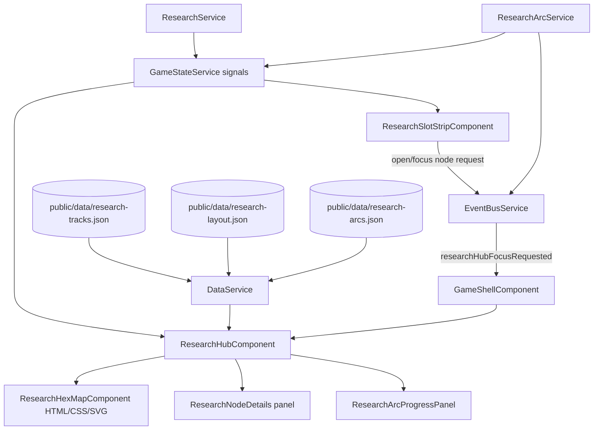

# Technical Implementation Plan: Research Hub Hex Grid Redesign

## 1. Architecture & Strategy

### System context

This plan scopes the corrective Research Hub redesign after the accidental over-implementation of the 26-x prompt set. It keeps the already-introduced canonical research data/slot/arc foundations where useful, but changes the Research Hub presentation into a fixed authored hex map with a right-side details panel and standalone arc progress section.

The feature touches Research Hub UI, shared research slot UI, data layout metadata, and a small EventBus focus flow. It should not add new research mechanics beyond what is needed to show slots, focus active research, unlock/show arcs, and remove old RP/capacity remnants.

### Architecture diagram

### Key design decisions

- **Fixed authored hex layout**: no automatic graph layout. Node coordinates live in data so the player's mental map stays stable and designers can tune placement.
- **HTML/CSS/SVG, not canvas**: hex tiles are accessible HTML buttons styled with CSS; relationship lines are SVG behind them. This preserves CSS transitions, devtools inspectability, and Angular component ergonomics.
- **Hex adjacency does not imply relationship**: tiles sit on a sparse hex grid with gaps. Only drawn lines mean dependencies/transfers/spillovers.
- **Arcs are standalone progress surfaces**: research arcs are not connected visually to the hex map. A node completion can unlock/update an arc, a CE tells the player, and the arc appears in the bottom-right panel.
- **Slots are one shared UI concept**: bottom HUD slots and Research Hub slots behave the same. Occupied slot click opens/focuses the active research tile.
- **Future slots grow outward**: start with two default slots around the research button. Venus slot appears bottom-left when unlocked; Mars slot appears bottom-right when unlocked.

### Data flow

- `DataService` loads research nodes, arcs, and new fixed layout metadata.
- `GameStateService` remains the only mutable state owner: active research, completed nodes, completion years, visible slots, occupied slots, and arc log.
- `ResearchService` owns start/pause/resume/completion logic. Progress is derived from `gameYear`, `startYear`, `elapsedBeforeStart`, and node duration.
- `ResearchArcService` writes durable arc-log entries and should also unlock/mark arcs as available when a node or finding starts an arc.
- `EventBusService` gains a focused hub request event so external UI can request `open Research Hub and focus node X` without depending on Research Hub DOM.
- `ResearchHubComponent` owns local UI state only: selected node, pan target/focus request, drag position, and transient New acknowledgement state.

### Patterns & conventions to follow

- Signals only; state in `GameStateService`; logic in system services; timers only in `GameLoopService`.
- Standalone + OnPush; `@if`/`@for` with `track`; `inject()`; `input()`/`output()`; strict types.
- Content and layout metadata from `public/data/*.json`; matching interfaces in `core/models`.
- No direct DOM manipulation in services. DOM measurement/panning belongs to components and cleans up listeners.
- Do not use canvas for the Research Hub map.
- Use design tokens; no hardcoded colors/spacing/radii except where pixel geometry requires documented constants.

---

## 2. Subtasks

### Milestone 1 - Correct Current Research V2 Mistakes

- [ ] `public/data/research-tracks.json` - remove all old player-facing RP/capacity text and old `rp_capacity_boost` effects. Automated Food Systems should describe the Naturalist/Architect fork and downstream branch unlocks, not generic capacity. (+ data service/integrity spec)
- [ ] `src/app/core/models/research-track.model.ts` - remove `rp_capacity_boost` from `ResearchEffect` once data and consumers no longer use it, or keep a temporary deprecated branch only until the same milestone removes consumers. (+ model compile coverage)
- [ ] `src/app/core/systems/tech-tree.service.ts` - remove runtime handling of `rp_capacity_boost` if it no longer exists in data. If the service remains temporarily named `TechTreeService`, do not expand its old RP responsibilities. (+ service specs)
- [ ] `src/app/features/research-hub/fork-choice-modal/*` - remove `+X RP capacity` rendering and replace with effect summaries that match the remaining effects, e.g. branch unlocks, tags, or flat research-time reductions. (+ spec)
- [ ] `src/app/features/research-hub/tech-node-card/tech-node-card.component.scss` - make locked and post-V1 states visually much less prominent than available/running/completed. Remove obsolete hint/tooltip styles where not used. (+ card spec)
- [ ] `src/app/features/research-hub/research-hub.component.ts` - add a short-term focus/scroll-to-selected behavior for the existing tree so Mercury Launch is in view until the hex map replaces the layout. (+ focused component/class spec where possible)

Pitfalls: do not remove compatibility aliases that are still required for build in unrelated files unless this milestone also updates every consumer. Keep the cleanup narrow and buildable.

### Milestone 2 - Shared Research Slot Strip And Focus Events

- [ ] `src/app/core/services/event-bus.service.ts` - add a typed event such as `researchHubFocusRequested$ = new Subject<{ nodeId?: string }>()`. Existing `researchHubRequested$` may remain for generic open requests, but new slot clicks should use the focus-capable event. (+ event-bus compile coverage)
- [ ] `src/app/core/models/research-slot-view.model.ts` - add a UI view model if useful: `ResearchSlotView { slotId, displayName, planetId, position, activeNodeId, activeNodeName, progressPercent, etaYear, isVisible }`. Keep it view-only.
- [ ] `src/app/shared/components/research-slot-strip/research-slot-strip.component.ts|html|scss` - new standalone shared component. Reads `GameStateService` and `DataService`, derives slot occupancy/progress, emits or directly sends EventBus focus/open requests. Inputs: compact/context if needed. (+ spec)
- [ ] `src/app/shared/components/resource-power-bar/*` - integrate the slot strip into the bottom bar center. Research button is icon-only and centered between Slot 1 and Slot 2. Slot 1 progress fills right-to-left; Slot 2 fills left-to-right. Venus slot appears bottom-left; Mars slot appears bottom-right. (+ spec)
- [ ] `src/app/features/hud/hud.component.html|scss|ts` - remove top-bar research button and keep the culture-event bell/time controls. `openResearchHub()` can be removed if no longer used by HUD. (+ spec)
- [ ] `src/app/features/game-shell/game-shell.component.ts` - subscribe to `researchHubFocusRequested$`, open the hub, and store pending focus node id for ResearchHub input. Clear it after handoff if needed. (+ spec)
- [ ] `src/app/features/game-shell/game-shell.component.html` - pass pending focus node id to Research Hub.
- [ ] `src/app/features/research-hub/research-hub.component.ts` - accept optional focused node input or event-driven setter and select/focus/pan to the node. Header slots should use the same shared component or the same view model as the HUD. (+ spec)

Pitfalls: slot component must not know ResearchHub DOM or map geometry. It only requests focus by node id. Empty slot click should open the hub without selecting arbitrary hidden state unless the product decision is to select the first available node.

### Milestone 3 - Fixed Hex Layout Data

- [ ] `src/app/core/models/research-layout.model.ts` - define layout interfaces: `ResearchLayoutData`, `ResearchLayoutNode`, `ResearchLayoutRegion`, `ResearchLayoutLinkWaypoint` if needed. Coordinates use axial hex coords `{ q, r }` plus optional `region` and label/group metadata. (+ model compile coverage)
- [ ] `public/data/research-layout.json` - authored fixed layout for every rendered research node. Mercury Launch at `{ q: 0, r: 0 }`; Earth fills center; Mars upper-left; Venus upper-right; Moon lower arc; Mercury operations as an inner/industrial branch. Include deliberate gaps for line routes.
- [ ] `src/app/core/services/data.service.ts` - load and expose `getResearchLayout()`, `getResearchLayoutNode(nodeId)`, and layout integrity helpers if local pattern fits. (+ `data.service.spec.ts`)
- [ ] `src/app/core/services/data-integrity.spec.ts` or extend existing data spec - validate every layout node id exists, every rendered research node has a layout entry, no duplicate coordinates, and every line waypoint references known nodes/regions if used.
- [ ] `src/app/shared/utils/hex-grid.utils.ts` - pure axial-to-pixel helpers and tile anchor helpers. Example signatures: `axialToPixel(q, r, size, gap)`, `hexAnchor(center, side)`. (+ spec)

Pitfalls: do not auto-place nodes. The utility only converts authored coordinates to pixels. Avoid putting layout fields into the research node data unless the team decides presentation metadata should live there.

### Milestone 4 - HTML/CSS/SVG Hex Map

- [ ] `src/app/features/research-hub/research-hex-map/research-hex-map.component.ts|html|scss` - new left-side map component. Inputs: node entries, selected node id, layout, line definitions, focus request. Outputs: node selected. Owns pan state and drag handling. (+ spec)
- [ ] `src/app/features/research-hub/research-hex-tile/research-hex-tile.component.ts|html|scss` - new accessible button tile. Inputs: node, visibility, selected, progress, new/completed badge. Uses CSS `clip-path` for hex visuals and tokens for state styling. (+ spec)
- [ ] `src/app/features/research-hub/research-map-lines/research-map-lines.component.ts|html|scss` - optional subcomponent for SVG relationships if it keeps `ResearchHexMapComponent` smaller. Draws prerequisite/spillover/transfer lines behind tiles. (+ spec)
- [ ] `src/app/features/research-hub/research-hub.component.ts` - replace column/tier row view models with map entry view models and relationship line view models. Keep game logic in services. Reuse selected inspector VM logic. (+ spec)
- [ ] `src/app/features/research-hub/research-hub.component.html|scss` - left/right shell: left map viewport, right node details, right arc panel. Remove old Mars/Earth/Venus columns and old scroll-column layout.

Map interaction requirements:
- Viewport uses `overflow: hidden`; no horizontal/vertical scrollbars.
- Drag starts only from empty map space, not from a tile or button.
- Pointer capture is cleaned up; listeners do not leak.
- Panning uses `transform: translate3d(...)` on the HTML map layer and SVG layer alignment stays in sync.
- `focusNode(nodeId)` recenters the map on that tile and selects it.
- Opening the hub centers Mercury Launch or the focused active node.

Line design:
- Solid line: prerequisite.
- Dashed line: spillover unlock.
- Dotted line: deterministic knowledge transfer, if shown in default map.
- No research arc lines on the map.
- Adjacent hexes do not imply relationship; only lines do.

Pitfalls: absolute-positioned tiles must remain keyboard focusable. SVG lines should not intercept pointer events. Avoid recomputing layout from DOM every change detection cycle; derive positions from data and only measure viewport bounds for centering/panning.

### Milestone 5 - Right Details Panel And Standalone Arc Progress

- [ ] `src/app/features/research-hub/research-node-details/research-node-details.component.ts|html|scss` - renamed/rebuilt details panel from the current inspector. Scrollable top-right section. Shows node name, status, duration, unlock condition, prerequisites as focus buttons, outcomes, start/pause/resume actions, and active transfer notes. (+ spec)
- [ ] `src/app/features/research-hub/research-arc-progress-panel/research-arc-progress-panel.component.ts|html|scss` - bottom-right arc section. Hidden until at least one arc is available. Closed arcs show finite progress and remain visible when complete. Open/endless arcs show an ongoing shimmer/progress sweep from 0% to 100% in a loop. (+ spec)
- [ ] `src/app/core/models/research-track.model.ts` - if missing, add arc availability/progress types or refine `ResearchArcDefinition` with `progressMode: 'finite' | 'ongoing'`, `totalFindings?: number`, `unlockNodeIds?: string[]`. Prefer data-driven fields. (+ model/data spec)
- [ ] `public/data/research-arcs.json` - add/adjust fields for standalone arc progress display. Keep copy data-driven. Closed arcs get finite known stages where known; open arcs get `progressMode: 'ongoing'`.
- [ ] `src/app/core/services/game-state.service.ts` - add durable available arc state only if arc availability cannot be derived from `arcLog`. Suggested: `availableResearchArcIds` with mutation `unlockResearchArc(arcId, year)` so completed arcs remain visible even before findings exist. (+ spec)
- [ ] `src/app/core/services/save.service.ts` - migrate/hydrate available arc ids if added. (+ spec)
- [ ] `src/app/core/systems/research-arc.service.ts` - on relevant node completion, unlock arc, write findings idempotently, and request linked CE. No visual map coupling. (+ spec)

Pitfalls: open arcs should not look like failed/incomplete finite arcs. Completed closed arcs remain visible permanently. Arc availability is not a line on the map; it is a CE plus progress panel state.

### Milestone 6 - Tests, Renames, And Old Component Removal

- [ ] Remove old `tech-node-*` component names/selectors/files only after new `research-hex-*`/`research-node-details` components compile and tests cover the replacement.
- [ ] Remove stale Research Hub component specs that assert V1 behavior such as `???`, hint-only nodes, RP capacity warnings, and old column previews.
- [ ] Add/repair component specs with `// @vitest-environment jsdom` and `compileComponents()` where external templates/styles are used.
- [ ] Add focused class-only specs for pan/focus math where possible to avoid brittle DOM tests.
- [ ] Update prompts/plan docs only if needed to reflect the fixed authored hex-grid direction.

Pitfalls: avoid a giant rename-only diff before behavior is stable. Keep compatibility aliases only as long as needed for build, then remove in one cleanup pass.

---

## 3. Assets (placeholders)

No new mandatory visual/audio assets are required for the hex-map shell. Use CSS/SVG shapes for tiles, lines, progress bars, and icon buttons.

Optional if the design wants an explicit research button icon asset instead of text/lucide:

- [ ] `public/assets/svg/icons/research-hub.svg` - icon, `viewBox 0 0 24 24`, placeholder only if no existing icon/lucide option is used.

---

## 4. Cross-cutting Concerns

### Edge cases & pitfalls

- The map must not imply relationships through touching hex edges. Keep gaps and draw explicit relationship lines.
- High-degree nodes such as Mercury Launch and Mercury phase gates have more than six relationships. Do not enforce one edge per hex side; allow bundled lines through directional anchor zones.
- Venus/Mars future slots should appear outward from the two default slots. The slot strip must support two, three, or four visible slots without layout shift breaking the bottom HUD.
- If an occupied slot points to a node that is no longer in the current map data, open the hub and show a graceful fallback rather than throwing.
- If an arc is available but has no findings yet, show it as available with 0 progress or an idle ongoing state.
- Locked nodes remain selectable for reading details, but should be visually quiet and should not look actionable.

### Save/load

- Slot progress stays derived from existing active research fields and `gameYear`.
- If `availableResearchArcIds` is added, serialize it and migrate old saves to infer availability from existing `arcLog` where possible.
- Hex layout is static data, not save state.
- Pan/selected node is UI state and should not be serialized unless a future UX decision asks for it.

### Memory & performance

- Drag/pointer listeners must clean up through Angular lifecycle or pointer capture release.
- Avoid DOM measurement per frame. Use authored hex coordinates and pure pixel conversion for tile/line positions.
- SVG line count is modest, but keep it derived from computed view models and avoid rebuilding on unrelated state changes.
- Use CSS transforms for panning for GPU-friendly updates.

### Accessibility & motion

- Hex tiles are buttons with labels and focus styles.
- Dragging empty space must not block keyboard navigation.
- Provide keyboard fallback for focus navigation through tile buttons and prerequisite buttons.
- Respect reduced motion for shimmer/looping arc bars and running-progress animations.
- Arc progress bars need accessible text: finite arcs as `n of total findings`, ongoing arcs as `Ongoing, n findings`.
- Locked/available distinctions cannot rely on color alone; use opacity, border weight, icon/check/badge differences, and text labels.

---

## 5. Out of Scope / Deferred

- No automatic graph layout.
- No canvas rendering for the Research Hub map.
- No permanent arc-to-node visual lines on the hex map.
- No probabilistic confidence mechanics.
- No new probe mission, outer ring, or full late-game arc mechanics beyond displaying available arcs and findings.
- No full content rewrite of the entire research graph beyond removing old RP/capacity remnants needed for correctness.
- No E2E automation; manual playtest is required for pan/drag feel and visual readability.

---

## 6. Verification

- [ ] `npm run build` succeeds with 0 TypeScript/template errors.
- [ ] Focused data specs pass: research nodes, layout, arcs, effect targets, prerequisites, transfers.
- [ ] Focused service specs pass: DataService, GameStateService, SaveService, ResearchService, ResearchArcService.
- [ ] Focused component specs pass for slot strip, hex tile, hex map, node details, arc progress panel, and Research Hub shell.
- [ ] Manual check: start a new game, bottom HUD shows Slot 1, research icon, Slot 2 only.
- [ ] Manual check: opening Research Hub centers Mercury Launch and selects it.
- [ ] Manual check: dragging empty map space pans the hex grid; dragging/clicking tiles does not accidentally pan.
- [ ] Manual check: occupied slot click opens the hub, selects the active node, and centers its hex tile.
- [ ] Manual check: locked nodes are visibly quieter than available/running/completed nodes.
- [ ] Manual check: Mars slot appears bottom-right when Mars slot unlocks; Venus slot appears bottom-left when Venus slot unlocks.
- [ ] Manual check: first available arc triggers CE, then arc section appears bottom-right.
- [ ] Manual check: closed completed arcs stay visible; ongoing arcs show looping shimmer without implying incomplete failure.
- [ ] Ask the user to playtest the full Research Hub map manually; no automated E2E.

---

## 7. References

- Saved prior plan: `docs/agents/plans/research-hub-v2.md`
- Prompt overview: `docs/agents/prompts/26-0-research-hub-v2-overview.txt`
- Research GDD: `docs/GDD/research-hub-gdd.md`
- Arc GDD: `docs/GDD/research-arcs-gdd.md`
- Architecture: `docs/agents/ARCHITECTURE.md`
- Current implementation anchors: `src/app/features/research-hub/`, `src/app/shared/components/resource-power-bar/`, `src/app/features/hud/`, `src/app/core/services/game-state.service.ts`, `src/app/core/systems/research.service.ts`, `src/app/core/systems/research-arc.service.ts`
