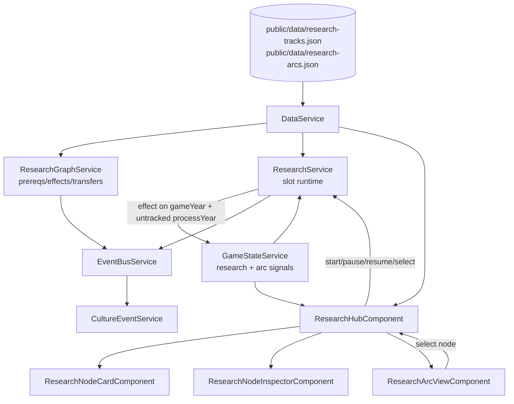

# Technical Implementation Plan: Research Hub V2 + Arcs

## 1. Architecture & Strategy

### System context

This plan implements Block 26 from `docs/agents/prompts/26-0-research-hub-v2-overview.txt`: replacing the current RP-capacity / tech-tree Research Hub with canonical Research Tracks, population-unlocked colony research slots, Research Arcs, deterministic knowledge transfer, and a durable arc log. It supersedes the current Block 20 Research Hub work while preserving useful behaviors already implemented: timed progress, pause/resume, explicit inspector start actions, local completion feedback, and culture-event routing.

The rewrite touches core data/model boundaries first, then state/service runtime, then Research Hub UI, then arc/culture-event integration. Do not start with UI renames: the controlling abstraction is the data and runtime model (`TechNode` + separate `ResearchTrack` + RP capacity), so that must be collapsed before the component layer can become clean.

### Architecture diagram

### Key design decisions

- **Research tracks are canonical**: merge old `tech-tree.json` and old `research-tracks.json` into one graph in `public/data/research-tracks.json`. A graph node is a `ResearchNode`; "track" is the gameplay activity the node enters when assigned to a slot.
- **Slots, not RP**: remove `rpCost`, `usedRpCapacity`, `totalRpCapacity`, and RP display from new research. Earth starts with two default slots. Mars and Venus colony slots unlock independently at a data-driven 50,000 population threshold.
- **Planet unlock is not slot unlock**: Mars/Venus access may unlock simultaneously, but colony research slots depend on each planet's population, not menu availability.
- **Full tree visibility**: all nodes render from game start with title, tier, icon, and unlock condition. Remove `???`, hint-only titles, and tooltip prerequisite disclosure.
- **Deterministic transfer now, probability later**: transfers are explicit metadata with deterministic active/inactive state based on completed source nodes. Do not add confidence scoring in this block.
- **Arc log is durable**: CEs can narrate findings, but `arcLog` is the authoritative saved record the Research Hub reads.

### Data flow

`DataService` loads canonical research nodes and optional arc definitions. `GameStateService` owns `completedResearchNodeIds`, `completedResearchYears`, `activeResearch`, and `arcLog`, plus typed mutations for start/pause/resume/complete and arc-finding writes. `ResearchService` reacts to `gameYear` with `effect()` and calls `processYear()` inside `untracked()`; progress is derived from `startYear`, `elapsedBeforeStart`, `isPaused`, and node duration, never stored as a per-tick float.

The Research Hub reads `GameStateService` signals and `DataService` definitions through computed view models. It calls `ResearchService.startNode/pauseNode/resumeNode`, and it stores only transient UI acknowledgement state for New badges. Arc findings are written by a system service on completion, not by components.

### Patterns & conventions to follow

- Signals only; state in `GameStateService`; logic in system services; timers only in `GameLoopService`.
- Standalone + OnPush; `@if`/`@for` with `track`; `inject()`; `input()`/`output()`; strict types.
- Content from `public/data/*.json`; matching interfaces in `core/models`.
- Use `takeUntilDestroyed()` for EventBus subscriptions and cleanup `ResizeObserver` / RAF line redraws.
- No Tauri changes. Narrator/player-facing copy remains data-driven JSON.

---

## 2. Subtasks

### Milestone 1 — Canonical Research Models And Data

- [ ] `src/app/core/models/research-track.model.ts` — rename from `tech-tree.model.ts`; define `ResearchNode`, `ResearchEffect`, `ResearchTransfer`, `ActiveResearch`, `ResearchArcDefinition`, `ResearchArcLogEntry`, and fork types. Avoid permanent `TechNode` aliases; if temporary aliases are necessary, remove them in Milestone 6. (+ model/import compile coverage)
- [ ] `src/app/core/models/game-state.model.ts` — rename serialized fields where practical: `completedTechs` → `completedResearchNodeIds`; `activeResearch` entries use `nodeId` and `slotId`; add `arcLog`. Keep migration-friendly optional handling for old saves. (+ save/model specs)
- [ ] `src/app/core/models/index.ts` — export new research model names and remove old tech-tree barrel exports once consumers move.
- [ ] `public/data/research-tracks.json` — become the only canonical research graph. Migrate old `tech-tree.json` nodes into it, fold/remove duplicate old track entries, remove `rpCost`, add `category`, `tier`, `unlockCondition`, `visualOrder`, `arcIds`, `transfersFrom`, and colony-slot eligibility metadata.
- [ ] `public/data/research-arcs.json` — add if keeping arc display copy separate is cleaner. Include Hunt for Life, Deep Ocean Exploration, Solar Gravitational Lens, and Understanding the Universe definitions.
- [ ] `public/data/tech-tree.json` — remove from load path. Delete or leave unused only until Milestone 6, but no runtime code should fetch it after Milestone 1.
- [ ] `src/app/core/services/data.service.ts` — replace `techTree` + separate `researchTracks` collections with canonical `researchNodes`; expose `getResearchNode`, `getResearchNodesForPlanet`, `getAllResearchNodes`, `getResearchArc`, `getAllResearchArcs`. (+ `data.service.spec.ts`)

Pitfalls: keep JSON complete enough that locked nodes render from game start; do not hardcode unlock text in components; do not strand old `research-tracks.json` Moon entries as a second system.

### Milestone 2 — Slot Runtime, Save Migration, And Research Systems

- [ ] `src/app/core/services/game-state.service.ts` — replace RP computed signals with research slot computed state. Add `visibleResearchSlots` or equivalent derived view: two default Earth slots, Mars colony slot when Mars population >= threshold, Venus colony slot when Venus population >= threshold. Add mutation methods: `startResearch(nodeId, planetId, slotId, startYear)`, `pauseResearch(nodeId)`, `resumeResearch(nodeId, slotId)`, `completeResearch(nodeId, completedYear)`, `addArcFinding(entry)`. (+ specs)
- [ ] `src/app/core/systems/research.service.ts` — own start/pause/resume/completion rules. It validates prerequisites through the graph service, assigns first eligible free slot, frees slot on pause/complete, applies flat duration reductions, and supports collaborative nodes occupying all visible slots. Use `effect()` on `gameYear` with `untracked()`.
- [ ] `src/app/core/systems/tech-tree.service.ts` → `src/app/core/systems/research-graph.service.ts` — rename and narrow responsibility to prerequisites, availability, fork/effect application, deterministic transfer queries, and research-node metadata. Update EventBus naming where feasible. (+ specs)
- [ ] `src/app/core/services/save.service.ts` — add migration for old `trackId` → `nodeId`, missing `slotId`, old `completedTechs`, old RP-era fields, and missing `arcLog`. Overflow old running tracks should become paused if not enough slots exist. (+ specs)
- [ ] `src/app/core/services/event-bus.service.ts` — rename payloads/events where needed (`techUnlocked$` → research-language event). Keep compatibility only if it avoids a dangerous all-at-once break, then remove in Milestone 6.
- [ ] `src/app/shared/components/resource-power-bar/*` — remove Research Points display from the global bar; slot state belongs in Research Hub header.

Pitfalls: Mars/Venus planet unlocks do not reveal slots; colony slots should reject nodes not assigned/eligible for that colony; paused research has `slotId: null`; collaborative nodes block all other starts.

### Milestone 3 — Research Hub V2 UI

- [ ] `src/app/features/research-hub/research-hub.component.ts` — rebuild view models around canonical `ResearchNode` entries, visible slots, full-visible locked nodes, persistent New acknowledgement state, graph line rendering, and tab/view selection for Tree vs Arcs. Keep selection state local; no game logic.
- [ ] `src/app/features/research-hub/research-hub.component.html` — remove right-side vignette, render top-right slot overview, render all research nodes, wire pause/resume/start/select outputs, and add Arc view shell.
- [ ] `src/app/features/research-hub/research-hub.component.scss` — adapt layout for header slots, stable node grid dimensions, inspector spacing, graph/transfer line distinction, and responsive Arc view. Use tokens only.
- [ ] `src/app/features/research-hub/tech-node-card/*` → `research-node-card/*` — rename component/class/selectors, remove tooltip code and `???` masking, show name/tier/category/duration/status/New. (+ specs)
- [ ] `src/app/features/research-hub/tech-node-inspector/*` → `research-node-inspector/*` — rename; add unlock condition, prerequisite buttons, transfer list, Start/Pause/Resume actions, sticky action spacing, completed year. (+ specs)
- [ ] `src/app/features/research-hub/tech-node-icon/*` → `research-node-icon/*` — rename and remove silhouette-title assumptions; keep icon rendering reusable for cards/inspector.
- [ ] `src/app/features/research-hub/research-node-view.model.ts` — replace `hint`/`needs_capacity` naming with research statuses: `locked`, `available`, `running`, `paused`, `completed`, `post_v1`.

Pitfalls: clicking a New node keeps New; New clears when selecting another node or starting that node; prerequisite buttons must not crash if data references are invalid; Moon Phase 2 ordering must come from data (`visualOrder`), not recursive depth alone.

### Milestone 4 — Research Arcs And Deterministic Transfers

- [ ] `src/app/core/systems/research-arc.service.ts` — new service if useful. It listens to research completion events, writes arc findings idempotently, requests linked CEs, and exposes transfer helper methods such as `isTransferActive(toNodeId, fromNodeId)` and `getActiveTransfersForNode(nodeId)`. (+ specs)
- [ ] `src/app/core/services/game-state.service.ts` — add `arcLog` readonly signal and `addArcFinding()` idempotent mutation if not already done in Milestone 2.
- [ ] `src/app/core/services/save.service.ts` — hydrate/migrate `arcLog`.
- [ ] `public/data/research-tracks.json` — add initial deterministic transfer metadata for Deep Ocean → Hunt for Life, Earth CO2 Drawdown → Venus CO2 Removal, Mars bio → Venus bio, and other GDD-listed known transfer links where source/target nodes exist.
- [ ] `public/data/research-arcs.json` — define known findings, next requirements, member nodes, and display copy.
- [ ] `src/app/features/research-hub/research-arc-view/*` — new read-only component or internal subcomponent showing arc list, findings so far, next known requirement, transfer outputs, and clickable member nodes. (+ specs)
- [ ] Research Hub SVG line drawing — draw transfer links as dotted/distinct from prerequisite links without direct game logic in the component.

Pitfalls: deterministic transfer should expose hooks even when future systems (probe missions, bio variance, Mercury queue reductions) do not yet consume them. Do not implement probabilistic confidence mechanics.

### Milestone 5 — Culture Events, Overlay Layering, And Unlock Events

- [ ] `src/app/features/culture-events/culture-event-card/culture-event-card.component.scss` — ensure modal CE overlay stacks above Research Hub; preserve toast/bell behavior for notification-only events. (+ component/service specs where practical)
- [ ] `src/app/core/systems/culture-event.service.ts` — verify research `emit_event` effects still queue modal landmark events after renames; arc-finding events may be requested alongside arc-log writes.
- [ ] `src/app/core/systems/planet-unlock.service.ts` — merge simultaneous Mars/Venus unlock into one combined event without double-firing on saves or partial old states.
- [ ] `public/data/planets.json` — replace separate Mars/Venus unlock event references with the combined event strategy, while keeping Venus opening decision flag behavior.
- [ ] `public/data/culture-events.json` — add `ce_inner_worlds_unlocked`, preserving narrator voice and making clear both Mars and Venus are newly reachable.
- [ ] `public/assets/svg/portraits/ce_inner_worlds_unlocked.svg` — placeholder portrait if no suitable asset exists.

Pitfalls: landmark modal should appear while Research Hub is open; ordinary completions should remain local UI/notification, not a new modal; use CultureEventService duplicate guards where possible.

### Milestone 6 — Cleanup, Rename Completion, And Test Hardening

- [ ] Remove old `TechNode`, `TechEffect`, `TechTreeService`, `tech-node-*`, `getTechNode`, `getTechNodesForPlanet`, `rpCost`, `usedRpCapacity`, `totalRpCapacity`, and `Research Points` runtime references, except historical prompt/docs mentions.
- [ ] Delete or stop shipping `public/data/tech-tree.json` once no code loads it.
- [ ] Add data-integrity specs for all prerequisite ids, transfer source ids, arc node ids, effect targets, and event ids.
- [ ] Update all component/service specs around research names and slots.
- [ ] Update `docs/agents/TODO.md` only for truly deferred future consumers, such as probe mission outcome consumption of deterministic transfer helpers.

---

## 3. Assets (placeholders)

- [ ] `public/assets/svg/portraits/ce_inner_worlds_unlocked.svg` — culture-event portrait, match existing portrait dimensions/style expectations; placeholder via `create-placeholder-svg`. Include Mars and Venus discs, dashed placeholder border, and `PLACEHOLDER` marker.

No audio placeholders are required; audio hooks remain deferred until AudioService work.

---

## 4. Cross-cutting Concerns

### Edge cases & pitfalls

- Mars/Venus menu unlock can happen long before colony research slots unlock.
- Mars and Venus may cross their 50,000 population threshold in the same game-year; both slots should appear immediately.
- Old saves may contain more running tracks than the new visible slot count. Overflow should pause rather than disappear.
- A paused node has progress but no slot. Resuming requires a free eligible slot.
- Collaborative nodes must require all visible slots free and block other starts until completion.
- Fork-bearing research nodes must still pause further unlocks until the fork resolves.
- Full-visible locked nodes need useful unlock text; missing `unlockCondition` should be treated as data invalid, not hidden by UI.

### Save/load

Serialize completed research ids, completion years, active research with `nodeId`/`slotId`, and `arcLog`. Save migration must handle old `completedTechs`, old `activeResearch.trackId`, missing `slotId`, and missing arc log. Progress after load derives from `gameYear`, `startYear`, and `elapsedBeforeStart` only.

### Memory & performance

Research Hub line drawing already uses DOM measurement and SVG updates; keep redraw scheduled via RAF and disconnect `ResizeObserver` on destroy. Avoid recomputing graph relationships with repeated deep recursion in templates; build maps in computed values. Late-game full-visible graph is larger than current hint graph, so prefer indexed maps and data-driven ordering.

### Accessibility & motion

Cards, prerequisite buttons, arc member buttons, and slot entries must be keyboard reachable. Progress bars need labels and values. New/Completed states cannot rely only on color; include badges/icons/outline. Keep animations short and non-layout-shifting; remove timed New badge behavior.

---

## 5. Out Of Scope / Deferred

- Full colony population production/management is not part of this plan; it only reads existing/future `PlanetState.population` and uses a data-driven threshold.
- Full probe mission implementation is deferred to the existing ProbeMissions TODO; this plan only exposes deterministic transfer helpers for future probe outcomes.
- Full bio variance and Mercury queue reduction consumers are deferred to their owning terraforming/bio/Mercury blocks; this plan renders transfer metadata and exposes helpers.
- Probabilistic confidence mechanics are explicitly deferred.
- Full long-form arc CE chains are deferred; only minimal data/events needed for integration should be added.
- Audio feedback remains deferred until AudioService work.

---

## 6. Verification

- [ ] `ng build` succeeds with no TypeScript/template errors.
- [ ] Targeted Vitest specs pass for `DataService`, `GameStateService`, `SaveService`, `ResearchService`, research graph/arc service, Research Hub components, CultureEventService, and PlanetUnlockService.
- [ ] Data integrity specs pass: prerequisites, transfers, arcs, effects, and event ids all resolve.
- [ ] Manual check: start a new game, open Research Hub, confirm all nodes show names and locked unlock conditions.
- [ ] Manual check: start two default research nodes; verify a third cannot start until a colony slot threshold is met.
- [ ] Manual check: set Mars population above threshold in debug/dev state; verify Mars colony slot appears and only accepts eligible research.
- [ ] Manual check: pause a node, start another, resume when a slot is free, and confirm progress is retained.
- [ ] Manual check: unlock a node, confirm New state persists on first click and clears only when leaving or starting.
- [ ] Manual check: complete Fusion Ignition Theory with Research Hub open and confirm the CE modal appears above the hub.
- [ ] Ask the user to playtest the full Research Hub and arc view manually; no automated E2E.

---

## 7. References

- Prompt overview: `docs/agents/prompts/26-0-research-hub-v2-overview.txt`
- Prompt steps: `docs/agents/prompts/26-1-*` through `26-6-*`
- GDD: `docs/GDD/research-hub-gdd.md`
- GDD addendum: `docs/GDD/research-hub-gdd-addendum.md`
- Arc design: `docs/GDD/research-arcs-gdd.md`
- Current architecture: `docs/agents/ARCHITECTURE.md`
- Current old implementation anchors: `src/app/core/models/tech-tree.model.ts`, `src/app/core/services/game-state.service.ts`, `src/app/core/systems/research.service.ts`, `src/app/core/systems/tech-tree.service.ts`, `src/app/features/research-hub/`
